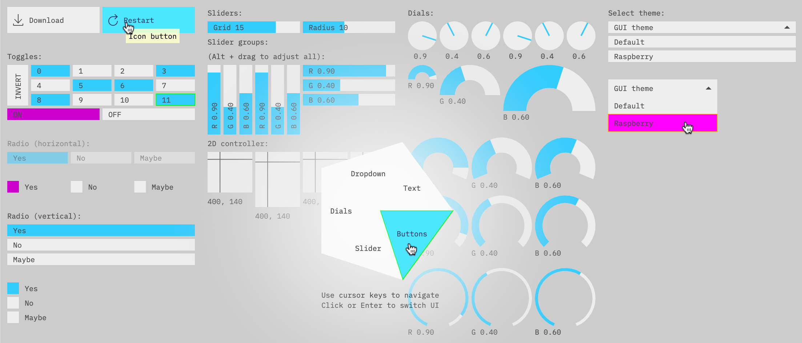
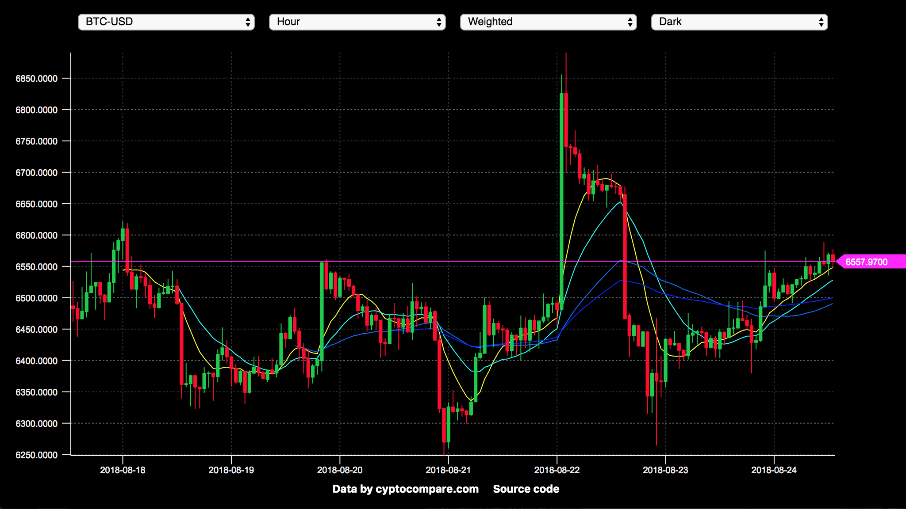

# 

[](https://travis-ci.org/thi-ng/umbrella)
[](https://codeclimate.com/github/thi-ng/umbrella/maintainability)
[](https://www.patreon.com/thing_umbrella)
[](https://discord.gg/JhYcmBw)
[](https://twitter.com/thing_umbrella)

## About

> "A collection of functional programming libraries that can be composed together.
> Unlike a framework, thi.ng is a suite of instruments and you (the user) must be
> the composer of. Geared towards versatility, not any specific type of music."
> &mdash; [@loganpowell](https://twitter.com/logantpowell/status/1186334119812304901) via Twitter

Mono-repository for 126 thi.ng TypeScript/ES6 projects, a wide
collection of largely data transformation oriented packages and building
blocks for:

- Functional programming (composition, memoization, transducers,
  multi-methods)
- ES6 iterators/generators
- Stream & transducer based, reactive programming, dataflow graphs /
  pipelines
- WebWorker workflow abstractions
- Data structures & data transformations for wide range of use cases
  (list, sets, maps, joins, spatial indexing)
- Immutable data handling, state containers, transacted state updates,
  Undo-Redo history
- Vector & matrix implementations with optional support for strided
  layouts, SIMD etc.
- Value-based equivalence
- PEG-style parser combinators, FSM primitives
- Forth-style pointfree DSL for functional composition
- S-expression parser & runtime infrastructure for custom DSL creation
- DSL for shader functions defined in TypeScript and cross-compilation
  to GLSL, JS, VEX etc.
- 2D geometry generation, shape primitives, processing, conversion &
  visualization
- Multi-format pixel buffers, conversions, Porter-Duff alpha-blending
  operators
- Color space/format conversions, matrix based color manipulation,
  cosine gradients
- Data driven UI components, event & side effect handling
- Canvas abstraction & SVG conversion
- Canvas-based Immediate mode GUI components
- Declarative WebGL 1/2 abstraction layer
- Low-level tooling for binary data, shared memory/WASM/WebGL interop
- etc. (see package overview below)

**...all with a keen eye on simplicity, re-use & minimalism without
sacrificing flexibility.**

**This project is NOT a framework**, provides no turn-key,
one-size-fits-all approach and instead encourages a mix & match
philosophy for various key aspects of application design (in & outside
the browser). Most customization points only expect certain interfaces
rather than concrete implementations.

Most packages:

- have detailed, individual README files w/ small usage examples
- are versioned independently
- distributed in ES2017 syntax and multiple formats (ESM, CommonJS, UMD)
  with TypeScript typings & changelogs
- highly modular with largely only a few closely related functions or
  single function / class per file to help w/ tree shaking
- provide re-exports of all their publics for full library imports
- have either none or only @thi.ng internal runtime dependencies
- have been used in production
- declare public interfaces, enums & types in an `api.ts` and/or
  `constants.ts` file (larger packages only)
- have auto-generated online documentation at [docs.thi.ng](http://docs.thi.ng)
- licensed under Apache Software License 2.0

## Examples

There's a steadily growing number (~85) of standalone examples
(different complexities, often combining functionality from several
packages) in the [**examples**](./examples/README.md) directory.

| Example screenshots                                               | (small selection)                                           |                                                                      |
|-------------------------------------------------------------------|-------------------------------------------------------------|----------------------------------------------------------------------|
|        |        |  |
|  |  |       |
|         |            |           |

## Blog posts

- [How to UI in 2018](https://medium.com/@thi.ng/how-to-ui-in-2018-ac2ae02acdf3)

- "Of umbrellas, transducers, reactive streams & mushrooms" (ongoing series):
  - [Part 1 - Project & series overview](https://medium.com/@thi.ng/of-umbrellas-transducers-reactive-streams-mushrooms-pt-1-a8717ce3a170)
  - [Part 2 - HOFs, Transducers, Reducers](https://medium.com/@thi.ng/of-umbrellas-transducers-reactive-streams-mushrooms-pt-2-9c540beb0023)
  - [Part 3 - Convolution, 1D/2D Cellular automata](https://medium.com/@thi.ng/of-umbrellas-transducers-reactive-streams-mushrooms-pt-3-a1c4e621db9b)
  - [Part 4 - Disjoint Sets, Graph analysis, Signed Distance Fields](https://medium.com/@thi.ng/of-umbrellas-transducers-reactive-streams-mushrooms-pt-4-62d8e71e5603)

## Community & contributing

Join our little community on our [Discord
server](https://discord.gg/JhYcmBw) or get in touch via
[Twitter](https://twitter.com/thing_umbrella) or the [issue
tracker](https://github.com/thi-ng/umbrella/issues). If you'd like to
contribute, please first read [this document](./CONTRIBUTING.md).

In general, we welcome contributions of all kinds (docs, examples, bug
fixes, feature requests, financial contributions etc.). You can find a
fairly detailed overview for contributors here:
[CONTRIBUTING.md](https://github.com/thi-ng/umbrella/blob/develop/CONTRIBUTING.md).

## Projects

### New / unreleased packages in development

(These packages are still unreleased and only available on their feature or `develop` branches)

- [@thi.ng/hdom2020](https://github.com/thi-ng/umbrella/tree/feature/hdom2020/packages/hdom2020) - Diff-less, reactive version of thi.ng/hdom

### Fundamentals

| Project                                   | Version                                                                                                         | Changelog                                     | Description                                              |
|-------------------------------------------|-----------------------------------------------------------------------------------------------------------------|-----------------------------------------------|----------------------------------------------------------|
| [`@thi.ng/api`](./packages/api)           | [](https://www.npmjs.com/package/@thi.ng/api)           | [changelog](./packages/api/CHANGELOG.md)      | Common types, decorators, mixins                         |
| [`@thi.ng/bench`](./packages/bench)       | [](https://www.npmjs.com/package/@thi.ng/bench)       | [changelog](./packages/bench/CHANGELOG.md)    | Basic benchmarking helpers                               |
| [`@thi.ng/checks`](./packages/checks)     | [](https://www.npmjs.com/package/@thi.ng/checks)     | [changelog](./packages/checks/CHANGELOG.md)   | Type & value checks                                      |
| [`@thi.ng/compare`](./packages/compare)   | [](https://www.npmjs.com/package/@thi.ng/compare)   | [changelog](./packages/compare/CHANGELOG.md)  | Comparator                                               |
| [`@thi.ng/compose`](./packages/compose)   | [](https://www.npmjs.com/package/@thi.ng/compose)   | [changelog](./packages/compose/CHANGELOG.md)  | Functional composition helpers                           |
| [`@thi.ng/defmulti`](./packages/defmulti) | [](https://www.npmjs.com/package/@thi.ng/defmulti) | [changelog](./packages/defmulti/CHANGELOG.md) | Dynamic multiple dispatch                                |
| [`@thi.ng/dsp`](./packages/dsp)           | [](https://www.npmjs.com/package/@thi.ng/dsp)           | [changelog](./packages/dsp/CHANGELOG.md)      | DSP utils, oscillators                                   |
| [`@thi.ng/ecs`](./packages/ecs)           | [](https://www.npmjs.com/package/@thi.ng/ecs)           | [changelog](./packages/ecs/CHANGELOG.md)      | Entity-Component System                                  |
| [`@thi.ng/equiv`](./packages/equiv)       | [](https://www.npmjs.com/package/@thi.ng/equiv)       | [changelog](./packages/equiv/CHANGELOG.md)    | Deep value equivalence checking                          |
| [`@thi.ng/errors`](./packages/errors)     | [](https://www.npmjs.com/package/@thi.ng/errors)     | [changelog](./packages/errors/CHANGELOG.md)   | Custom error types                                       |
| [`@thi.ng/math`](./packages/math)         | [](https://www.npmjs.com/package/@thi.ng/math)         | [changelog](./packages/math/CHANGELOG.md)     | Assorted common math functions & utilities               |
| [`@thi.ng/memoize`](./packages/memoize)   | [](https://www.npmjs.com/package/@thi.ng/memoize)   | [changelog](./packages/memoize/CHANGELOG.md)  | Function memoization w/ customizable caching             |
| [`@thi.ng/mime`](./packages/mime)         | [](https://www.npmjs.com/package/@thi.ng/mime)         | [changelog](./packages/mime/CHANGELOG.md)     | File extension to MIME type mappings                     |
| [`@thi.ng/paths`](./packages/paths)       | [](https://www.npmjs.com/package/@thi.ng/paths)       | [changelog](./packages/paths/CHANGELOG.md)    | Immutable nested object accessors                        |
| [`@thi.ng/random`](./packages/random)     | [](https://www.npmjs.com/package/@thi.ng/random)     | [changelog](./packages/random/CHANGELOG.md)   | Seedable PRNG implementations w/ unified API             |
| [`@thi.ng/strings`](./packages/strings)   | [](https://www.npmjs.com/package/@thi.ng/strings)   | [changelog](./packages/strings/CHANGELOG.md)  | Higher-order string formatting utils                     |
| [`@thi.ng/system`](./packages/system)     | [](https://www.npmjs.com/package/@thi.ng/system)     | [changelog](./packages/system/CHANGELOG.md)   | Minimal life cycle container for stateful app components |

### Iterator, stream & sequence processing

| Project                                                       | Version                                                                                                                             | Changelog                                               | Description                             |
|---------------------------------------------------------------|-------------------------------------------------------------------------------------------------------------------------------------|---------------------------------------------------------|-----------------------------------------|
| [`@thi.ng/csp`](./packages/csp)                               | [](https://www.npmjs.com/package/@thi.ng/csp)                               | [changelog](./packages/csp/CHANGELOG.md)                | Channel based async ops                 |
| [`@thi.ng/fsm`](./packages/fsm)                               | [](https://www.npmjs.com/package/@thi.ng/fsm)                               | [changelog](./packages/fsm/CHANGELOG.md)                | FSM / parser primitives                 |
| [`@thi.ng/grid-iterators`](./packages/grid-iterators)         | [](https://www.npmjs.com/package/@thi.ng/grid-iterators)         | [changelog](./packages/grid-iterators/CHANGELOG.md)     | 2D grid iterator strategies             |
| [`@thi.ng/iterators`](./packages/iterators)                   | [](https://www.npmjs.com/package/@thi.ng/iterators)                   | [changelog](./packages/iterators/CHANGELOG.md)          | ES6 generators / iterators              |
| [`@thi.ng/sax`](./packages/sax)                               | [](https://www.npmjs.com/package/@thi.ng/sax)                               | [changelog](./packages/sax/CHANGELOG.md)                | SAX-like XML parser / transducer        |
| [`@thi.ng/seq`](./packages/seq)                               | [](https://www.npmjs.com/package/@thi.ng/seq)                               | [changelog](./packages/seq/CHANGELOG.md)                | Lisp/Clojure-style sequence abstraction |
| [`@thi.ng/transducers`](./packages/transducers)               | [](https://www.npmjs.com/package/@thi.ng/transducers)               | [changelog](./packages/transducers/CHANGELOG.md)        | Composable data transformations         |
| [`@thi.ng/transducers-binary`](./packages/transducers-binary) | [](https://www.npmjs.com/package/@thi.ng/transducers-binary) | [changelog](./packages/transducers-binary/CHANGELOG.md) | Binary data related transducers         |
| [`@thi.ng/transducers-fsm`](./packages/transducers-fsm)       | [](https://www.npmjs.com/package/@thi.ng/transducers-fsm)       | [changelog](./packages/transducers-fsm/CHANGELOG.md)    | Finite state transducer                 |
| [`@thi.ng/transducers-hdom`](./packages/transducers-hdom)     | [](https://www.npmjs.com/package/@thi.ng/transducers-hdom)     | [changelog](./packages/transducers-hdom/CHANGELOG.md)   | Transducer based hdom UI updates        |
| [`@thi.ng/transducers-patch`](./packages/transducers-patch)   | [](https://www.npmjs.com/package/@thi.ng/transducers-patch)   | [changelog](./packages/transducers-patch/CHANGELOG.md)  | Patch-based, array & object editing     |
| [`@thi.ng/transducers-stats`](./packages/transducers-stats)   | [](https://www.npmjs.com/package/@thi.ng/transducers-stats)   | [changelog](./packages/transducers-stats/CHANGELOG.md)  | Technical / statistical analysis        |

### Reactive programming

| Project                                                   | Version                                                                                                                         | Changelog                                             | Description                                  |
|-----------------------------------------------------------|---------------------------------------------------------------------------------------------------------------------------------|-------------------------------------------------------|----------------------------------------------|
| [`@thi.ng/rstream`](./packages/rstream)                   | [](https://www.npmjs.com/package/@thi.ng/rstream)                   | [changelog](./packages/rstream/CHANGELOG.md)          | Push-based, reactive event stream primitves  |
| [`@thi.ng/rstream-csp`](./packages/rstream-csp)           | [](https://www.npmjs.com/package/@thi.ng/rstream-csp)           | [changelog](./packages/rstream-csp/CHANGELOG.md)      | Adapter bridge CSP -> rstream                |
| [`@thi.ng/rstream-dot`](./packages/rstream-dot)           | [](https://www.npmjs.com/package/@thi.ng/rstream-dot)           | [changelog](./packages/rstream-dot/CHANGELOG.md)      | Graphviz visualization of rstream topologies |
| [`@thi.ng/rstream-gestures`](./packages/rstream-gestures) | [](https://www.npmjs.com/package/@thi.ng/rstream-gestures) | [changelog](./packages/rstream-gestures/CHANGELOG.md) | Mouse & touch event stream abstraction       |
| [`@thi.ng/rstream-graph`](./packages/rstream-graph)       | [](https://www.npmjs.com/package/@thi.ng/rstream-graph)       | [changelog](./packages/rstream-graph/CHANGELOG.md)    | Declarative dataflow graph construction      |
| [`@thi.ng/rstream-log`](./packages/rstream-log)           | [](https://www.npmjs.com/package/@thi.ng/rstream-log)           | [changelog](./packages/rstream-log/CHANGELOG.md)      | Hierarchical structured data logging         |
| [`@thi.ng/rstream-log-file`](./packages/rstream-log-file) | [](https://www.npmjs.com/package/@thi.ng/rstream-log-file) | [changelog](./packages/rstream-log-file/CHANGELOG.md) | Log-file output handler                      |
| [`@thi.ng/rstream-query`](./packages/rstream-query)       | [](https://www.npmjs.com/package/@thi.ng/rstream-query)       | [changelog](./packages/rstream-query/CHANGELOG.md)    | Triple store & query engine                  |

### Data structures

| Project                                         | Version                                                                                                               | Changelog                                        | Description                              |
|-------------------------------------------------|-----------------------------------------------------------------------------------------------------------------------|--------------------------------------------------|------------------------------------------|
| [`@thi.ng/adjacency`](./packages/adjacency)     | [](https://www.npmjs.com/package/@thi.ng/adjacency)     | [changelog](./packages/adjacency/CHANGELOG.md)   | Adjacency matrices & graph algorithms    |
| [`@thi.ng/arrays`](./packages/arrays)           | [](https://www.npmjs.com/package/@thi.ng/arrays)           | [changelog](./packages/arrays/CHANGELOG.md)      | Array utilities                          |
| [`@thi.ng/associative`](./packages/associative) | [](https://www.npmjs.com/package/@thi.ng/associative) | [changelog](./packages/associative/CHANGELOG.md) | Alt Set & Map implementations            |
| [`@thi.ng/atom`](./packages/atom)               | [](https://www.npmjs.com/package/@thi.ng/atom)               | [changelog](./packages/atom/CHANGELOG.md)        | Immutable value wrappers, views, history |
| [`@thi.ng/bitfield`](./packages/bitfield)       | [](https://www.npmjs.com/package/@thi.ng/bitfield)       | [changelog](./packages/bitfield/CHANGELOG.md)    | 1D/2D bit field implementations          |
| [`@thi.ng/cache`](./packages/cache)             | [](https://www.npmjs.com/package/@thi.ng/cache)             | [changelog](./packages/cache/CHANGELOG.md)       | In-memory caches / strategies            |
| [`@thi.ng/dcons`](./packages/dcons)             | [](https://www.npmjs.com/package/@thi.ng/dcons)             | [changelog](./packages/dcons/CHANGELOG.md)       | Doubly-linked list                       |
| [`@thi.ng/diff`](./packages/diff)               | [](https://www.npmjs.com/package/@thi.ng/diff)               | [changelog](./packages/diff/CHANGELOG.md)        | Array & object diffing                   |
| [`@thi.ng/dgraph`](./packages/dgraph)           | [](https://www.npmjs.com/package/@thi.ng/dgraph)           | [changelog](./packages/dgraph/CHANGELOG.md)      | Dependency graph                         |
| [`@thi.ng/gp`](./packages/gp)                   | [](https://www.npmjs.com/package/@thi.ng/gp)                   | [changelog](./packages/gp/CHANGELOG.md)          | Genetic programming helpers / AST gen    |
| [`@thi.ng/heaps`](./packages/heaps)             | [](https://www.npmjs.com/package/@thi.ng/heaps)             | [changelog](./packages/heaps/CHANGELOG.md)       | Binary & d-ary heap impls                |
| [`@thi.ng/idgen`](./packages/idgen)             | [](https://www.npmjs.com/package/@thi.ng/idgen)             | [changelog](./packages/idgen/CHANGELOG.md)       | Versioned ID generation / free-list      |
| [`@thi.ng/intervals`](./packages/intervals)     | [](https://www.npmjs.com/package/@thi.ng/intervals)     | [changelog](./packages/intervals/CHANGELOG.md)   | Open/closed intervals, queries, set ops  |
| [`@thi.ng/ramp`](./packages/ramp)               | [](https://www.npmjs.com/package/@thi.ng/ramp)               | [changelog](./packages/ramp/CHANGELOG.md)        | Parametric, interpolated lookup tables   |
| [`@thi.ng/quad-edge`](./packages/quad-edge)     | [](https://www.npmjs.com/package/@thi.ng/quad-edge)     | [changelog](./packages/quad-edge/CHANGELOG.md)   | Quad-edge, dual-graph data structure     |
| [`@thi.ng/resolve-map`](./packages/resolve-map) | [](https://www.npmjs.com/package/@thi.ng/resolve-map) | [changelog](./packages/resolve-map/CHANGELOG.md) | DAG computations & value resolution      |
| [`@thi.ng/sparse`](./packages/sparse)           | [](https://www.npmjs.com/package/@thi.ng/sparse)           | [changelog](./packages/sparse/CHANGELOG.md)      | Sparse matrix & vector impls             |
| [`@thi.ng/zipper`](./packages/zipper)           | [](https://www.npmjs.com/package/@thi.ng/zipper)           | [changelog](./packages/zipper/CHANGELOG.md)      | Immutable tree editing / navigation      |

### Frontend / UI

| Project                                                         | Version                                                                                                                               | Changelog                                                | Description                                      |
|-----------------------------------------------------------------|---------------------------------------------------------------------------------------------------------------------------------------|----------------------------------------------------------|--------------------------------------------------|
| [`@thi.ng/dl-asset`](./packages/dl-asset)                       | [](https://www.npmjs.com/package/@thi.ng/dl-asset)                       | [changelog](./packages/download/CHANGELOG.md)            | Asset download trigger helper                    |
| [`@thi.ng/hdom`](./packages/hdom)                               | [](https://www.npmjs.com/package/@thi.ng/hdom)                               | [changelog](./packages/hdom/CHANGELOG.md)                | Hiccup based VDOM & diffing                      |
| [`@thi.ng/hdom-canvas`](./packages/hdom-canvas)                 | [](https://www.npmjs.com/package/@thi.ng/hdom-canvas)                 | [changelog](./packages/hdom-canvas/CHANGELOG.md)         | hdom adapter for hiccup-canvas                   |
| [`@thi.ng/hdom-components`](./packages/hdom-components)         | [](https://www.npmjs.com/package/@thi.ng/hdom-components)         | [changelog](./packages/hdom-components/CHANGELOG.md)     | hdom based UI components                         |
| [`@thi.ng/hdom-mock`](./packages/hdom-mock)                     | [](https://www.npmjs.com/package/@thi.ng/hdom-mock)                     | [changelog](./packages/hdom-mock/CHANGELOG.md)           | hdom mock implementation (testing / prototyping) |
| [`@thi.ng/hiccup`](./packages/hiccup)                           | [](https://www.npmjs.com/package/@thi.ng/hiccup)                           | [changelog](./packages/hiccup/CHANGELOG.md)              | S-expression based HTML/XML serialization        |
| [`@thi.ng/hiccup-canvas`](./packages/hiccup-canvas)             | [](https://www.npmjs.com/package/@thi.ng/hiccup-canvas)             | [changelog](./packages/hiccup-canvas/CHANGELOG.md)       | hiccup interpreter for canvas api                |
| [`@thi.ng/hiccup-carbon-icons`](./packages/hiccup-carbon-icons) | [](https://www.npmjs.com/package/@thi.ng/hiccup-carbon-icons) | [changelog](./packages/hiccup-carbon-icons/CHANGELOG.md) | IBM Carbon icons in hiccup format                |
| [`@thi.ng/hiccup-css`](./packages/hiccup-css)                   | [](https://www.npmjs.com/package/@thi.ng/hiccup-css)                   | [changelog](./packages/hiccup-css/CHANGELOG.md)          | CSS from nested JS data structures               |
| [`@thi.ng/hiccup-markdown`](./packages/hiccup-markdown)         | [](https://www.npmjs.com/package/@thi.ng/hiccup-markdown)         | [changelog](./packages/hiccup-markdown/CHANGELOG.md)     | Hiccup-to-Markdown serialization                 |
| [`@thi.ng/hiccup-svg`](./packages/hiccup-svg)                   | [](https://www.npmjs.com/package/@thi.ng/hiccup-svg)                   | [changelog](./packages/hiccup-svg/CHANGELOG.md)          | hiccup based SVG vocab                           |
| [`@thi.ng/imgui`](./packages/imgui)                             | [](https://www.npmjs.com/package/@thi.ng/imgui)                             | [changelog](./packages/imgui/CHANGELOG.md)               | Immediate mode GUI                               |
| [`@thi.ng/interceptors`](./packages/interceptors)               | [](https://www.npmjs.com/package/@thi.ng/interceptors)               | [changelog](./packages/interceptors/CHANGELOG.md)        | Composable event handlers & processor            |
| [`@thi.ng/router`](./packages/router)                           | [](https://www.npmjs.com/package/@thi.ng/router)                           | [changelog](./packages/router/CHANGELOG.md)              | Customizable browser & non-browser router        |
| [`@thi.ng/text-canvas`](./packages/text-canvas)                 | [](https://www.npmjs.com/package/@thi.ng/text-canvas)                 | [changelog](./packages/text-canvas/CHANGELOG.md)         | Text-mode canvas, drawing, tables, charts        |

### Geometry & visualization

| Project                                                       | Version                                                                                                                             | Changelog                                               | Description                              |
|---------------------------------------------------------------|-------------------------------------------------------------------------------------------------------------------------------------|---------------------------------------------------------|------------------------------------------|
| [`@thi.ng/adapt-dpi`](./packages/adapt-dpi)                   | [](https://www.npmjs.com/package/@thi.ng/adapt-dpi)                   | [changelog](./packages/adapt-dpi/CHANGELOG.md)          | HDPI canvas adaptation / styling util    |
| [`@thi.ng/color`](./packages/color)                           | [](https://www.npmjs.com/package/@thi.ng/color)                           | [changelog](./packages/color/CHANGELOG.md)              | Color conversions, gradients             |
| [`@thi.ng/dgraph-dot`](./packages/dgraph-dot)                 | [](https://www.npmjs.com/package/@thi.ng/dgraph-dot)                 | [changelog](./packages/dgraph-dot/CHANGELOG.md)         | Dependency graph -> Graphviz             |
| [`@thi.ng/dot`](./packages/dot)                               | [](https://www.npmjs.com/package/@thi.ng/dot)                               | [changelog](./packages/dot/CHANGELOG.md)                | Graphviz DOM & export                    |
| [`@thi.ng/geom`](./packages/geom)                             | [](https://www.npmjs.com/package/@thi.ng/geom)                             | [changelog](./packages/geom/CHANGELOG.md)               | 2D only geometry types & ops             |
| [`@thi.ng/geom-accel`](./packages/geom-accel)                 | [](https://www.npmjs.com/package/@thi.ng/geom-accel)                 | [changelog](./packages/geom-accel/CHANGELOG.md)         | Spatial indexing data structures         |
| [`@thi.ng/geom-api`](./packages/geom-api)                     | [](https://www.npmjs.com/package/@thi.ng/geom-api)                     | [changelog](./packages/geom-api/CHANGELOG.md)           | Shared types & interfaces                |
| [`@thi.ng/geom-arc`](./packages/geom-arc)                     | [](https://www.npmjs.com/package/@thi.ng/geom-arc)                     | [changelog](./packages/geom-arc/CHANGELOG.md)           | 2D elliptic arc utils                    |
| [`@thi.ng/geom-clip-line`](./packages/geom-clip-line)         | [](https://www.npmjs.com/package/@thi.ng/geom-clip-line)         | [changelog](./packages/geom-clip-line/CHANGELOG.md)     | 2D line clipping                         |
| [`@thi.ng/geom-clip-poly`](./packages/geom-clip-poly)         | [](https://www.npmjs.com/package/@thi.ng/geom-clip-poly)         | [changelog](./packages/geom-clip-poly/CHANGELOG.md)     | 2D convex polygon clipping               |
| [`@thi.ng/geom-closest-point`](./packages/geom-closest-point) | [](https://www.npmjs.com/package/@thi.ng/geom-closest-point) | [changelog](./packages/geom-closest-point/CHANGELOG.md) | Closest point helpers                    |
| [`@thi.ng/geom-hull`](./packages/geom-hull)                   | [](https://www.npmjs.com/package/@thi.ng/geom-hull)                   | [changelog](./packages/geom-hull/CHANGELOG.md)          | 2D convex hull (Graham scan)             |
| [`@thi.ng/geom-io-obj`](./packages/geom-io-obj)               | [](https://www.npmjs.com/package/@thi.ng/geom-io-obj)               | [changelog](./packages/geom-io-obj/CHANGELOG.md)        | Wavefront OBJ model parser               |
| [`@thi.ng/geom-isec`](./packages/geom-isec)                   | [](https://www.npmjs.com/package/@thi.ng/geom-isec)                   | [changelog](./packages/geom-isec/CHANGELOG.md)          | Point & shape intersection tests         |
| [`@thi.ng/geom-isoline`](./packages/geom-isoline)             | [](https://www.npmjs.com/package/@thi.ng/geom-isoline)             | [changelog](./packages/geom-isoline/CHANGELOG.md)       | 2D contour line extraction               |
| [`@thi.ng/geom-poly-utils`](./packages/geom-poly-utils)       | [](https://www.npmjs.com/package/@thi.ng/geom-poly-utils)       | [changelog](./packages/geom-poly-utils/CHANGELOG.md)    | 2D polygon helpers                       |
| [`@thi.ng/geom-resample`](./packages/geom-resample)           | [](https://www.npmjs.com/package/@thi.ng/geom-resample)           | [changelog](./packages/geom-resample/CHANGELOG.md)      | nD polyline / curve resampling           |
| [`@thi.ng/geom-splines`](./packages/geom-splines)             | [](https://www.npmjs.com/package/@thi.ng/geom-splines)             | [changelog](./packages/geom-splines/CHANGELOG.md)       | nD cubic / quadratic spline ops          |
| [`@thi.ng/geom-subdiv-curve`](./packages/geom-subdiv-curve)   | [](https://www.npmjs.com/package/@thi.ng/geom-subdiv-curve)   | [changelog](./packages/geom-subdiv-curve/CHANGELOG.md)  | nD iterative subdivision curves          |
| [`@thi.ng/geom-tessellate`](./packages/geom-tessellate)       | [](https://www.npmjs.com/package/@thi.ng/geom-tessellate)       | [changelog](./packages/geom-tessellate/CHANGELOG.md)    | nD convex polygon tessellators           |
| [`@thi.ng/geom-voronoi`](./packages/geom-voronoi)             | [](https://www.npmjs.com/package/@thi.ng/geom-voronoi)             | [changelog](./packages/geom-voronoi/CHANGELOG.md)       | 2D iterative delaunay/voronoi            |
| [`@thi.ng/iges`](./packages/iges)                             | [](https://www.npmjs.com/package/@thi.ng/iges)                             | [changelog](./packages/iges/CHANGELOG.md)               | IGES format geometry serialization       |
| [`@thi.ng/lsys`](./packages/lsys)                             | [](https://www.npmjs.com/package/@thi.ng/lsys)                             | [changelog](./packages/lsys/CHANGELOG.md)               | Extensible L-System architecture         |
| [`@thi.ng/matrices`](./packages/matrices)                     | [](https://www.npmjs.com/package/@thi.ng/matrices)                     | [changelog](./packages/matrices/CHANGELOG.md)           | Matrix operations                        |
| [`@thi.ng/pixel`](./packages/pixel)                           | [](https://www.npmjs.com/package/@thi.ng/pixel)                           | [changelog](./packages/pixel/CHANGELOG.md)              | Multi-format pixel buffers               |
| [`@thi.ng/poisson`](./packages/poisson)                       | [](https://www.npmjs.com/package/@thi.ng/poisson)                       | [changelog](./packages/poisson/CHANGELOG.md)            | nD Poisson disk sampling                 |
| [`@thi.ng/porter-duff`](./packages/porter-duff)               | [](https://www.npmjs.com/package/@thi.ng/porter-duff)               | [changelog](./packages/porter-duff/CHANGELOG.md)        | Alpha blending / compositing ops         |
| [`@thi.ng/scenegraph`](./packages/scenegraph)                 | [](https://www.npmjs.com/package/@thi.ng/scenegraph)                 | [changelog](./packages/scenegraph/CHANGELOG.md)         | Extensible 2D/3D scenegraph              |
| [`@thi.ng/simd`](./packages/simd)                             | [](https://www.npmjs.com/package/@thi.ng/simd)                             | [changelog](./packages/simd/CHANGELOG.md)               | WebAssembly SIMD vector batch processing |
| [`@thi.ng/vectors`](./packages/vectors)                       | [](https://www.npmjs.com/package/@thi.ng/vectors)                       | [changelog](./packages/vectors/CHANGELOG.md)            | Fixed & arbitrary-length vector ops      |

### WebGL / GPGPU

| Project                                                     | Version                                                                                                                           | Changelog                                              | Description                        |
|-------------------------------------------------------------|-----------------------------------------------------------------------------------------------------------------------------------|--------------------------------------------------------|------------------------------------|
| [`@thi.ng/shader-ast`](./packages/shader-ast)               | [](https://www.npmjs.com/package/@thi.ng/shader-ast)               | [changelog](./packages/shader-ast/CHANGELOG.md)        | AST DSL for x-platform shader code |
| [`@thi.ng/shader-ast-glsl`](./packages/shader-ast-glsl)     | [](https://www.npmjs.com/package/@thi.ng/shader-ast-glsl)     | [changelog](./packages/shader-ast-glsl/CHANGELOG.md)   | GLSL code generator                |
| [`@thi.ng/shader-ast-js`](./packages/shader-ast-js)         | [](https://www.npmjs.com/package/@thi.ng/shader-ast-js)         | [changelog](./packages/shader-ast-js/CHANGELOG.md)     | JS code generator                  |
| [`@thi.ng/shader-ast-stdlib`](./packages/shader-ast-stdlib) | [](https://www.npmjs.com/package/@thi.ng/shader-ast-stdlib) | [changelog](./packages/shader-ast-stdlib/CHANGELOG.md) | 100+ useful AST shader functions   |
| [`@thi.ng/webgl`](./packages/webgl)                         | [](https://www.npmjs.com/package/@thi.ng/webgl)                         | [changelog](./packages/webgl/CHANGELOG.md)             | WebGL 1/2 / GPGPU facilities       |
| [`@thi.ng/webgl-msdf`](./packages/webgl-msdf)               | [](https://www.npmjs.com/package/@thi.ng/webgl-msdf)               | [changelog](./packages/webgl-msdf/CHANGELOG.md)        | MSDF font rendering                |
| [`@thi.ng/webgl-shadertoy`](./packages/webgl-shadertoy)     | [](https://www.npmjs.com/package/@thi.ng/webgl-shadertoy)     | [changelog](./packages/webgl-shadertoy/CHANGELOG.md)   | Shadertoy-like WebGL setup         |

### Low-level, binary, memory management

| Project                                           | Version                                                                                                                 | Changelog                                         | Description                                   |
|---------------------------------------------------|-------------------------------------------------------------------------------------------------------------------------|---------------------------------------------------|-----------------------------------------------|
| [`@thi.ng/bencode`](./packages/bencode)           | [](https://www.npmjs.com/package/@thi.ng/bencode)           | [changelog](./packages/bencode/CHANGELOG.md)      | Bencode binary format encoding                |
| [`@thi.ng/binary`](./packages/binary)             | [](https://www.npmjs.com/package/@thi.ng/binary)             | [changelog](./packages/binary/CHANGELOG.md)       | Assorted binary / bitwise ops, utilities      |
| [`@thi.ng/bitstream`](./packages/bitstream)       | [](https://www.npmjs.com/package/@thi.ng/bitstream)       | [changelog](./packages/bitstream/CHANGELOG.md)    | Bitwise input / output streams                |
| [`@thi.ng/dlogic`](./packages/dlogic)             | [](https://www.npmjs.com/package/@thi.ng/dlogic)             | [changelog](./packages/dlogic/CHANGELOG.md)       | Digital logic ops / constructs                |
| [`@thi.ng/leb128`](./packages/leb128)             | [](https://www.npmjs.com/package/@thi.ng/leb128)             | [changelog](./packages/leb128/CHANGELOG.md)       | WASM based LEB128 varint encoder / decoder    |
| [`@thi.ng/malloc`](./packages/malloc)             | [](https://www.npmjs.com/package/@thi.ng/malloc)             | [changelog](./packages/malloc/CHANGELOG.md)       | Raw & typed array memory pool & allocator     |
| [`@thi.ng/morton`](./packages/morton)             | [](https://www.npmjs.com/package/@thi.ng/morton)             | [changelog](./packages/morton/CHANGELOG.md)       | Z-order-curve / Morton coding                 |
| [`@thi.ng/range-coder`](./packages/range-coder)   | [](https://www.npmjs.com/package/@thi.ng/range-coder)   | [changelog](./packages/range-coder/CHANGELOG.md)  | Binary data Range encoder / decoder           |
| [`@thi.ng/rle-pack`](./packages/rle-pack)         | [](https://www.npmjs.com/package/@thi.ng/rle-pack)         | [changelog](./packages/rle-pack/CHANGELOG.md)     | Run-length encoding data compression          |
| [`@thi.ng/soa`](./packages/soa)                   | [](https://www.npmjs.com/package/@thi.ng/soa)                   | [changelog](./packages/soa/CHANGELOG.md)          | Memory mapped data structures & serialization |
| [`@thi.ng/unionstruct`](./packages/unionstruct)   | [](https://www.npmjs.com/package/@thi.ng/unionstruct)   | [changelog](./packages/unionstruct/CHANGELOG.md)  | Wrapper for C-like structs / unions           |
| [`@thi.ng/vector-pools`](./packages/vector-pools) | [](https://www.npmjs.com/package/@thi.ng/vector-pools) | [changelog](./packages/vector-pools/CHANGELOG.md) | Data structures for memory mapped vectors     |

### DSLs

| Project                                               | Version                                                                                                                     | Changelog                                           | Description                                    |
|-------------------------------------------------------|-----------------------------------------------------------------------------------------------------------------------------|-----------------------------------------------------|------------------------------------------------|
| [`@thi.ng/parse`](./packages/parse)                   | [](https://www.npmjs.com/package/@thi.ng/parse)                   | [changelog](./packages/parse/CHANGELOG.md)          | Parser combinators & AST generator/transformer |
| [`@thi.ng/pointfree`](./packages/pointfree)           | [](https://www.npmjs.com/package/@thi.ng/pointfree)           | [changelog](./packages/pointfree/CHANGELOG.md)      | Stack-based DSL & functional composition       |
| [`@thi.ng/pointfree-lang`](./packages/pointfree-lang) | [](https://www.npmjs.com/package/@thi.ng/pointfree-lang) | [changelog](./packages/pointfree-lang/CHANGELOG.md) | Forth-like syntax layer for @thi.ng/pointfree  |
| [`@thi.ng/sexpr`](./packages/sexpr)                   | [](https://www.npmjs.com/package/@thi.ng/sexpr)                   | [changelog](./packages/sexpr/CHANGELOG.md)          | S-Expression parser & runtime infrastructure   |

## Building

```bash
git clone https://github.com/thi-ng/umbrella.git
cd umbrella

yarn install
yarn build
```

Once the entire mono-repo has been fully built at least once before,
individual packages can then be (re)built like so:

```bash
lerna run build --scope @thi.ng/transducers
```

### Building example projects

Please see the [example build
instructions](https://github.com/thi-ng/umbrella/wiki/Example-build-instructions)
in the wiki for further details.

### Testing

(most, but not all packages have tests)

```bash
yarn test

# or individually
lerna run test --scope @thi.ng/rstream
```

### Coverage

The resulting reports will be saved under `/packages/*/coverage/lcov-report/`.

```bash
yarn cover
```

### Documentation

Autogenerated documentation (using
[TypeDoc](https://github.com/TypeStrong/typedoc)) will be saved under
`/packages/*/doc/` and is also available at [docs.thi.ng](http://docs.thi.ng).

```bash
yarn doc
```

## License

&copy; 2018 Karsten Schmidt // Apache Software License 2.0

## Contributors ✨

Thanks goes to these wonderful people ([emoji key](https://allcontributors.org/docs/en/emoji-key)):

<!-- ALL-CONTRIBUTORS-LIST:START - Do not remove or modify this section -->
<!-- prettier-ignore-start -->
<!-- markdownlint-disable -->
<table>
  <tr>
    <td align="center"><a href="http://thi.ng"><br /><sub><b>Karsten Schmidt</b></sub></a><br /><a href="https://github.com/thi-ng/umbrella/commits?author=postspectacular" title="Code">💻</a> <a href="https://github.com/thi-ng/umbrella/commits?author=postspectacular" title="Documentation">📖</a> <a href="#maintenance-postspectacular" title="Maintenance">🚧</a> <a href="#financial-postspectacular" title="Financial">💵</a></td>
    <td align="center"><a href="https://github.com/nkint"><br /><sub><b>Alberto</b></sub></a><br /><a href="https://github.com/thi-ng/umbrella/commits?author=nkint" title="Code">💻</a> <a href="#example-nkint" title="Examples">💡</a> <a href="https://github.com/thi-ng/umbrella/issues?q=author%3Ankint" title="Bug reports">🐛</a> <a href="#ideas-nkint" title="Ideas, Planning, & Feedback">🤔</a> <a href="#financial-nkint" title="Financial">💵</a></td>
    <td align="center"><a href="http://www.arthurcarabott.com/"><br /><sub><b>Arthur Carabott</b></sub></a><br /><a href="https://github.com/thi-ng/umbrella/commits?author=acarabott" title="Code">💻</a> <a href="#ideas-acarabott" title="Ideas, Planning, & Feedback">🤔</a> <a href="#example-acarabott" title="Examples">💡</a> <a href="#blog-acarabott" title="Blogposts">📝</a> <a href="#financial-acarabott" title="Financial">💵</a></td>
    <td align="center"><a href="http://andrewachter.de"><br /><sub><b>André Wachter</b></sub></a><br /><a href="https://github.com/thi-ng/umbrella/commits?author=andrew8er" title="Code">💻</a> <a href="#ideas-andrew8er" title="Ideas, Planning, & Feedback">🤔</a> <a href="https://github.com/thi-ng/umbrella/issues?q=author%3Aandrew8er" title="Bug reports">🐛</a></td>
    <td align="center"><a href="https://github.com/gavinpc-mindgrub"><br /><sub><b>Gavin Cannizzaro</b></sub></a><br /><a href="https://github.com/thi-ng/umbrella/commits?author=gavinpc-mindgrub" title="Code">💻</a> <a href="https://github.com/thi-ng/umbrella/issues?q=author%3Agavinpc-mindgrub" title="Bug reports">🐛</a> <a href="#ideas-gavinpc-mindgrub" title="Ideas, Planning, & Feedback">🤔</a></td>
    <td align="center"><a href="https://github.com/loganpowell"><br /><sub><b>Logan Powell</b></sub></a><br /><a href="https://github.com/thi-ng/umbrella/commits?author=loganpowell" title="Documentation">📖</a> <a href="https://github.com/thi-ng/umbrella/issues?q=author%3Aloganpowell" title="Bug reports">🐛</a> <a href="#ideas-loganpowell" title="Ideas, Planning, & Feedback">🤔</a> <a href="#financial-loganpowell" title="Financial">💵</a></td>
    <td align="center"><a href="http://marcinignac.com"><br /><sub><b>Marcin Ignac</b></sub></a><br /><a href="https://github.com/thi-ng/umbrella/issues?q=author%3Avorg" title="Bug reports">🐛</a></td>
  </tr>
  <tr>
    <td align="center"><a href="https://github.com/arcticnoah"><br /><sub><b>arcticnoah</b></sub></a><br /><a href="https://github.com/thi-ng/umbrella/commits?author=arcticnoah" title="Code">💻</a></td>
    <td align="center"><a href="https://github.com/allforabit"><br /><sub><b>allforabit</b></sub></a><br /><a href="https://github.com/thi-ng/umbrella/issues?q=author%3Aallforabit" title="Bug reports">🐛</a> <a href="https://github.com/thi-ng/umbrella/commits?author=allforabit" title="Code">💻</a> <a href="#ideas-allforabit" title="Ideas, Planning, & Feedback">🤔</a> <a href="#financial-allforabit" title="Financial">💵</a></td>
    <td align="center"><a href="https://yifanwu.studio/"><br /><sub><b>Yifan Wu</b></sub></a><br /><a href="https://github.com/thi-ng/umbrella/issues?q=author%3AIvanWoo" title="Bug reports">🐛</a> <a href="https://github.com/thi-ng/umbrella/commits?author=IvanWoo" title="Documentation">📖</a></td>
    <td align="center"><a href="https://pngupngu.com/"><br /><sub><b>stwind</b></sub></a><br /><a href="https://github.com/thi-ng/umbrella/commits?author=stwind" title="Code">💻</a> <a href="https://github.com/thi-ng/umbrella/issues?q=author%3Astwind" title="Bug reports">🐛</a></td>
    <td align="center"><a href="https://github.com/evilive3000"><br /><sub><b>evilive</b></sub></a><br /><a href="https://github.com/thi-ng/umbrella/commits?author=evilive3000" title="Code">💻</a></td>
    <td align="center"><a href="https://github.com/Bnaya"><br /><sub><b>Bnaya Peretz</b></sub></a><br /><a href="https://github.com/thi-ng/umbrella/commits?author=Bnaya" title="Code">💻</a> <a href="https://github.com/thi-ng/umbrella/issues?q=author%3ABnaya" title="Bug reports">🐛</a> <a href="#ideas-Bnaya" title="Ideas, Planning, & Feedback">🤔</a></td>
    <td align="center"><a href="https://github.com/oljeger"><br /><sub><b>oljeger</b></sub></a><br /><a href="https://github.com/thi-ng/umbrella/issues?q=author%3Aoljeger" title="Bug reports">🐛</a></td>
  </tr>
  <tr>
    <td align="center"><a href="https://shevchenkonik.com"><br /><sub><b>Nik Shevchenko</b></sub></a><br /><a href="https://github.com/thi-ng/umbrella/issues?q=author%3Ashevchenkonik" title="Bug reports">🐛</a> <a href="https://github.com/thi-ng/umbrella/commits?author=shevchenkonik" title="Code">💻</a></td>
    <td align="center"><a href="https://github.com/Mateiadrielrafael"><br /><sub><b>Matei Adriel</b></sub></a><br /><a href="https://github.com/thi-ng/umbrella/commits?author=Mateiadrielrafael" title="Code">💻</a> <a href="https://github.com/thi-ng/umbrella/issues?q=author%3AMateiadrielrafael" title="Bug reports">🐛</a> <a href="#ideas-Mateiadrielrafael" title="Ideas, Planning, & Feedback">🤔</a></td>
    <td align="center"><a href="https://github.com/pgrimaud"><br /><sub><b>Pierre Grimaud</b></sub></a><br /><a href="https://github.com/thi-ng/umbrella/commits?author=pgrimaud" title="Documentation">📖</a></td>
    <td align="center"><a href="http://matt.is"><br /><sub><b>Matt Huebert</b></sub></a><br /><a href="#financial-mhuebert" title="Financial">💵</a></td>
    <td align="center"><a href="http://raphaelsaunier.com"><br /><sub><b>Raphael Saunier</b></sub></a><br /><a href="#financial-raphaelsaunier" title="Financial">💵</a></td>
    <td align="center"><a href="http://owoga.com"><br /><sub><b>Eric Ihli</b></sub></a><br /><a href="#financial-eihli" title="Financial">💵</a></td>
  </tr>
</table>

<!-- markdownlint-enable -->
<!-- prettier-ignore-end -->
<!-- ALL-CONTRIBUTORS-LIST:END -->

This project follows the [all-contributors](https://github.com/all-contributors/all-contributors) specification. Contributions of any kind welcome!
