<!-- This file is autogenerated - DO NOT EDIT! -->
# @thi.ng/umbrella examples

This directory contains a growing number (currently 185) of standalone
example projects, including live online versions, build instructions
and commented source code.

If you want to [contribute](../CONTRIBUTING.md) an example, please get
in touch via PR, issue tracker, email or twitter!

| #   | Screenshot                                                                    | Name                                                          | Description                                                                                             |
|:----|:------------------------------------------------------------------------------|:--------------------------------------------------------------|:--------------------------------------------------------------------------------------------------------|
| 001 |             | [adaptive-threshold](./adaptive-threshold/)                   | Interactive image processing (adaptive threshold)                                                       |
| 002 |                 | [ascii-raymarch](./ascii-raymarch/)                           | ASCII art raymarching with thi.ng/shader-ast & thi.ng/text-canvas                                       |
| 003 |                                                                               | [async-effect](./async-effect/)                               | Minimal demo using interceptors with an async side effect                                               |
| 004 |                       | [big-font](./big-font/)                                       | Large ASCII font text generator using @thi.ng/rdom                                                      |
| 005 |                    | [bitmap-font](./bitmap-font/)                                 | Figlet-style bitmap font creation with transducers                                                      |
| 006 | 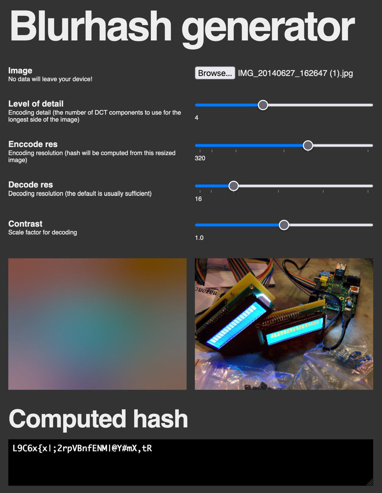                      | [blurhash](./blurhash/)                                       | Interactive & reactive image blurhash generator                                                         |
| 007 | 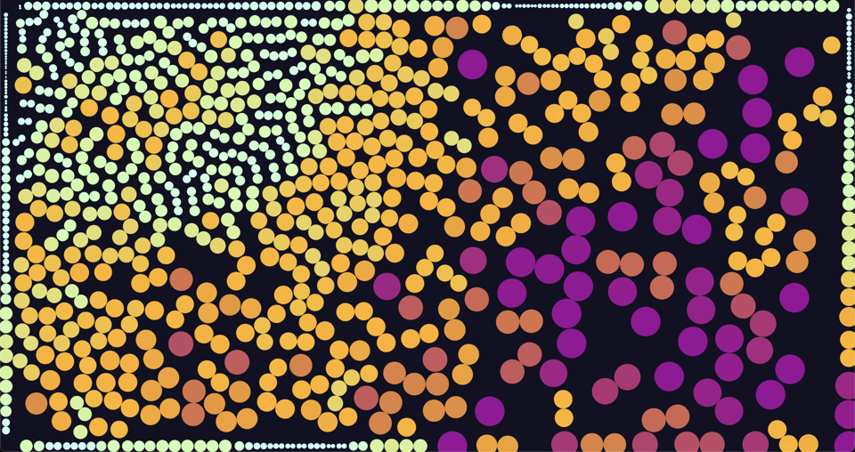                   | [boid-basics](./boid-basics/)                                 | Basic 2D boid simulation and spatial indexing neighbor lookups                                          |
| 008 |             | [calibration-sheet](./calibration-sheet/)                     | Parametrically design calibration sheet for B&W photography                                             |
| 009 |                    | [canvas-dial](./canvas-dial/)                                 | Canvas based dial widget                                                                                |
| 010 | 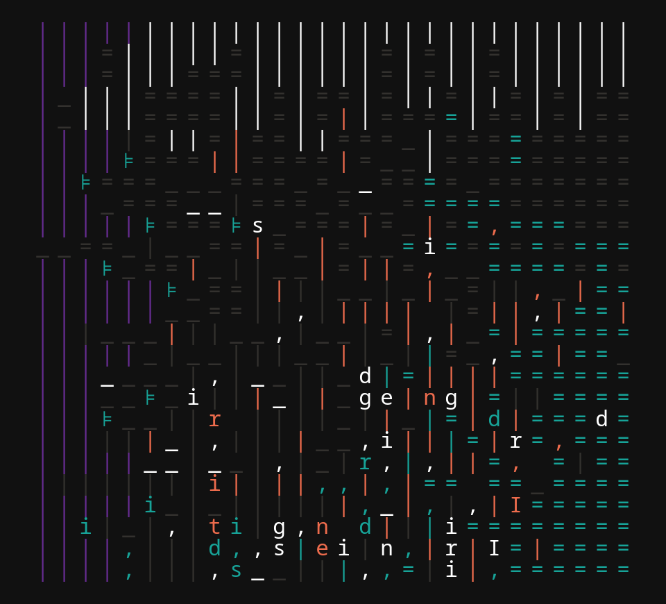               | [canvas-recorder](./canvas-recorder/)                         | Self-modifying, animated typographic grid with emergent complex patterns                                |
| 011 |              | [cellular-automata](./cellular-automata/)                     | 2D transducer based cellular automata                                                                   |
| 012 |                | [color-contrast](./color-contrast/)                           | Tool to interactively compute & visualize color contrasts against WCAG threshold                        |
| 013 |                   | [color-themes](./color-themes/)                               | Probabilistic color theme generator                                                                     |
| 014 |                 | [commit-heatmap](./commit-heatmap/)                           | Heatmap visualization of this mono-repo's commits                                                       |
| 015 |               | [commit-table-ssr](./commit-table-ssr/)                       | Filterable commit log UI w/ minimal server to provide commit history                                    |
| 016 |                   | [crypto-chart](./crypto-chart/)                               | Basic crypto-currency candle chart with multiple moving averages plots                                  |
| 017 | 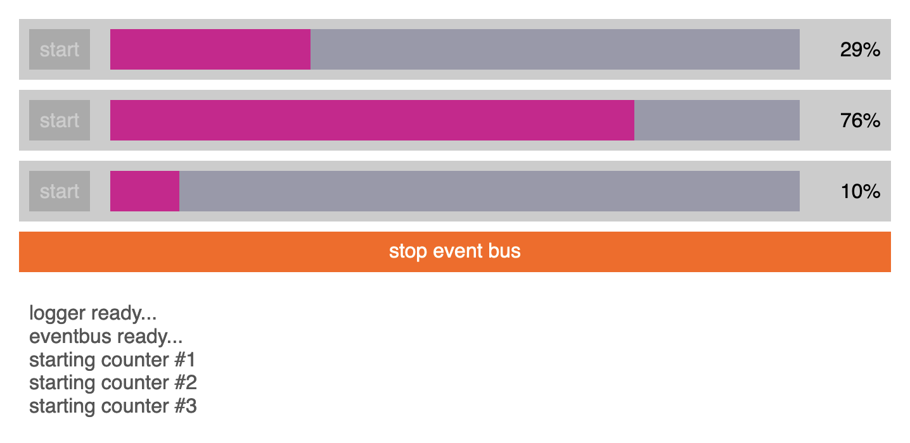                       | [csp-bus](./csp-bus/)                                         | CSP channel-based event handling, async transducers & reactive UI components                            |
| 018 |                                                                               | [devcards](./devcards/)                                       | BMI calculator in a devcards format                                                                     |
| 019 |                | [dominant-colors](./dominant-colors/)                         | Color palette generation via dominant color extraction from uploaded images                             |
| 020 |              | [ellipse-proximity](./ellipse-proximity/)                     | Interactive visualization of closest points on ellipses                                                 |
| 021 |                      | [fft-synth](./fft-synth/)                                     | Interactive inverse FFT toy synth                                                                       |
| 022 |                   | [fiber-basics](./fiber-basics/)                               | Fiber-based cooperative multitasking basics                                                             |
| 023 |                  | [fisheye-menu](./fisheye-menu/)                               | Fisheye menu list component for thi.ng/rdom                                                             |
| 024 | 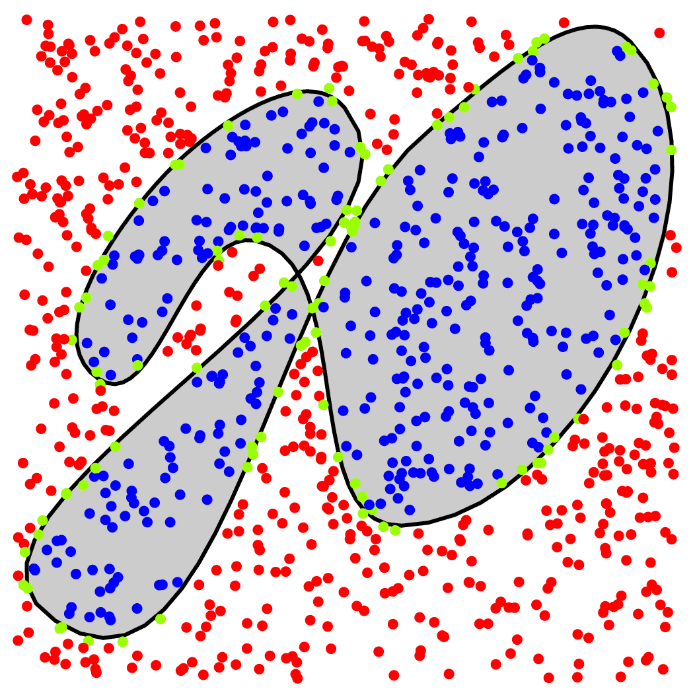           | [geom-classify-point](./geom-classify-point/)                 | Polygon point classification (inside/boundary/outside)                                                  |
| 025 | 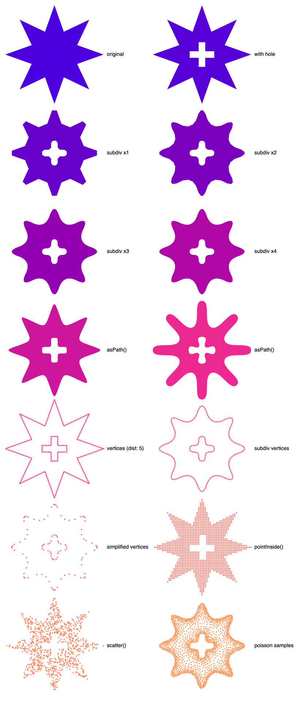             | [geom-complex-poly](./geom-complex-poly/)                     | Shape conversions & operations using polygons with holes                                                |
| 026 |               | [geom-convex-hull](./geom-convex-hull/)                       | Convex hull & shape clipping of 2D polygons                                                             |
| 027 | 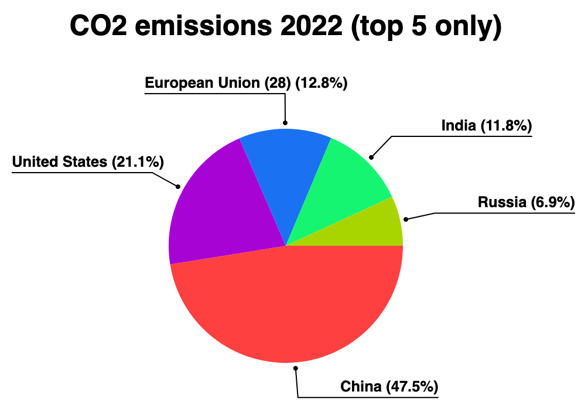             | [geom-csv-piechart](./geom-csv-piechart/)                     | Piechart visualization of CSV data                                                                      |
| 028 | 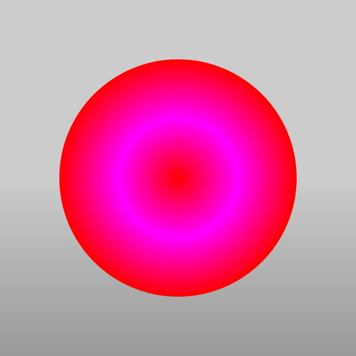             | [geom-extra-hiccup](./geom-extra-hiccup/)                     | Embedding thi.ng/hiccup data/elements in thi.ng/geom shape hierarchies                                  |
| 029 |                          | [geom-fuzz-basics](./geom-fuzz-basics/)                       | geom-fuzz basic shape & fill examples                                                                   |
| 030 | 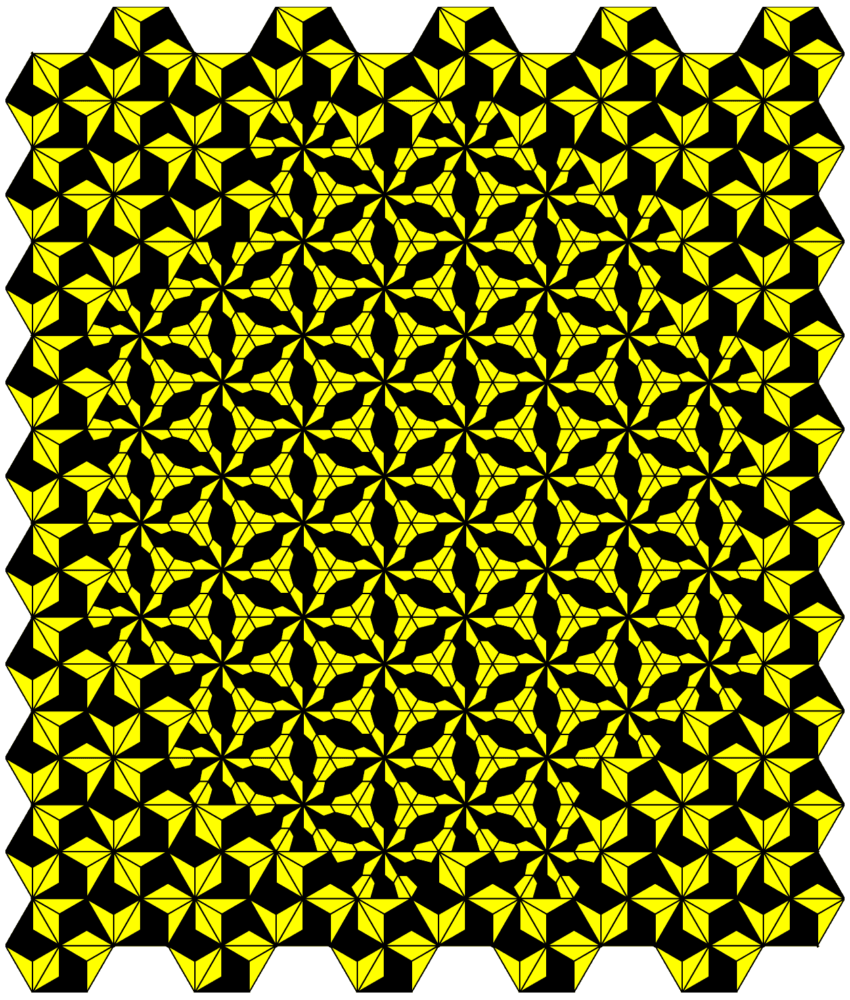                  | [geom-hexgrid](./geom-hexgrid/)                               | Hex grid generation & tessellations                                                                     |
| 031 |                       | [geom-knn](./geom-knn/)                                       | Doodle w/ K-nearest neighbor search result visualization                                                |
| 032 |                  | [geom-knn-hash](./geom-knn-hash/)                             | K-nearest neighbor search in an hash grid                                                               |
| 033 | 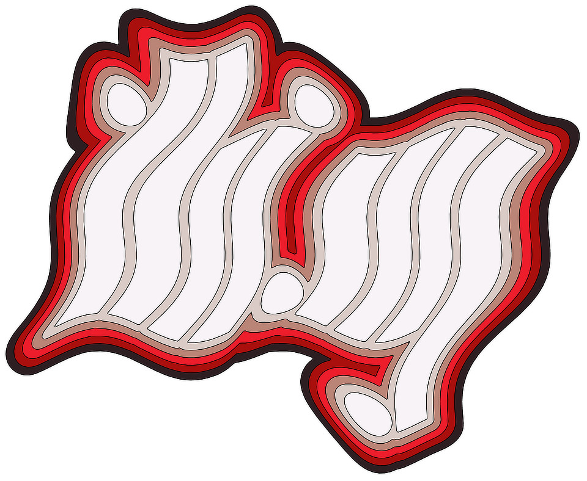                 | [geom-sdf-logo](./geom-sdf-logo/)                             | (Re)Constructing the thi.ng logo using a 2D signed-distance field                                       |
| 034 |                  | [geom-sdf-path](./geom-sdf-path/)                             | SVG path to SDF, applying deformation and converting back to SVG                                        |
| 035 |               | [geom-terrain-viz](./geom-terrain-viz/)                       | 2.5D hidden line visualization of digital elevation files (DEM)                                         |
| 036 |                             | [geom-tessel](./geom-tessel/)                                 | Animated, recursive polygon tessellations                                                               |
| 037 | 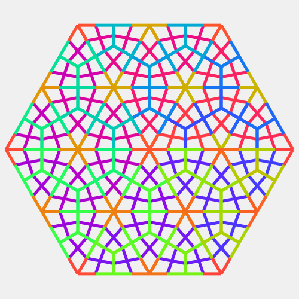             | [geom-unique-edges](./geom-unique-edges/)                     | Iterating the unique edges of a tessellation                                                            |
| 038 |               | [geom-voronoi-mst](./geom-voronoi-mst/)                       | Poisson-disk shape-aware sampling, Voronoi & Minimum Spanning Tree visualization                        |
| 039 | 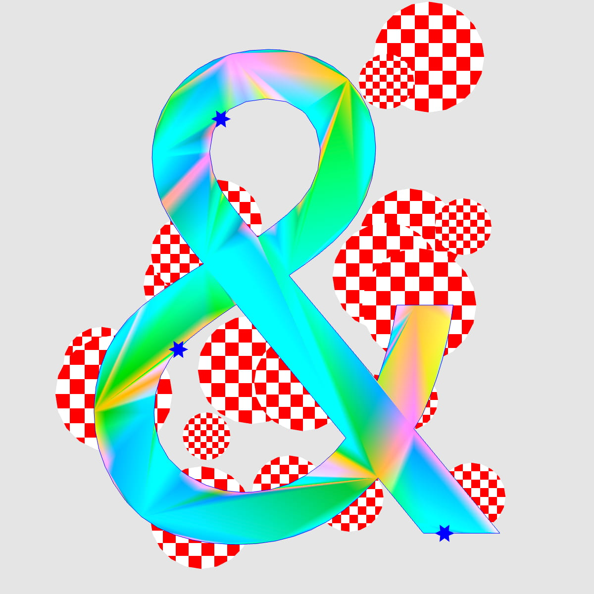        | [geom-webgl-attrib-pool](./geom-webgl-attrib-pool/)           | Augmenting thi.ng/geom shapes for WebGL, using instancing & attribute buffers                           |
| 040 | 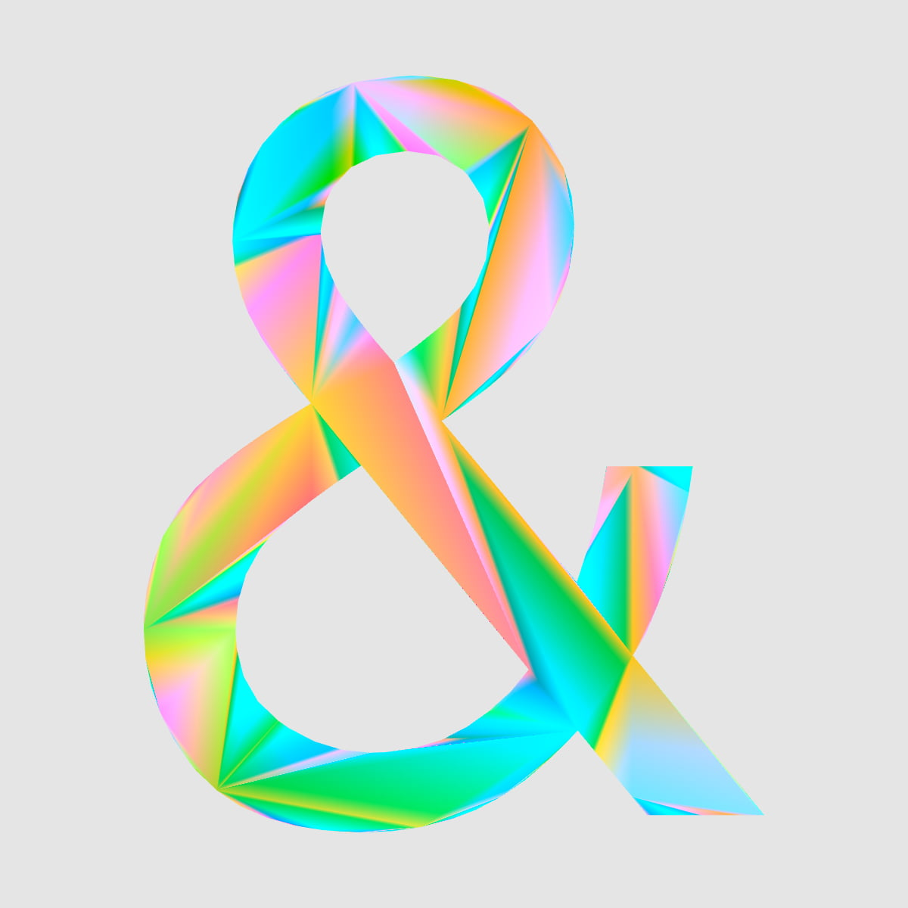             | [geom-webgl-basics](./geom-webgl-basics/)                     | Converting thi.ng/geom shape types for WebGL                                                            |
| 041 |               | [gesture-analysis](./gesture-analysis/)                       | Mouse gesture / stroke analysis, simplification, corner detection                                       |
| 042 |                                                                               | [gpgpu-reduce](./gpgpu-reduce/)                               | GPU-based data reduction using thi.ng/shader-ast & WebGL multi-pass pipeline                            |
| 043 |                 | [grid-iterators](./grid-iterators/)                           | Visualization of different grid iterator strategies                                                     |
| 044 |                         | [hdiff](./hdiff/)                                             | Applying thi.ng/hdiff to generate static HTML diff output                                               |
| 045 |                                                                               | [hdom-basics](./hdom-basics/)                                 | Minimal hdom usage example                                                                              |
| 046 |                 | [hdom-benchmark](./hdom-benchmark/)                           | hdom update performance benchmark (old version)                                                         |
| 047 |                | [hdom-benchmark2](./hdom-benchmark2/)                         | hdom update performance benchmark w/ config options                                                     |
| 048 |              | [hdom-canvas-clock](./hdom-canvas-clock/)                     | Realtime analog clock demo                                                                              |
| 049 |               | [hdom-canvas-draw](./hdom-canvas-draw/)                       | Interactive pattern drawing demo using transducers                                                      |
| 050 |          | [hdom-canvas-particles](./hdom-canvas-particles/)             | 2D Bezier curve-guided particle system                                                                  |
| 051 |  | [hdom-canvas-shapes](./hdom-canvas-shapes/)                   | Various hdom-canvas shape drawing examples & SVG conversion / export                                    |
| 052 |                                                                               | [hdom-dropdown](./hdom-dropdown/)                             | Custom dropdown UI component for hdom                                                                   |
| 053 |                                                                               | [hdom-dropdown-fuzzy](./hdom-dropdown-fuzzy/)                 | Custom dropdown UI component w/ fuzzy search                                                            |
| 054 |                                                                               | [hdom-dyn-context](./hdom-dyn-context/)                       | Using custom hdom context for dynamic UI theming                                                        |
| 055 |                                                                               | [hdom-elm](./hdom-elm/)                                       | Using hdom in an Elm-like manner                                                                        |
| 056 |                                                                               | [hdom-inner-html](./hdom-inner-html/)                         | Higher-order component for rendering HTML strings                                                       |
| 057 |                                                                               | [hdom-local-render](./hdom-local-render/)                     | Isolated, component-local DOM updates                                                                   |
| 058 |                                                                               | [hdom-localstate](./hdom-localstate/)                         | UI component w/ local state stored in hdom context                                                      |
| 059 |                                                                               | [hdom-skip](./hdom-skip/)                                     | Skipping UI updates for selected component(s)                                                           |
| 060 |                                                                               | [hdom-skip-nested](./hdom-skip-nested/)                       | Skipping UI updates for nested component(s)                                                             |
| 061 |                                                                               | [hdom-theme](./hdom-theme/)                                   | Example for themed components proposal                                                                  |
| 062 |                    | [hdom-toggle](./hdom-toggle/)                                 | Customizable slide toggle component demo                                                                |
| 063 |                                                                               | [hdom-vscroller](./hdom-vscroller/)                           | Virtual scroller component for large tables / lists                                                     |
| 064 | 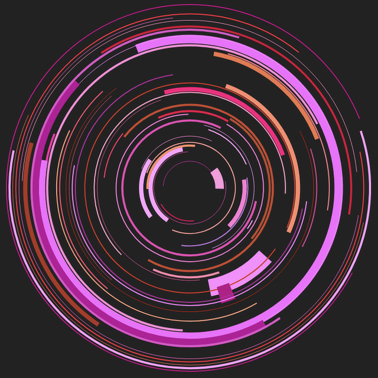            | [hiccup-canvas-arcs](./hiccup-canvas-arcs/)                   | Animated arcs & drawing using hiccup-canvas                                                             |
| 065 | 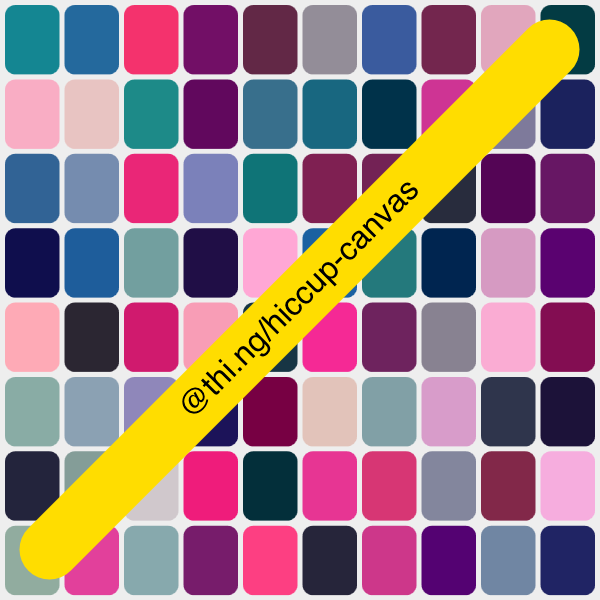          | [hiccup-canvas-basics](./hiccup-canvas-basics/)               | Basic hiccup-based canvas drawing                                                                       |
| 066 |    | [hiccup-css-image-transition](./hiccup-css-image-transition/) | Generating pure CSS image transitions                                                                   |
| 067 |                                                                               | [hydrate-basics](./hydrate-basics/)                           | Hiccup / hdom DOM hydration example                                                                     |
| 068 |                    | [ifs-fractal](./ifs-fractal/)                                 | Barnsley fern IFS fractal renderer                                                                      |
| 069 |                         | [imgui](./imgui/)                                             | Canvas based Immediate Mode GUI components                                                              |
| 070 |                   | [imgui-basics](./imgui-basics/)                               | Minimal IMGUI usage example                                                                             |
| 071 |                                                                               | [interceptor-basics](./interceptor-basics/)                   | Event handling w/ interceptors and side effects                                                         |
| 072 |                                                                               | [interceptor-basics2](./interceptor-basics2/)                 | Event handling w/ interceptors and side effects                                                         |
| 073 |                       | [iso-plasma](./iso-plasma/)                                   | Animated sine plasma effect visualized using contour lines                                              |
| 074 |                | [json-components](./json-components/)                         | Transforming JSON into UI components                                                                    |
| 075 |                     | [kmeans-viz](./kmeans-viz/)                                   | k-means clustering visualization                                                                        |
| 076 | 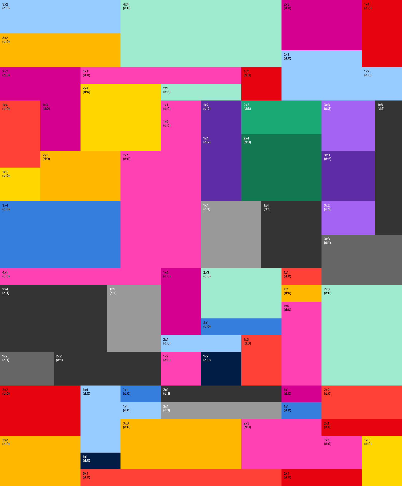                | [layout-gridgen](./layout-gridgen/)                           | Randomized space-filling, nested grid layout generator                                                  |
| 077 |                     | [lispy-repl](./lispy-repl/)                                   | Browser REPL for a Lispy S-expression based mini language                                               |
| 078 |                                                                               | [login-form](./login-form/)                                   | Basic SPA example with atom-based UI router                                                             |
| 079 |                     | [mandelbrot](./mandelbrot/)                                   | Worker based, interactive Mandelbrot visualization                                                      |
| 080 |                | [markdown](./markdown/)                                       | Markdown to Hiccup to HTML parser / transformer                                                         |
| 081 |                  | [mastodon-feed](./mastodon-feed/)                             | Mastodon API feed reader with support for different media types, fullscreen media modal, HTML rewriting |
| 082 | 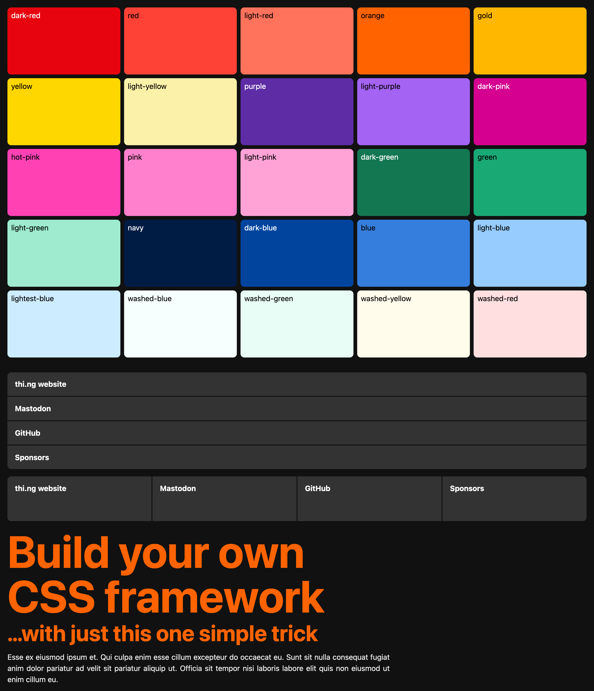               | [meta-css-basics](./meta-css-basics/)                         | Basic thi.ng/meta-css usage & testbed                                                                   |
| 083 |                                                                               | [multitouch](./multitouch/)                                   | Basic rstream-gestures multi-touch demo                                                                 |
| 084 |                  | [optical-flow](./optical-flow/)                               | Optical flow analysis of web cam or video inputs                                                        |
| 085 |                  | [package-stats](./package-stats/)                             | CLI util to visualize umbrella pkg stats                                                                |
| 086 |               | [parse-playground](./parse-playground/)                       | Parser grammar livecoding editor/playground & codegen                                                   |
| 087 |                      | [pixel-basics](./pixel-basics/)                               | Pixel buffer manipulations                                                                              |
| 088 | 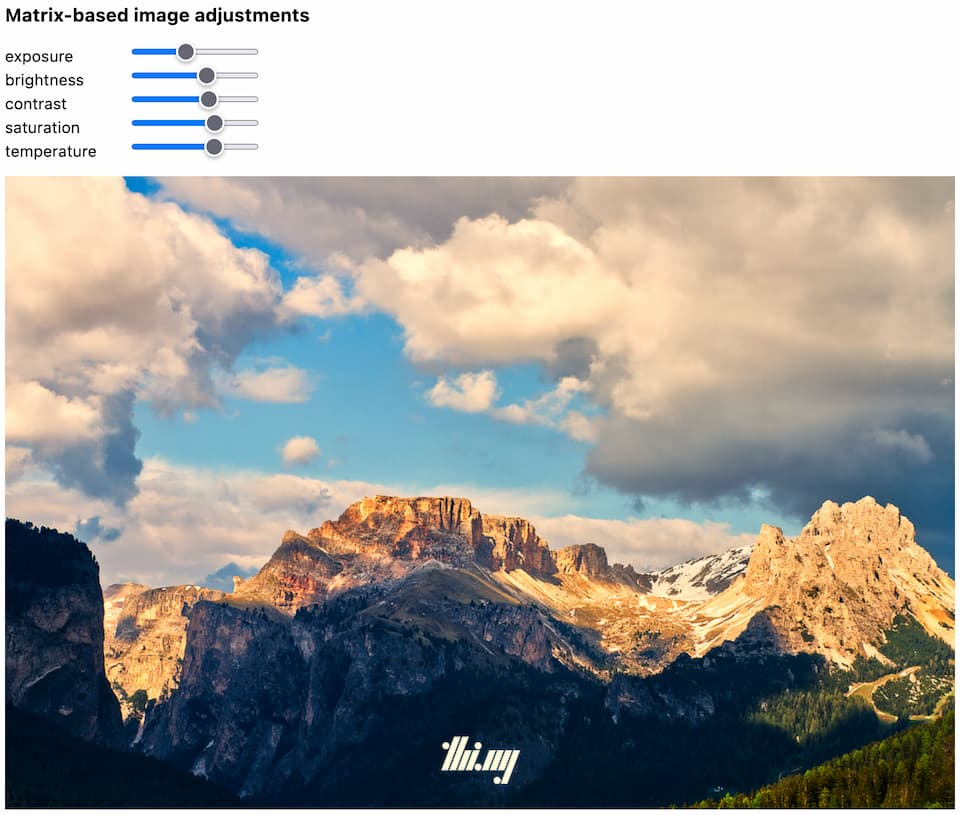             | [pixel-colormatrix](./pixel-colormatrix/)                     | Matrix-based image color adjustments                                                                    |
| 089 |                   | [pixel-dither](./pixel-dither/)                               | Showcase of various dithering algorithms                                                                |
| 090 | 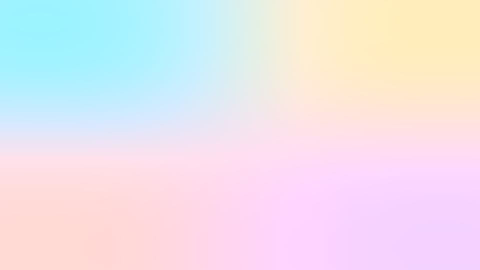               | [pixel-gradients](./pixel-gradients/)                         | Randomized 4-point 2D color gradient image generator                                                    |
| 091 |                  | [pixel-indexed](./pixel-indexed/)                             | Image dithering and remapping using indexed palettes                                                    |
| 092 |               | [pixel-normal-map](./pixel-normal-map/)                       | Normal map creation/conversion basics                                                                   |
| 093 |                  | [pixel-sorting](./pixel-sorting/)                             | Interactive pixel sorting tool using thi.ng/color & thi.ng/pixel                                        |
| 094 | 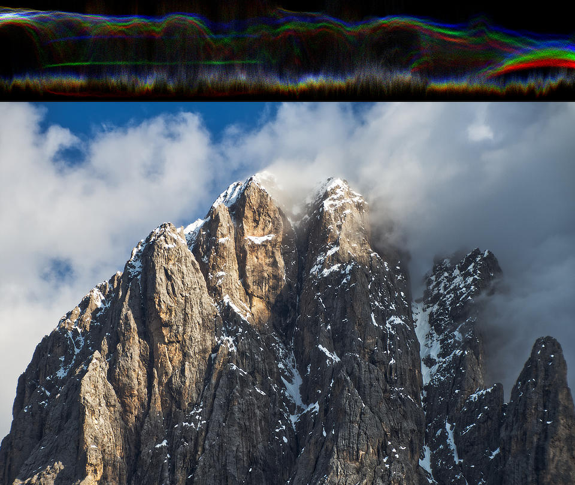                | [pixel-waveform](./pixel-waveform/)                           | RGB waveform image analysis                                                                             |
| 095 |                 | [pointfree-geom](./pointfree-geom/)                           | Live coding playground for 2D geometry generation using @thi.ng/pointfree-lang                          |
| 096 |                  | [pointfree-svg](./pointfree-svg/)                             | Generate SVG using pointfree DSL                                                                        |
| 097 |                         | [poisson-circles](./poisson-circles/)                         | 2D Poisson-disc sampler with procedural gradient map                                                    |
| 098 |                 | [poisson-image](./poisson-image/)                             | Image-based Poisson-disk sampling                                                                       |
| 099 |                    | [poly-spline](./poly-spline/)                                 | Polygon to cubic curve conversion & visualization                                                       |
| 100 | 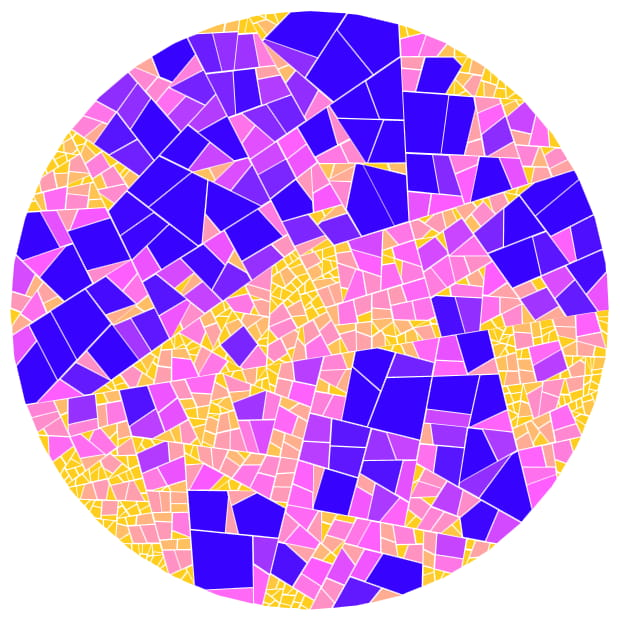                   | [poly-subdiv](./poly-subdiv/)                                 | Animated, iterative polygon subdivisions & visualization                                                |
| 101 |                | [porter-duff](./porter-duff/)                                 | Port-Duff image compositing / alpha blending                                                            |
| 102 | 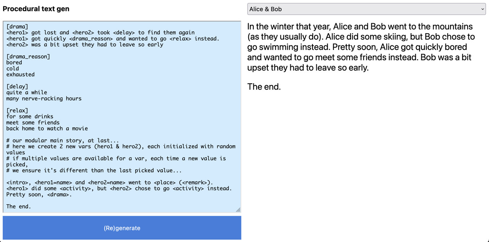               | [procedural-text](./procedural-text/)                         | Procedural stochastic text generation via custom DSL, parse grammar & AST transformation                |
| 103 | 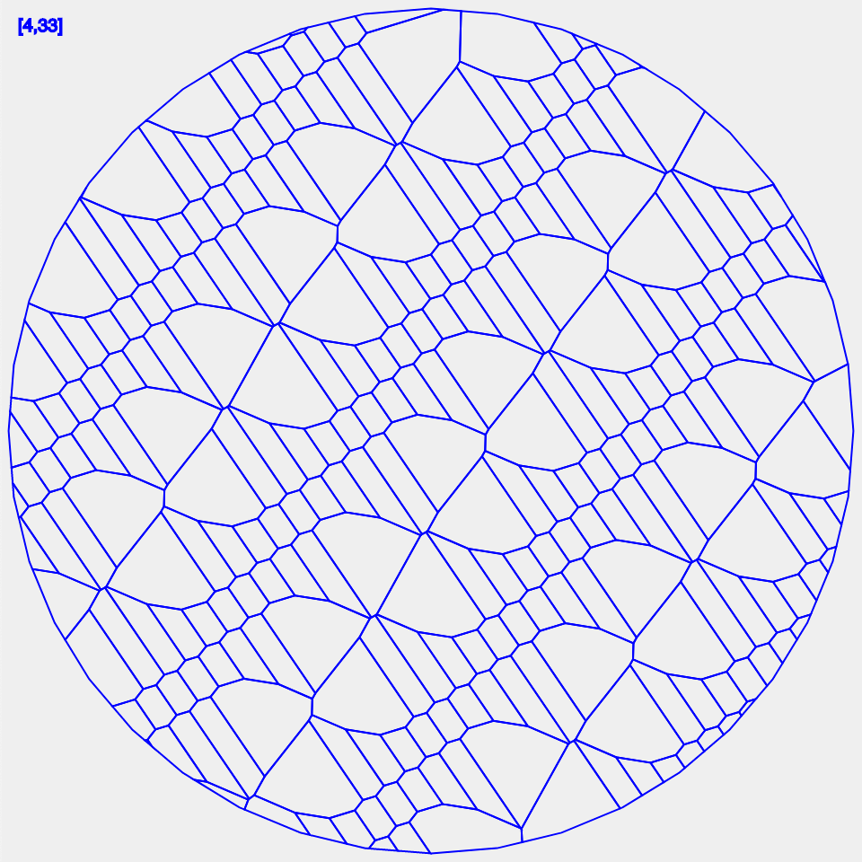                 | [quasi-lattice](./quasi-lattice/)                             | Quasi-random lattice generator                                                                          |
| 104 | 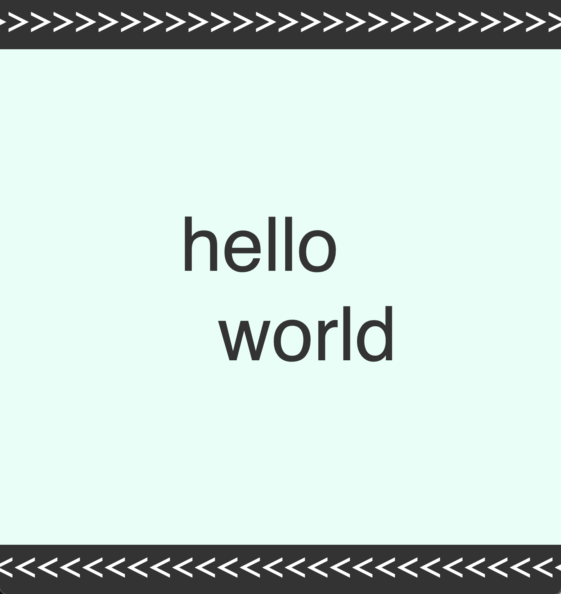              | [ramp-scroll-anim](./ramp-scroll-anim/)                       | Scroll-based, reactive, multi-param CSS animation basics                                                |
| 105 |                     | [ramp-synth](./ramp-synth/)                                   | Unison wavetable synth with waveform editor                                                             |
| 106 |                | [rasterize-blend](./rasterize-blend/)                         | Steering behavior drawing with alpha-blended shapes                                                     |
| 107 |                                                                               | [rdom-async](./rdom-async/)                                   | Basic & barebones usage of async iterables in thi.ng/rdom                                               |
| 108 |                                                                               | [rdom-basics](./rdom-basics/)                                 | Demonstates various rdom usage patterns                                                                 |
| 109 |             | [rdom-canvas-basics](./rdom-canvas-basics/)                   | Minimal rdom-canvas animation                                                                           |
| 110 |            | [rdom-delayed-update](./rdom-delayed-update/)                 | Dynamically loaded images w/ preloader state                                                            |
| 111 |                       | [rdom-dnd](./rdom-dnd/)                                       | rdom drag & drop example                                                                                |
| 112 | 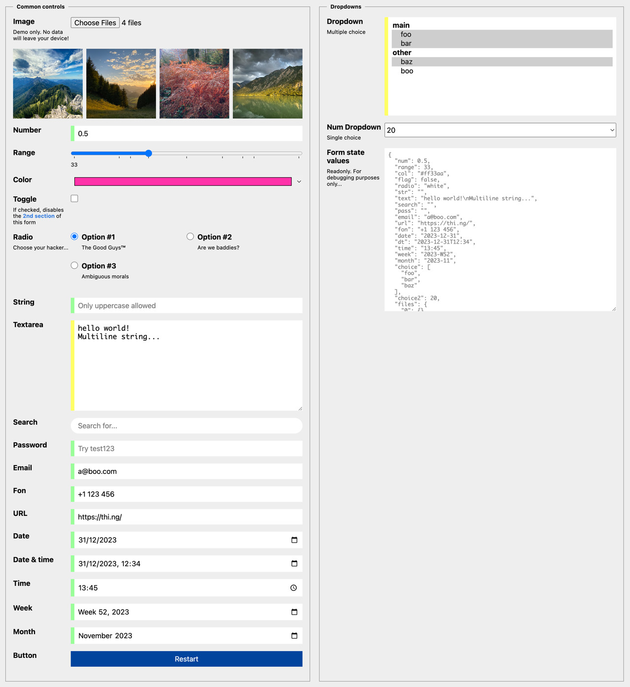                  | [rdom-formgen](./rdom-formgen/)                               | Basic usage of the declarative rdom-forms generator                                                     |
| 113 |             | [rdom-key-sequences](./rdom-key-sequences/)                   | rstream & transducer-based FSM for converting key event sequences into high-level commands              |
| 114 | 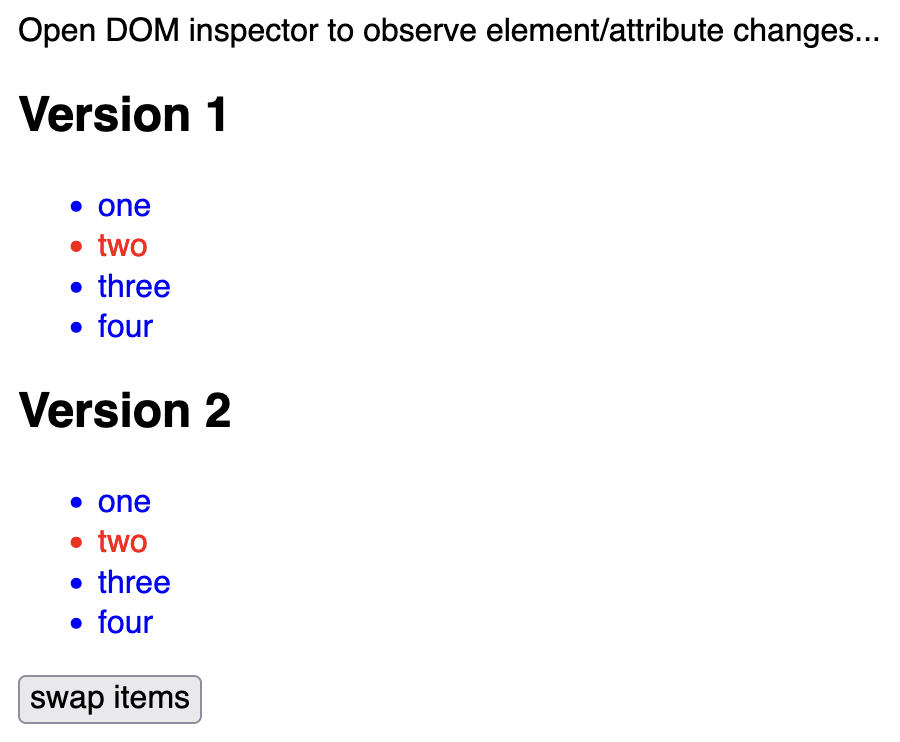                    | [rdom-klist](./rdom-klist/)                                   | Basic usage of thi.ng/rdom keyed list component wrapper                                                 |
| 115 | 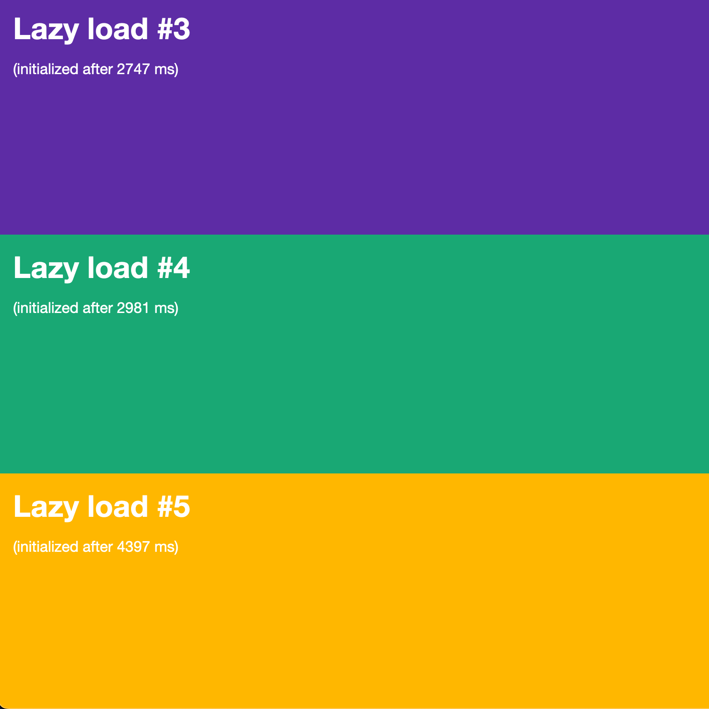                | [rdom-lazy-load](./rdom-lazy-load/)                           | Lazy loading components via @thi.ng/rdom                                                                |
| 116 |                 | [rdom-lissajous](./rdom-lissajous/)                           | rdom & hiccup-canvas interop test                                                                       |
| 117 | 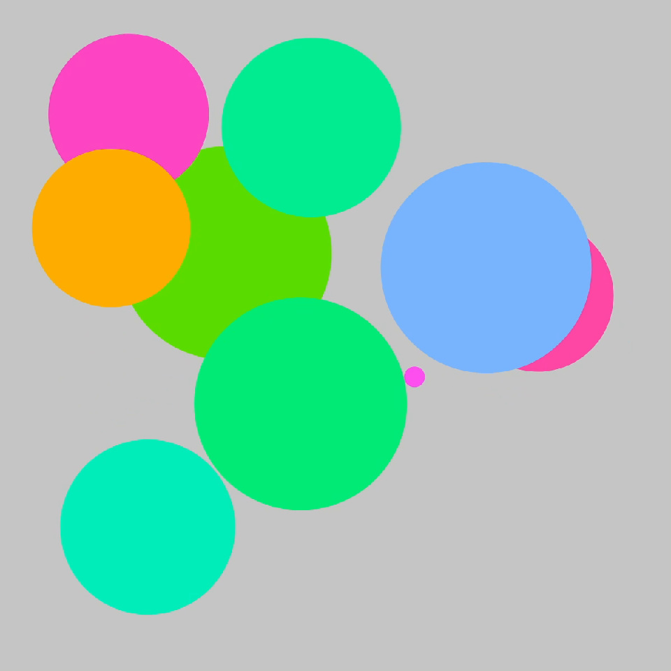             | [rdom-reactive-svg](./rdom-reactive-svg/)                     | Animated SVG elements with reactive attributes                                                          |
| 118 | 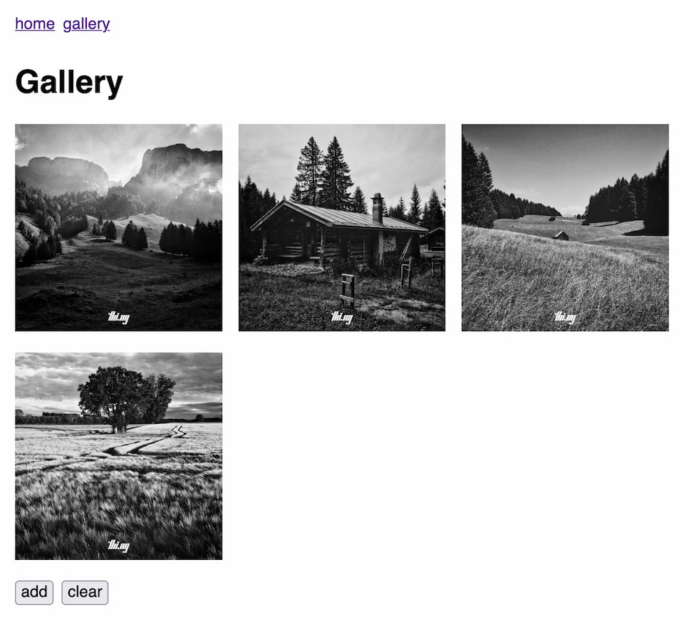                   | [rdom-router](./rdom-router/)                                 | Basic thi.ng/router usage with thi.ng/rdom components                                                   |
| 119 |                                                                               | [rdom-search-docs](./rdom-search-docs/)                       | Full umbrella repo doc string search w/ paginated results                                               |
| 120 |                 | [rdom-svg-nodes](./rdom-svg-nodes/)                           | rdom powered SVG graph with draggable nodes                                                             |
| 121 |            | [rdom-web-components](./rdom-web-components/)                 | Defining & using basic Web Components (with shadow DOM) via @thi.ng/rdom & @thi.ng/meta-css             |
| 122 | 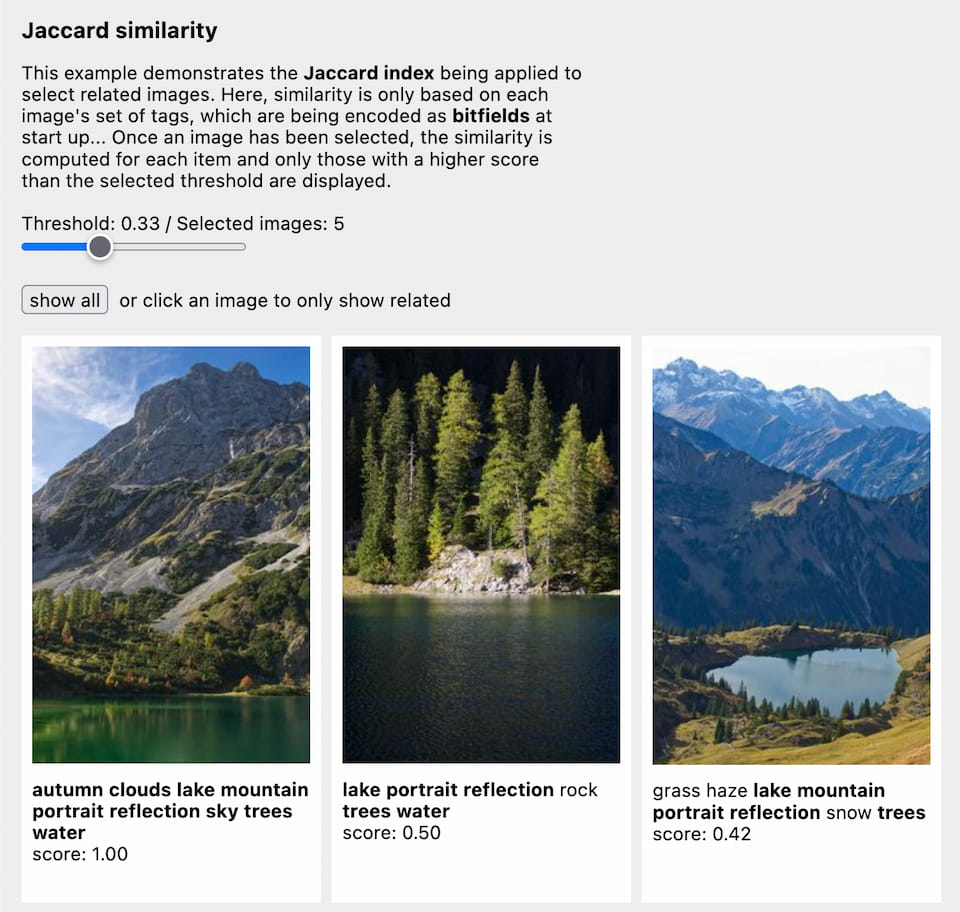                | [related-images](./related-images/)                           | Responsive image gallery with tag-based Jaccard similarity ranking                                      |
| 123 | 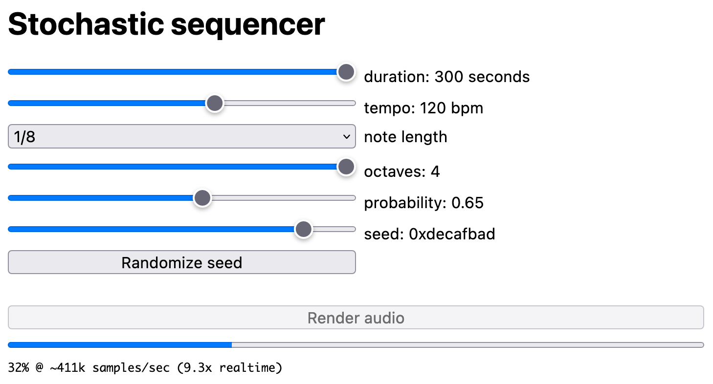                  | [render-audio](./render-audio/)                               | Generative audio synth offline renderer and WAV file export                                             |
| 124 |               | [rotating-voronoi](./rotating-voronoi/)                       | Animated Voronoi diagram, cubic splines & SVG download                                                  |
| 125 |                  | [router-basics](./router-basics/)                             | Complete mini SPA app w/ router & async content loading                                                 |
| 126 | 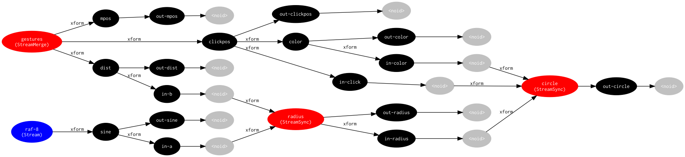                      | [rstream-dataflow](./rstream-dataflow/)                       | Minimal rstream dataflow graph                                                                          |
| 127 |             | [rstream-event-loop](./rstream-event-loop/)                   | Minimal demo of using rstream constructs to form an interceptor-style event loop                        |
| 128 |                   | [rstream-grid](./rstream-grid/)                               | Interactive grid generator, SVG generation & export, undo/redo support                                  |
| 129 |                                                                               | [rstream-hdom](./rstream-hdom/)                               | rstream based UI updates & state handling                                                               |
| 130 |            | [rstream-spreadsheet](./rstream-spreadsheet/)                 | rstream based spreadsheet w/ S-expression formula DSL                                                   |
| 131 |                   | [rstream-sync](./rstream-sync/)                               | Minimal rstream sync() example using rdom                                                               |
| 132 | 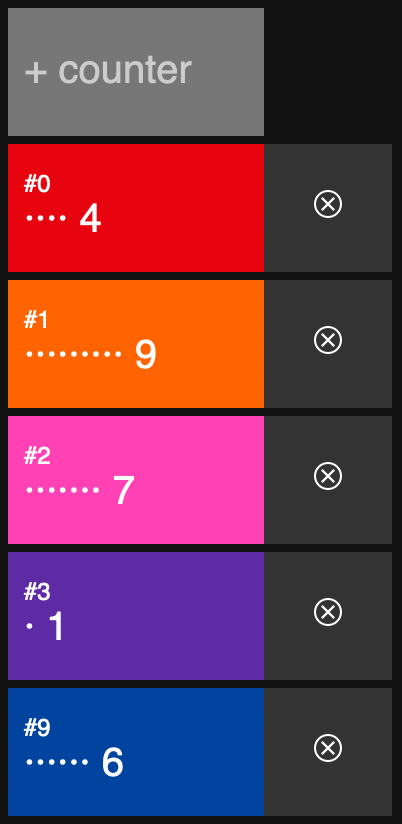            | [rstream-system-bus](./rstream-system-bus/)                   | Declarative component-based system with central rstream-based pubsub event bus                          |
| 133 |                     | [scenegraph](./scenegraph/)                                   | 2D scenegraph & shape picking                                                                           |
| 134 |               | [scenegraph-image](./scenegraph-image/)                       | 2D scenegraph & image map based geometry manipulation                                                   |
| 135 |           | [scenegraph-pan-zoom](./scenegraph-pan-zoom/)                 | Basic 2D scenegraph example with pan/zoom functionality                                                 |
| 136 |                | [shader-ast-canvas2d](./shader-ast-canvas2d/)                 | 2D canvas shader emulation                                                                              |
| 137 | 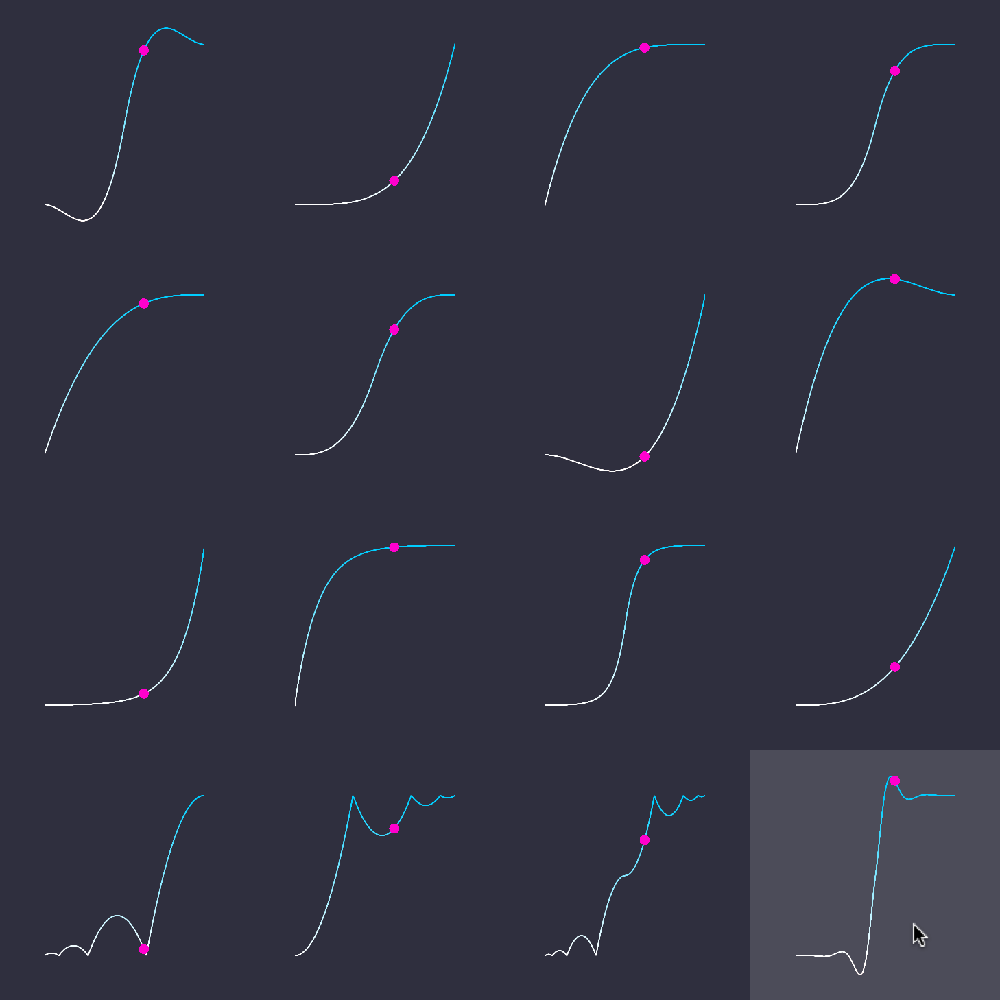            | [shader-ast-easings](./shader-ast-easings/)                   | Shader-AST meta-programming techniques for animated function plots                                      |
| 138 |                 | [shader-ast-evo](./shader-ast-evo/)                           | Evolutionary shader generation using genetic programming                                                |
| 139 |               | [shader-ast-noise](./shader-ast-noise/)                       | HOF shader procedural noise function composition                                                        |
| 140 |          | [shader-ast-raymarch](./shader-ast-raymarch/)                 | WebGL & JS canvas2D raymarch shader cross-compilation                                                   |
| 141 |               | [shader-ast-sdf2d](./shader-ast-sdf2d/)                       | WebGL & JS canvas 2D SDF                                                                                |
| 142 |              | [shader-ast-tunnel](./shader-ast-tunnel/)                     | WebGL & Canvas2D textured tunnel shader                                                                 |
| 143 |             | [shader-ast-workers](./shader-ast-workers/)                   | Fork-join worker-based raymarch renderer (JS/CPU only)                                                  |
| 144 |                   | [shader-graph](./shader-graph/)                               | Minimal shader graph developed during livestream #2                                                     |
| 145 | 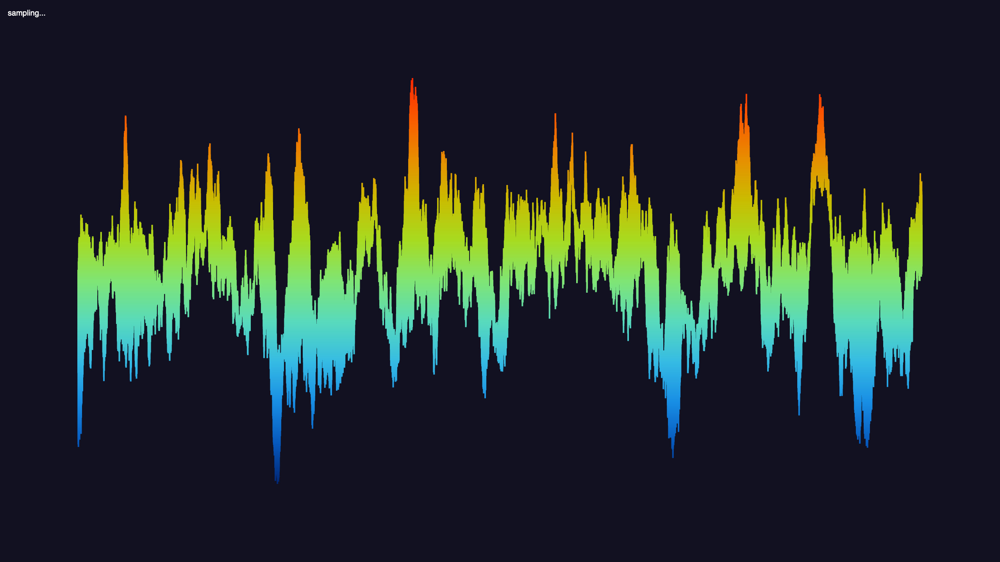                     | [simd-plot](./simd-plot/)                                     | Fitting, transforming & plotting 10k data points per frame using SIMD                                   |
| 146 |                   | [soa-ecs](./soa-ecs/)                                         | Entity Component System w/ 100k 3D particles                                                            |
| 147 |                 | [spline-tangent](./spline-tangent/)                           | Compute cubic spline position & tangent using Dual Numbers                                              |
| 148 |                 | [stacked-layout](./stacked-layout/)                           | Responsive & reactively computed stacked column layout                                                  |
| 149 |                 | [stratified-grid](./stratified-grid/)                         | 2D Stratified grid sampling example                                                                     |
| 150 |                   | [svg-barchart](./svg-barchart/)                               | Simplistic SVG bar chart component                                                                      |
| 151 |                                                                               | [svg-particles](./svg-particles/)                             | Basic 2D particle system w/ SVG shapes                                                                  |
| 152 |                   | [svg-resample](./svg-resample/)                               | SVG path parsing & dynamic resampling                                                                   |
| 153 |                   | [svg-waveform](./svg-waveform/)                               | Additive waveform synthesis & SVG visualization with undo/redo                                          |
| 154 |                    | [talk-slides](./talk-slides/)                                 | hdom based slide deck viewer & slides from my ClojureX 2018 keynote                                     |
| 155 |                    | [text-canvas](./text-canvas/)                                 | 3D wireframe textmode demo                                                                              |
| 156 |              | [text-canvas-image](./text-canvas-image/)                     | Textmode image warping w/ 16bit color output                                                            |
| 157 |                 | [thing-browser](./thing-browser/)                             | Tree-based UI to find & explore thi.ng projects via their associated keywords                           |
| 158 |           | [thing-packages-quiz](./thing-packages-quiz/)                 | thi.ng/rdom & thi.ng/rstream based quiz to guess thi.ng package names                                   |
| 159 |                      | [todo-list](./todo-list/)                                     | Obligatory to-do list example with undo/redo                                                            |
| 160 |                   | [trace-bitmap](./trace-bitmap/)                               | Multi-layer vectorization & dithering of bitmap images                                                  |
| 161 |                                                                               | [transducers-hdom](./transducers-hdom/)                       | Transducer & rstream based hdom UI updates                                                              |
| 162 |                   | [triple-query](./triple-query/)                               | Triple store query results & sortable table                                                             |
| 163 |                   | [tsne-colors](./tsne-colors/)                                 | Animated t-SNE visualization of 4D data                                                                 |
| 164 |               | [unbiased-normals](./unbiased-normals/)                       | Visual comparison of biased vs. unbiased normal vectors projected on the surface of a sphere            |
| 165 |               | [viz-ridge-lines](./viz-ridge-lines/)                         | Interactive ridge-line plot                                                                             |
| 166 |              | [viz-scatter-plot](./viz-scatter-plot/)                       | Interactive scatter & line plot of low-discrepancy samples                                              |
| 167 |                     | [webgl-arcball](./webgl-arcball/)                             | 3D arcball controller to rotate the camera view of a colored cube                                       |
| 168 |            | [webgl-channel-mixer](./webgl-channel-mixer/)                 | rdom & WebGL-based image channel editor                                                                 |
| 169 |                     | [webgl-cube](./webgl-cube/)                                   | WebGL multi-colored cube mesh                                                                           |
| 170 |                  | [webgl-cubemap](./webgl-cubemap/)                             | WebGL cube maps with async texture loading                                                              |
| 171 |                | [webgl-float-fbo](./webgl-float-fbo/)                         | Drawing to floating point offscreen / multi-pass shader pipeline                                        |
| 172 |             | [webgl-game-of-life](./webgl-game-of-life/)                   | Game of Life implemented as WebGL2 multi-pass shader pipeline                                           |
| 173 |                     | [webgl-grid](./webgl-grid/)                                   | WebGL instancing, animated grid                                                                         |
| 174 |                     | [webgl-msdf](./webgl-msdf/)                                   | WebGL MSDF text rendering & particle system                                                             |
| 175 |                                                                               | [webgl-multipass](./webgl-multipass/)                         | Minimal multi-pass / GPGPU example                                                                      |
| 176 |                | [webgl-shadertoy](./webgl-shadertoy/)                         | Shadertoy-like WebGL setup                                                                              |
| 177 |                     | [webgl-ssao](./webgl-ssao/)                                   | WebGL screenspace ambient occlusion                                                                     |
| 178 | 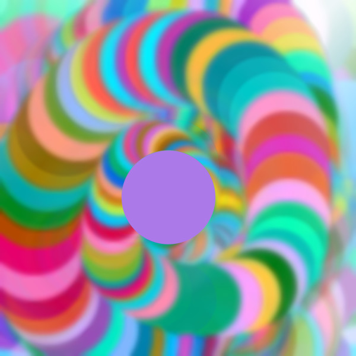           | [webgl-texture-paint](./webgl-texture-paint/)                 | Interactively drawing to & reading from a WebGL offscreen render texture                                |
| 179 |                        | [wolfram](./wolfram/)                                         | 1D Wolfram automata with OBJ point cloud export                                                         |
| 180 |                  | [xml-converter](./xml-converter/)                             | XML/HTML/SVG to hiccup/JS conversion                                                                    |
| 181 |                     | [zig-canvas](./zig-canvas/)                                   | Zig-based DOM creation & canvas drawing app                                                             |
| 182 |                   | [zig-cellular](./zig-cellular/)                               | Zig-based 2D multi-behavior cellular automata                                                           |
| 183 |                    | [zig-counter](./zig-counter/)                                 | Simple Zig/WASM click counter DOM component                                                             |
| 184 |                  | [zig-todo-list](./zig-todo-list/)                             | Zig-based To-Do list, DOM creation, local storage task persistence                                      |
| 185 |                     | [zig-webgl](./zig-webgl/)                                     | Basic Zig/WebAssembly WebGL demo                                                                        |
