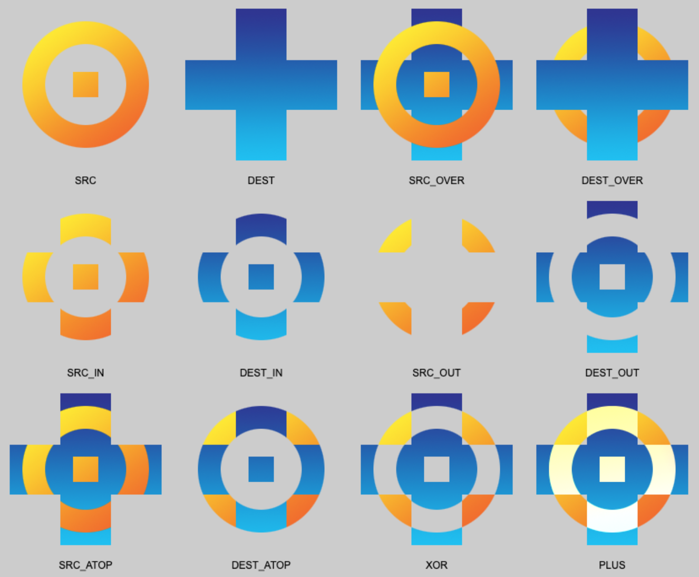

<!-- This file is autogenerated - DO NOT EDIT! -->
# @thi.ng/umbrella examples

This directory contains a growing number (currently 108) of standalone
example projects, including live online versions, build instructions
and commented source code.

If you want to [contribute](../CONTRIBUTING.md) an example, please get
in touch via PR, issue tracker, email or twitter!

| #   | Screenshot                                                                    | Name                                              | Description                                                                      |
|:----|:------------------------------------------------------------------------------|:--------------------------------------------------|:---------------------------------------------------------------------------------|
| 001 |             | [adaptive-threshold](./adaptive-threshold/)       | Interactive image processing (adaptive threshold)                                |
| 002 |                                                                               | [async-effect](./async-effect/)                   | Minimal demo using interceptors with an async side effect                        |
| 003 |                       | [big-font](./big-font/)                           | Large ASCII font text generator using @thi.ng/rdom                               |
| 004 |                    | [bitmap-font](./bitmap-font/)                     | Figlet-style bitmap font creation with transducers                               |
| 005 |                    | [canvas-dial](./canvas-dial/)                     | Canvas based dial widget                                                         |
| 006 |              | [cellular-automata](./cellular-automata/)         | 2D transducer based cellular automata                                            |
| 007 |                   | [color-themes](./color-themes/)                   | Probabilistic color theme generator                                              |
| 008 |                 | [commit-heatmap](./commit-heatmap/)               | Heatmap visualization of this mono-repo's commits                                |
| 009 |               | [commit-table-ssr](./commit-table-ssr/)           | Filterable commit log UI w/ minimal server to provide commit history             |
| 010 |                   | [crypto-chart](./crypto-chart/)                   | Basic crypto-currency candle chart with multiple moving averages plots           |
| 011 |                                                                               | [devcards](./devcards/)                           | BMI calculator in a devcards format                                              |
| 012 |                | [dominant-colors](./dominant-colors/)             | Color palette generation via dominant color extraction from uploaded images      |
| 013 |              | [ellipse-proximity](./ellipse-proximity/)         | Interactive visualization of closest points on ellipses                          |
| 014 |                      | [fft-synth](./fft-synth/)                         | Interactive inverse FFT toy synth                                                |
| 015 |               | [geom-convex-hull](./geom-convex-hull/)           | Convex hull & shape clipping of 2D polygons                                      |
| 016 |                          | [geom-fuzz-basics](./geom-fuzz-basics/)           | geom-fuzz basic shape & fill examples                                            |
| 017 |                       | [geom-knn](./geom-knn/)                           | Doodle w/ K-nearest neighbor search result visualization                         |
| 018 |                             | [geom-tessel](./geom-tessel/)                     | Animated, recursive polygon tessellations                                        |
| 019 |               | [geom-voronoi-mst](./geom-voronoi-mst/)           | Poisson-disk shape-aware sampling, Voronoi & Minimum Spanning Tree visualization |
| 020 |               | [gesture-analysis](./gesture-analysis/)           | Mouse gesture / stroke analysis, simplification, corner detection                |
| 021 |                 | [grid-iterators](./grid-iterators/)               | Visualization of different grid iterator strategies                              |
| 022 |                                                                               | [hdom-basics](./hdom-basics/)                     | Minimal hdom usage example                                                       |
| 023 |                 | [hdom-benchmark](./hdom-benchmark/)               | hdom update performance benchmark (old version)                                  |
| 024 |                | [hdom-benchmark2](./hdom-benchmark2/)             | hdom update performance benchmark w/ config options                              |
| 025 |              | [hdom-canvas-clock](./hdom-canvas-clock/)         | Realtime analog clock demo                                                       |
| 026 |               | [hdom-canvas-draw](./hdom-canvas-draw/)           | Interactive pattern drawing demo using transducers                               |
| 027 |          | [hdom-canvas-particles](./hdom-canvas-particles/) | 2D Bezier curve-guided particle system                                           |
| 028 |  | [hdom-canvas-shapes](./hdom-canvas-shapes/)       | Various hdom-canvas shape drawing examples & SVG conversion / export             |
| 029 |                                                                               | [hdom-dropdown](./hdom-dropdown/)                 | Custom dropdown UI component for hdom                                            |
| 030 |                                                                               | [hdom-dropdown-fuzzy](./hdom-dropdown-fuzzy/)     | Custom dropdown UI component w/ fuzzy search                                     |
| 031 |                                                                               | [hdom-dyn-context](./hdom-dyn-context/)           | Using custom hdom context for dynamic UI theming                                 |
| 032 |                                                                               | [hdom-elm](./hdom-elm/)                           | Using hdom in an Elm-like manner                                                 |
| 033 |                                                                               | [hdom-inner-html](./hdom-inner-html/)             | Higher-order component for rendering HTML strings                                |
| 034 |                                                                               | [hdom-local-render](./hdom-local-render/)         | Isolated, component-local DOM updates                                            |
| 035 |                                                                               | [hdom-localstate](./hdom-localstate/)             | UI component w/ local state stored in hdom context                               |
| 036 |                                                                               | [hdom-skip](./hdom-skip/)                         | Skipping UI updates for selected component(s)                                    |
| 037 |                                                                               | [hdom-skip-nested](./hdom-skip-nested/)           | Skipping UI updates for nested component(s)                                      |
| 038 |                                                                               | [hdom-theme](./hdom-theme/)                       | Example for themed components proposal                                           |
| 039 |                    | [hdom-toggle](./hdom-toggle/)                     | Customizable slide toggle component demo                                         |
| 040 |                                                                               | [hdom-vscroller](./hdom-vscroller/)               | Virtual scroller component for large tables / lists                              |
| 041 |             | [hiccup-canvas-arcs](./hiccup-canvas-arcs/)       | Animated arcs & drawing using hiccup-canvas                                      |
| 042 |                                                                               | [hydrate-basics](./hydrate-basics/)               | Hiccup / hdom DOM hydration example                                              |
| 043 |                         | [imgui](./imgui/)                                 | Canvas based Immediate Mode GUI components                                       |
| 044 |                   | [imgui-basics](./imgui-basics/)                   | Minimal IMGUI usage example                                                      |
| 045 |                                                                               | [interceptor-basics](./interceptor-basics/)       | Event handling w/ interceptors and side effects                                  |
| 046 |                                                                               | [interceptor-basics2](./interceptor-basics2/)     | Event handling w/ interceptors and side effects                                  |
| 047 |                       | [iso-plasma](./iso-plasma/)                       | Animated sine plasma effect visualized using contour lines                       |
| 048 |                | [json-components](./json-components/)             | Transforming JSON into UI components                                             |
| 049 |                                                                               | [login-form](./login-form/)                       | Basic SPA example with atom-based UI router                                      |
| 050 |                     | [mandelbrot](./mandelbrot/)                       | Worker based, interactive Mandelbrot visualization                               |
| 051 |                | [markdown](./markdown/)                           | Minimal Markdown to Hiccup to HTML parser / transformer                          |
| 052 |                                                                               | [multitouch](./multitouch/)                       | Basic rstream-gestures multi-touch demo                                          |
| 053 |                  | [package-stats](./package-stats/)                 | CLI util to visualize umbrella pkg stats                                         |
| 054 |               | [parse-playground](./parse-playground/)           | Parser grammar livecoding editor/playground & codegen                            |
| 055 |                      | [pixel-basics](./pixel-basics/)                   | Pixel buffer manipulations                                                       |
| 056 |                   | [pixel-dither](./pixel-dither/)                   | Showcase of various dithering algorithms                                         |
| 057 |                  | [pixel-indexed](./pixel-indexed/)                 | Image dithering and remapping using indexed palettes                             |
| 058 |                  | [pixel-sorting](./pixel-sorting/)                 | Interactive pixel sorting tool using thi.ng/color & thi.ng/pixel                 |
| 059 |                  | [pointfree-svg](./pointfree-svg/)                 | Generate SVG using pointfree DSL                                                 |
| 060 |                         | [poisson-circles](./poisson-circles/)             | 2D Poisson-disc sampler with procedural gradient map                             |
| 061 |                    | [poly-spline](./poly-spline/)                     | Polygon to cubic curve conversion & visualization                                |
| 062 |                | [porter-duff](./porter-duff/)                     | Port-Duff image compositing / alpha blending                                     |
| 063 |                     | [ramp-synth](./ramp-synth/)                       | Unison wavetable synth with waveform editor                                      |
| 064 |                                                                               | [rdom-basics](./rdom-basics/)                     | Demonstates various rdom usage patterns                                          |
| 065 |            | [rdom-delayed-update](./rdom-delayed-update/)     | Dynamically loaded images w/ preloader state                                     |
| 066 |                       | [rdom-dnd](./rdom-dnd/)                           | rdom drag & drop example                                                         |
| 067 |                 | [rdom-lissajous](./rdom-lissajous/)               | rdom & hiccup-canvas interop test                                                |
| 068 |                                                                               | [rdom-search-docs](./rdom-search-docs/)           | Full umbrella repo doc string search w/ paginated results                        |
| 069 |                 | [rdom-svg-nodes](./rdom-svg-nodes/)               | rdom powered SVG graph with draggable nodes                                      |
| 070 |               | [rotating-voronoi](./rotating-voronoi/)           | Animated Voronoi diagram, cubic splines & SVG download                           |
| 071 |                  | [router-basics](./router-basics/)                 | Complete mini SPA app w/ router & async content loading                          |
| 072 |                                                                               | [rstream-dataflow](./rstream-dataflow/)           | Minimal rstream dataflow graph                                                   |
| 073 |             | [rstream-event-loop](./rstream-event-loop/)       | Minimal demo of using rstream constructs to form an interceptor-style event loop |
| 074 |                   | [rstream-grid](./rstream-grid/)                   | Interactive grid generator, SVG generation & export, undo/redo support           |
| 075 |                                                                               | [rstream-hdom](./rstream-hdom/)                   | rstream based UI updates & state handling                                        |
| 076 |            | [rstream-spreadsheet](./rstream-spreadsheet/)     | rstream based spreadsheet w/ S-expression formula DSL                            |
| 077 |                     | [scenegraph](./scenegraph/)                       | 2D scenegraph & shape picking                                                    |
| 078 |               | [scenegraph-image](./scenegraph-image/)           | 2D scenegraph & image map based geometry manipulation                            |
| 079 |                | [shader-ast-canvas2d](./shader-ast-canvas2d/)     | 2D canvas shader emulation                                                       |
| 080 |                 | [shader-ast-evo](./shader-ast-evo/)               | Evolutionary shader generation using genetic programming                         |
| 081 |               | [shader-ast-noise](./shader-ast-noise/)           | HOF shader procedural noise function composition                                 |
| 082 |          | [shader-ast-raymarch](./shader-ast-raymarch/)     | WebGL & JS canvas2D raymarch shader cross-compilation                            |
| 083 |               | [shader-ast-sdf2d](./shader-ast-sdf2d/)           | WebGL & JS canvas 2D SDF                                                         |
| 084 |              | [shader-ast-tunnel](./shader-ast-tunnel/)         | WebGL & Canvas2D textured tunnel shader                                          |
| 085 |             | [shader-ast-workers](./shader-ast-workers/)       | Fork-join worker-based raymarch renderer (JS/CPU only)                           |
| 086 |                   | [shader-graph](./shader-graph/)                   | Minimal shader graph developed during livestream #2                              |
| 087 |                   | [soa-ecs](./soa-ecs/)                             | Entity Component System w/ 100k 3D particles                                     |
| 088 |                 | [spline-tangent](./spline-tangent/)               | Compute cubic spline position & tangent using Dual Numbers                       |
| 089 |                 | [stratified-grid](./stratified-grid/)             | 2D Stratified grid sampling example                                              |
| 090 |                   | [svg-barchart](./svg-barchart/)                   | Simplistic SVG bar chart component                                               |
| 091 |                                                                               | [svg-particles](./svg-particles/)                 | Basic 2D particle system w/ SVG shapes                                           |
| 092 |                   | [svg-waveform](./svg-waveform/)                   | Additive waveform synthesis & SVG visualization with undo/redo                   |
| 093 |                    | [talk-slides](./talk-slides/)                     | hdom based slide deck viewer & slides from my ClojureX 2018 keynote              |
| 094 |                    | [text-canvas](./text-canvas/)                     | 3D wireframe textmode demo                                                       |
| 095 |              | [text-canvas-image](./text-canvas-image/)         | Textmode image warping w/ 16bit color output                                     |
| 096 |                      | [todo-list](./todo-list/)                         | Obligatory to-do list example with undo/redo                                     |
| 097 |                                                                               | [transducers-hdom](./transducers-hdom/)           | Transducer & rstream based hdom UI updates                                       |
| 098 |                   | [triple-query](./triple-query/)                   | Triple store query results & sortable table                                      |
| 099 |                     | [webgl-cube](./webgl-cube/)                       | WebGL multi-colored cube mesh                                                    |
| 100 |                  | [webgl-cubemap](./webgl-cubemap/)                 | WebGL cube maps with async texture loading                                       |
| 101 |                | [webgl-float-fbo](./webgl-float-fbo/)             | TODO                                                                             |
| 102 |                     | [webgl-grid](./webgl-grid/)                       | WebGL instancing, animated grid                                                  |
| 103 |                     | [webgl-msdf](./webgl-msdf/)                       | WebGL MSDF text rendering & particle system                                      |
| 104 |                                                                               | [webgl-multipass](./webgl-multipass/)             | Minimal multi-pass / GPGPU example                                               |
| 105 |                | [webgl-shadertoy](./webgl-shadertoy/)             | Shadertoy-like WebGL setup                                                       |
| 106 |                     | [webgl-ssao](./webgl-ssao/)                       | WebGL screenspace ambient occlusion                                              |
| 107 |                        | [wolfram](./wolfram/)                             | 1D Wolfram automata with OBJ point cloud export                                  |
| 108 |                  | [xml-converter](./xml-converter/)                 | XML/HTML/SVG to hiccup/JS conversion                                             |
