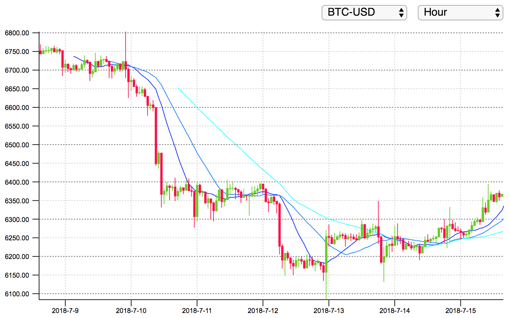

# crypto-chart

[Live demo](http://demo.thi.ng/umbrella/crypto-chart/)



This example demonstrates how to use
[@thi.ng/rstream](https://github.com/thi-ng/umbrella/tree/master/packages/rstream)
&
[@thi.ng/transducer](https://github.com/thi-ng/umbrella/tree/master/packages/transducer)
constructs to create a basic crypto-currency candle chart. Unlike most
other examples in this repo, there's no additional state handling used
(e.g. via
[@thi.ng/atom](https://github.com/thi-ng/umbrella/tree/master/packages/atom)
constructs) and the entire app largely relies on various stream
combinators & transformers. Furthermore, this approach only triggers UI
updates / diffs when there were any relevant upstream value changes.

```
git clone https://github.com/thi-ng/umbrella.git
cd umbrella/examples/crypto-chart
yarn install
yarn start
```

## Authors

- Karsten Schmidt

## License

&copy; 2018 Karsten Schmidt // Apache Software License 2.0
