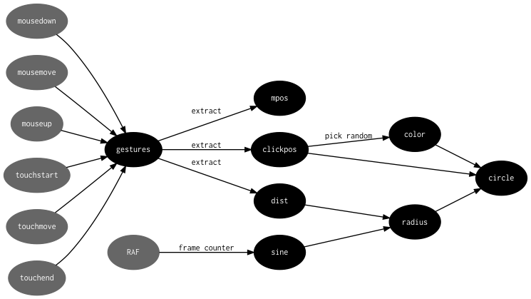

# rstream-dataflow

[Live demo](https://demo.thi.ng/umbrella/rstream-dataflow/)

```bash
git clone https://github.com/thi-ng/umbrella.git
cd umbrella/examples/rstream-dataflow
yarn install
yarn start
```

Installs all dependencies, runs `webpack-dev-server` and opens the app in your browser.

## About



This example combines the following packages to create & execute the
above dataflow graph in a declarative manner. The diagram generation
itself is part of the example and handled via the @thi.ng/rstream-dot
package.

- [@thi.ng/atom](https://github.com/thi-ng/umbrella/tree/master/packages/atom) - state container
- [@thi.ng/hdom](https://github.com/thi-ng/umbrella/tree/master/packages/hdom) - UI component rendering
- [@thi.ng/paths](https://github.com/thi-ng/umbrella/tree/master/packages/paths) - nested value accessors
- [@thi.ng/resolve-map](https://github.com/thi-ng/umbrella/tree/master/packages/resolve-map) - DAG-based object resolution
- [@thi.ng/rstream](https://github.com/thi-ng/umbrella/tree/master/packages/rstream) - reactive stream constructs
- [@thi.ng/rstream-dot](https://github.com/thi-ng/umbrella/tree/master/packages/rstream-dot) - GraphViz DOT output of graph topology
- [@thi.ng/rstream-gestures](https://github.com/thi-ng/umbrella/tree/master/packages/rstream-gestures) - unified mouse & single-touch event stream
- [@thi.ng/rstream-graph](https://github.com/thi-ng/umbrella/tree/master/packages/rstream-graph) - declarative dataflow graph creation
- [@thi.ng/transducers](https://github.com/thi-ng/umbrella/tree/master/packages/transducers) - data transformations (here used for stream transforms)

Please see detailed comments in the source code for further explanations.
