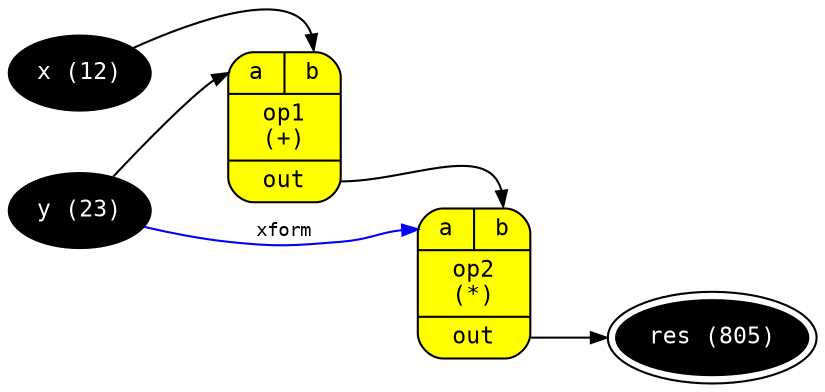

<!-- This file is generated - DO NOT EDIT! -->

# 

[](https://www.npmjs.com/package/@thi.ng/dot)

[](https://twitter.com/thing_umbrella)

This project is part of the
[@thi.ng/umbrella](https://github.com/thi-ng/umbrella/) monorepo.

- [About](#about)
- [Status](#status)
- [Related packages](#related-packages)
- [Installation](#installation)
- [Dependencies](#dependencies)
- [API](#api)
- [Authors](#authors)
- [License](#license)

## About

[Graphviz](http://www.graphviz.org/) document abstraction as vanilla JS
objects and serialization to DOT format.

Provides several
[interfaces](https://github.com/thi-ng/umbrella/tree/develop/packages/dot/src/api.ts)
covering a large subset of GraphViz options and
[functions](https://github.com/thi-ng/umbrella/tree/develop/packages/dot/src/serialize.ts)
to serialize whole graphs (incl. subgraphs), nodes or edges. Supports
both directed and undirected graphs.

Please see the [GraphViz DOT
guide](https://graphviz.gitlab.io/_pages/pdf/dotguide.pdf) for further
details.

## Status

**BETA** - possibly breaking changes forthcoming

[Search or submit any issues for this package](https://github.com/thi-ng/umbrella/issues?q=%5Bdot%5D+in%3Atitle)

## Related packages

- [@thi.ng/adjacency](https://github.com/thi-ng/umbrella/tree/develop/packages/adjacency) - Sparse & bitwise adjacency matrices and related functions for directed & undirected graphs
- [@thi.ng/dgraph](https://github.com/thi-ng/umbrella/tree/develop/packages/dgraph) - Type-agnostic directed acyclic graph (DAG) & graph operations

## Installation

```bash
yarn add @thi.ng/dot
```

ES module import:

```html
<script type="module" src="https://cdn.skypack.dev/@thi.ng/dot"></script>
```

[Skypack documentation](https://docs.skypack.dev/)

For Node.js REPL:

```text
# with flag only for < v16
node --experimental-repl-await

> const dot = await import("@thi.ng/dot");
```

Package sizes (gzipped, pre-treeshake): ESM: 729 bytes

## Dependencies

- [@thi.ng/api](https://github.com/thi-ng/umbrella/tree/develop/packages/api)
- [@thi.ng/checks](https://github.com/thi-ng/umbrella/tree/develop/packages/checks)

## API

[Generated API docs](https://docs.thi.ng/umbrella/dot/)


The source code of this example is also available in
[/test/example.ts](https://github.com/thi-ng/umbrella/tree/develop/packages/dot/test/example.ts).

```ts
import { serializeGraph } from "@thi.ng/dot";

// node type style presets
const terminal = {
    color: "black",
    fontcolor: "white",
};

// operator nodes use "Mrecord" shape
// with input and output port declarations
const operator = {
    fillcolor: "yellow",
    shape: "Mrecord",
    ins: { 0: "a", 1: "b" },
    outs: { "out": "out" }
};

serializeGraph({
    directed: true, // default
    // graph attributes
    attribs: {
        rankdir: "LR",
        fontname: "Inconsolata",
        fontsize: 9,
        fontcolor: "gray",
        label: "Generated with @thi.ng/dot",
        labeljust: "l",
        labelloc: "b",
        // node defaults
        node: {
            style: "filled",
            fontname: "Inconsolata",
            fontsize: 11
        },
        // edge defaults
        edge: {
            arrowsize: 0.75,
            fontname: "Inconsolata",
            fontsize: 9
        }
    },
    // graph nodes (the keys are used as node IDs)
    // use spread operator to inject style presets
    nodes: {
        x:   { ...terminal, label: "x (12)" },
        y:   { ...terminal, label: "y (23)" },
        res: { ...terminal, label: "result (8050)", peripheries: 2 },
        op1: { ...operator, fillcolor: "green", label: "op1\n(+)" },
        op2: { ...operator, label: "op2\n(*)" },
    },
    // graph edges (w/ optional ports & extra attribs)
    edges: [
        { src: "x", dest: "op1", destPort: 1 },
        { src: "y", dest: "op1", destPort: 0 },
        { src: "y", dest: "op2", destPort: 0, label: "xform", color: "blue" },
        { src: "op1", srcPort: "out", dest: "op2", destPort: 1 },
        { src: "op2", srcPort: "out", dest: "res"},
    ]
});
```

Resulting output:



## Authors

Karsten Schmidt

If this project contributes to an academic publication, please cite it as:

```bibtex
@misc{thing-dot,
  title = "@thi.ng/dot",
  author = "Karsten Schmidt",
  note = "https://thi.ng/dot",
  year = 2018
}
```

## License

&copy; 2018 - 2022 Karsten Schmidt // Apache Software License 2.0
