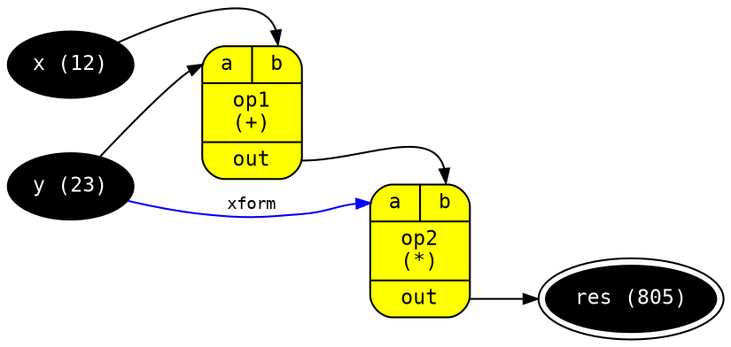

<!-- include ../../assets/tpl/header.md -->

<!-- toc -->

## About

[Graphviz](http://www.graphviz.org/) document abstraction as vanilla JS
objects and serialization to DOT format.

Provides several
[interfaces](https://github.com/thi-ng/umbrella/tree/develop/packages/dot/src/api.ts)
covering a large subset of GraphViz options and
[functions](https://github.com/thi-ng/umbrella/tree/develop/packages/dot/src/serialize.ts)
to serialize whole graphs (incl. subgraphs), nodes or edges. Supports
both directed and undirected graphs.

Please see the [GraphViz DOT
guide](https://graphviz.gitlab.io/_pages/pdf/dotguide.pdf) for further
details.

{{meta.status}}

{{repo.supportPackages}}

{{repo.relatedPackages}}

{{meta.blogPosts}}

## Installation

{{pkg.install}}

{{pkg.size}}

## Dependencies

{{pkg.deps}}

{{repo.examples}}

## API

{{pkg.docs}}


The source code of this example is also available in
[/test/example.ts](https://github.com/thi-ng/umbrella/tree/develop/packages/dot/test/example.ts).

```ts
import { serializeGraph } from "@thi.ng/dot";

// node type style presets
const terminal = {
    color: "black",
    fontcolor: "white",
};

// operator nodes use "Mrecord" shape
// with input and output port declarations
const operator = {
    fillcolor: "yellow",
    shape: "Mrecord",
    ins: { 0: "a", 1: "b" },
    outs: { "out": "out" }
};

serializeGraph({
    directed: true, // default
    // graph attributes
    attribs: {
        rankdir: "LR",
        fontname: "Inconsolata",
        fontsize: 9,
        fontcolor: "gray",
        label: "Generated with @thi.ng/dot",
        labeljust: "l",
        labelloc: "b",
        // node defaults
        node: {
            style: "filled",
            fontname: "Inconsolata",
            fontsize: 11
        },
        // edge defaults
        edge: {
            arrowsize: 0.75,
            fontname: "Inconsolata",
            fontsize: 9
        }
    },
    // graph nodes (the keys are used as node IDs)
    // use spread operator to inject style presets
    nodes: {
        x:   { ...terminal, label: "x (12)" },
        y:   { ...terminal, label: "y (23)" },
        res: { ...terminal, label: "result (8050)", peripheries: 2 },
        op1: { ...operator, fillcolor: "green", label: "op1\n(+)" },
        op2: { ...operator, label: "op2\n(*)" },
    },
    // graph edges (w/ optional ports & extra attribs)
    edges: [
        { src: "x", dest: "op1", destPort: 1 },
        { src: "y", dest: "op1", destPort: 0 },
        { src: "y", dest: "op2", destPort: 0, label: "xform", color: "blue" },
        { src: "op1", srcPort: "out", dest: "op2", destPort: 1 },
        { src: "op2", srcPort: "out", dest: "res"},
    ]
});
```

Resulting output:



<!-- include ../../assets/tpl/footer.md -->
