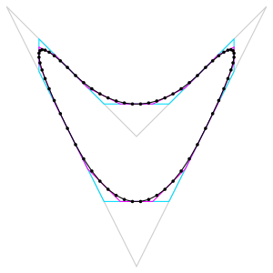
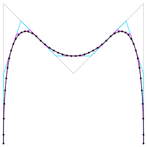

<!-- This file is generated - DO NOT EDIT! -->
<!-- Please see: https://github.com/thi-ng/umbrella/blob/develop/CONTRIBUTING.md#changes-to-readme-files -->

# 

[](https://www.npmjs.com/package/@thi.ng/geom-subdiv-curve)

[](https://mastodon.thi.ng/@toxi)

This project is part of the
[@thi.ng/umbrella](https://github.com/thi-ng/umbrella/) monorepo and anti-framework.

- [About](#about)
- [Status](#status)
- [Related packages](#related-packages)
- [Installation](#installation)
- [Dependencies](#dependencies)
- [API](#api)
- [Authors](#authors)
- [License](#license)

## About

Freely customizable, iterative nD subdivision curves for open / closed geometries. This is a support package for [@thi.ng/geom](https://github.com/thi-ng/umbrella/tree/develop/packages/geom).

Based in principle on:

- [Generating subdivision curves with L−systems on a
  GPU](http://algorithmicbotany.org/papers/subgpu.sig2003.pdf)
- Clojure version [thi.ng/geom-clj](http://thi.ng/geom-clj).

Supplied / implemented subdivision schemes:

- Split @ midpoints (open / closed)
- Split @ thirds (open / closed)
- Chaikin (open / closed)
- Cubic (closed only)

| Chaikin (closed)                                        | Chaikin (open)                                      |
|---------------------------------------------------------|-----------------------------------------------------|
|  |  |

## Status

**STABLE** - used in production

[Search or submit any issues for this package](https://github.com/thi-ng/umbrella/issues?q=%5Bgeom-subdiv-curve%5D+in%3Atitle)

## Related packages

- [@thi.ng/geom-splines](https://github.com/thi-ng/umbrella/tree/develop/packages/geom-splines) - nD cubic & quadratic curve analysis, conversion, interpolation, splitting

## Installation

```bash
yarn add @thi.ng/geom-subdiv-curve
```

ES module import:

```html
<script type="module" src="https://cdn.skypack.dev/@thi.ng/geom-subdiv-curve"></script>
```

[Skypack documentation](https://docs.skypack.dev/)

For Node.js REPL:

```js
const geomSubdivCurve = await import("@thi.ng/geom-subdiv-curve");
```

Package sizes (brotli'd, pre-treeshake): ESM: 661 bytes

## Dependencies

- [@thi.ng/api](https://github.com/thi-ng/umbrella/tree/develop/packages/api)
- [@thi.ng/geom-api](https://github.com/thi-ng/umbrella/tree/develop/packages/geom-api)
- [@thi.ng/transducers](https://github.com/thi-ng/umbrella/tree/develop/packages/transducers)
- [@thi.ng/vectors](https://github.com/thi-ng/umbrella/tree/develop/packages/vectors)

## API

[Generated API docs](https://docs.thi.ng/umbrella/geom-subdiv-curve/)

```ts
import * as gsc from "@thi.ng/geom-subdiv-curve";

gsc.subdivide([[0,0], [100,0], [100,100], [0,100]], gsc.SUBDIV_CHAIKIN_CLOSED, 4)
```

## Authors

- [Karsten Schmidt](https://thi.ng)

If this project contributes to an academic publication, please cite it as:

```bibtex
@misc{thing-geom-subdiv-curve,
  title = "@thi.ng/geom-subdiv-curve",
  author = "Karsten Schmidt",
  note = "https://thi.ng/geom-subdiv-curve",
  year = 2016
}
```

## License

&copy; 2016 - 2023 Karsten Schmidt // Apache License 2.0
