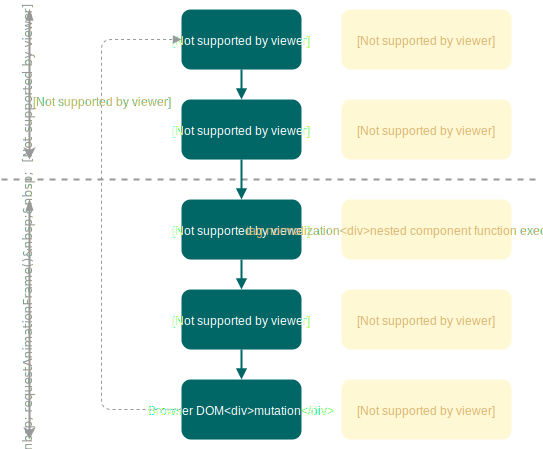

# @thi.ng/hdom

[](https://www.npmjs.com/package/@thi.ng/hdom)

This project is part of the
[@thi.ng/umbrella](https://github.com/thi-ng/umbrella/) monorepo.

<!-- TOC depthFrom:2 depthTo:3 -->

- [About](#about)
    - [Minimal example](#minimal-example)
    - [Component tree translation](#component-tree-translation)
    - [Event & state handling options](#event--state-handling-options)
    - [Reusable components](#reusable-components)
- [Status](#status)
- [Installation](#installation)
- [Dependencies](#dependencies)
- [Usage](#usage)
    - [User context injection](#user-context-injection)
    - [Component objects & life cycle methods](#component-objects--life-cycle-methods)
- [Example projects](#example-projects)
    - [Interactive SVG grid generator](#interactive-svg-grid-generator)
    - [Interactive additive waveform visualization](#interactive-additive-waveform-visualization)
    - [Dataflow graph SVG components](#dataflow-graph-svg-components)
    - [SPA with router and event bus](#spa-with-router-and-event-bus)
    - [Additive waveform synthesis & SVG visualization](#additive-waveform-synthesis--svg-visualization)
    - [Multiple apps with & without shared state](#multiple-apps-with--without-shared-state)
    - [Interceptor based event handling](#interceptor-based-event-handling)
    - [Todo list](#todo-list)
    - [Cellular automata](#cellular-automata)
    - [SVG particles](#svg-particles)
    - [JSON based components](#json-based-components)
    - [@thi.ng/rstream dataflow graph](#thingrstream-dataflow-graph)
    - [Basic usage patterns](#basic-usage-patterns)
    - [Benchmark](#benchmark)
- [Authors](#authors)
- [License](#license)

<!-- /TOC -->

## About

Lightweight reactive DOM components & VDOM implementation using only
vanilla JS data structures (arrays, objects with life cycle functions,
closures, iterators), based on
[@thi.ng/hiccup](https://github.com/thi-ng/umbrella/tree/master/packages/hiccup).

- Use the full expressiveness of ES6 / TypeScript to define, annotate &
  document components
- Clean, functional component composition and reuse
- No pre-processing / pre-compilation steps
- [Supports
  SVG](https://github.com/thi-ng/umbrella/tree/master/packages/hiccup-svg),
  arbitrary elements, attributes, events
- Less verbose than HTML / JSX, resulting in smaller file sizes
- Static components can be distributed as JSON (or [transform JSON
  into components](https://github.com/thi-ng/umbrella/tree/master/examples/json-components))
- Optional user context injection (an arbitrary object passed to all
  component functions)
- auto-deref of embedded value wrappers which implement the
  [@thi.ng/api/IDeref](https://github.com/thi-ng/umbrella/tree/master/packages/api/api)
  interface (e.g. atoms, cursors, derived views, streams etc.)
- CSS conversion from JS objects for `style` attribs
- Suitable for server side rendering (by passing the same data structure
  to @thi.ng/hiccup's `serialize()`)
- Fairly fast (see benchmark example below)
- Only ~4.4KB gzipped

In addition to the descriptions in this file, [further information and
examples are available in the
wiki](https://github.com/thi-ng/umbrella/wiki/hdom-recipes).

Also see the [work-in-progress
ADRs](https://github.com/thi-ng/umbrella/tree/master/packages/hdom-components/adr/)
for component configuration.

### Minimal example

```ts
import * as hdom from "@thi.ng/hdom";

// stateless component w/ params
// the first arg is an auto-injected context object
// (not used here, see `hdom-context-basics` example for details)
const greeter = (_, name) => ["h1.title", "hello ", name];

// component w/ local state
const counter = (i = 0) => {
    return () => ["button", { onclick: () => (i++) }, `clicks: ${i}`];
};

const app = () => {
    // initialization steps
    // ...
    // root component is just a static array
    return ["div#app", [greeter, "world"], counter(), counter(100)];
};

// start update loop (browser only, see diagram below)
hdom.start(document.body, app());

// alternatively apply DOM tree only once
// (stateful components won't update though)
hdom.createDOM(document.body, hdom.normalizeTree(app()));
```

[Live demo](https://demo.thi.ng/umbrella/hdom-basics/) |
[standalone example](https://github.com/thi-ng/umbrella/tree/master/examples/hdom-basics)

Alternatively, use the same component function for browser or server
side HTML serialization (Note: does not emit attributes w/ functions as
values, e.g. a button's `onclick` attrib).

```ts
import { serialize } from "@thi.ng/hiccup";

console.log(serialize(app()));
// <div id="app"><h1 class="title">hello world</h1><button>clicks: 0</button><button>clicks: 100</button></div>
```

No template engine & no pre-compilation steps needed, just use the full
expressiveness of ES6/TypeScript to define your DOM tree. Using
TypeScript gives the additional benefit of making UI components strongly
typed, and since they're just normal functions, can use generics,
overrides, varargs etc.

### Component tree translation

The actual DOM update is based on the minimal edit set of the recursive
difference between the old and new DOM trees (both expressed as nested
JS arrays). Components can be defined as static arrays, closures or
objects with [life cycle methods](#lifecycle-methods) (init, render,
release).



The syntax is inspired by Clojure's
[Hiccup](https://github.com/weavejester/hiccup) and
[Reagent](http://reagent-project.github.io/) projects, however the
latter is a wrapper around React, whereas this library is standalone,
more low-level & less opinionated.

### Event & state handling options

Since this package is purely dealing with the translation of DOM trees,
any form of state / event handling or routing required by a full app is
out of scope. These features are provided by the following packages and
can be used in a mix & match manner:

- [@thi.ng/atom](https://github.com/thi-ng/umbrella/tree/master/packages/atom)
- [@thi.ng/interceptors](https://github.com/thi-ng/umbrella/tree/master/packages/interceptors)
- [@thi.ng/router](https://github.com/thi-ng/umbrella/tree/master/packages/router)
- [@thi.ng/rstream](https://github.com/thi-ng/umbrella/tree/master/packages/rstream)
- [@thi.ng/transducers](https://github.com/thi-ng/umbrella/tree/master/packages/transducers)

### Reusable components

A currently small (but growing) number of reusable components are
provided by these packages:

- [@thi.ng/hdom-components](https://github.com/thi-ng/umbrella/tree/master/packages/hdom-components)
- [@thi.ng/hiccup-svg](https://github.com/thi-ng/umbrella/tree/master/packages/hiccup-svg)

## Status

The overall "API" is stable, but there's further work planned on
generalizing the approach beyond standard browser DOM use cases (planned
for v4.0.0). The project has been used for several projects in
production since 2016.

## Installation

```bash
yarn add @thi.ng/hdom
```

Use the customizable
[create-hdom-app](https://github.com/thi-ng/create-hdom-app) project
generator to create a pre-configured app skeleton using @thi.ng/atom,
@thi.ng/hdom, @thi.ng/interceptors & @thi.ng/router:

```bash
yarn create hdom-app my-app

cd my-app
yarn install
yarn start
```

## Dependencies

- [@thi.ng/api](https://github.com/thi-ng/umbrella/tree/master/packages/api)
- [@thi.ng/checks](https://github.com/thi-ng/umbrella/tree/master/packages/checks)
- [@thi.ng/diff](https://github.com/thi-ng/umbrella/tree/master/packages/diff)
- [@thi.ng/equiv](https://github.com/thi-ng/umbrella/tree/master/packages/equiv)
- [@thi.ng/hiccup](https://github.com/thi-ng/umbrella/tree/master/packages/hiccup)
- [@thi.ng/iterators](https://github.com/thi-ng/umbrella/tree/master/packages/iterators)

## Usage

Even though the overall approach should be obvious from the code
examples in this document, it's recommended to first study the
[@thi.ng/hiccup](https://github.com/thi-ng/umbrella/tree/master/packages/hiccup)
reference to learn about the basics of the approach and syntax used.
Both projects started in early 2016, have somewhat evolved
independently, however should be considered complementary.

#### `start(parent: Element | string, tree: any, ctx?: any, path?: number[], keys?: boolean, span?: boolean): () => boolean`

Main user function of this package. For most use cases, this function
should be the only one required in user code. It takes a parent DOM
element (or ID), hiccup tree (array, function or component object w/
life cycle methods) and an optional arbitrary context object. Starts RAF
update loop, in each iteration first normalizing given tree, then
computing diff to previous frame's tree and applying any changes to the
real DOM. The optional `context` arg can be used for passing global
config data or state down into the hiccup component tree. Any embedded
component function in the tree will receive this context object as first
argument, as will life cycle methods in component objects. See [context
description](#user-context) further below.

**Selective updates**: No updates will be applied if the given hiccup
tree is `undefined` or `null` or a root component function returns no
value. This way a given root component function can do some state
handling of its own and implement fail-fast checks to determine no DOM
updates are necessary, saving effort re-creating a new hiccup tree and
request skipping DOM updates via this function. In this case, the
previous DOM tree is kept around until the root function returns a tree
again, which then is diffed and applied against the previous tree kept
as usual. Any number of frames may be skipped this way.

**Important:** The parent element given is assumed to have NO children at
the time when `start()` is called. Since hdom does NOT track the real
DOM, the resulting changes will result in potentially undefined behavior
if the parent element wasn't empty.

Returns a function, which when called, immediately cancels the update
loop.

#### `normalizeTree(tree: any, ctx?: any): any`

Calling this function is a prerequisite before passing a component tree
to `diffElement`. Recursively expands given hiccup component tree into
its canonical form by:

- resolving Emmet-style tags (e.g. from `div#id.foo.bar`)
- evaluating embedded functions and replacing them with their result
- calling `render` life cycle method on component objects and using
  result
- consuming iterables and normalizing results
- calling `deref()` on elements implementing `IDeref` interface and
  using returned result
- calling `.toString()` on any other non-component value `x` and by
  default wrapping it in `["span", x]`. The only exceptions to this are:
  `option`, `textarea` and SVG `text` elements, for which spans are
  always skipped.

Additionally, unless `keys` is set to false, an unique `key` attribute
is created for each node in the tree. This attribute is used by
`diffElement` to determine if a changed node can be patched or will need
to be replaced/removed. The `key` values are defined by the `path` array
arg.

For normal usage only the first 2 args should be specified and the rest
kept at their defaults.

#### `diffElement(parent: Element, prev: any, curr: any): void`

Takes a DOM root element and two hiccup trees, `prev` and `curr`.
Recursively computes diff between both trees and applies any necessary
changes to reflect `curr` tree in real DOM.

For newly added components, calls `init` with created DOM element (plus
user provided context and any other args) for any components with `init`
life cycle method. Likewise, calls `release` on components with
`release` method when the DOM element is removed.

**Important:** The actual DOM element/subtree given is assumed to
exactly represent the state of the `prev` tree. Since this function does
NOT track the real DOM at all, the resulting changes will result in
potentially undefined behavior if there're discrepancies.

#### `createDOM(parent: Element, tag: any, insert?: number): any`

Creates an actual DOM tree from given hiccup component and `parent`
element. Calls `init` with created element (user provided context and
other args) for any components with `init` life cycle method. Returns
created root element(s) - usually only a single one, but can be an array
of elements, if the provided tree is an iterable. Creates DOM text nodes
for non-component values. Returns `parent` if tree is `null` or
`undefined`.

### User context injection

Since v3.0.0 hdom offers support for an arbitrary "context" object
passed to `start()`, and then automatically injected as argument to
**all** embedded component functions anywhere in the tree. This avoids
having to manually pass down configuration data into each sub-component
and so can simplify certain use cases, e.g. event dispatch, style /
theme information, global state etc.

```ts
import { start } from "@thi.ng/hdom";
import { Event, EventBus } from "@thi.ng/interceptors";

// (optional) type aliases to better illustrate demo context structure
type AppContext = {
    bus: EventBus,
    ui: { link: string, list: string }
};

type LinkSpec = [Event, any];

// user defined context object
// should include whatever config is required by your components
const ctx: AppContext = {
    // event processor from @thi.ng/interceptors
    bus: new EventBus(),
    // component styling (using Tachyons CSS)
    ui: {
        link: "fw7 blue link dim pointer",
        list: "list center tc"
    }
};

// link component with `onclick` handler, which dispatches `evt`
// on EventBus obtained from context
// `ctx` arg is automatically provided when component is called
const eventLink = (ctx: AppContext, evt: Event, ...body: any[]) =>
    ["a",
        {
            class: ctx.ui.link,
            onclick: () => ctx.bus.dispatch(evt),
        },
        ...body];


// list component wrapper for links
const linkList = (ctx: AppContext, ...links: LinkSpec[]) =>
    ["ul", { class: ctx.ui.list },
        links.map((l) => ["li", [eventLink, ...l]])];

// root component
// i.e. creates list of of provided dummy event link specs
const root = [
    linkList,
    [["handle-login"], "Login"],
    [["external-link", "http://thi.ng"], "thi.ng"],
];

// start hdom update loop
start("app", root, ctx);
```

### Component objects & life cycle methods

Most components can be succinctly expressed via vanilla JS functions,
though for some use cases we need to get a handle on the actual
underlying DOM element and can only fully initialize the component once
it's been mounted etc. For those cases components can be specified as
classes or plain objects implementing the following interface:

```ts
interface ILifecycle {
    /**
     * Component init method. Called with the actual DOM element,
     * hdom user context and any other args when the component is
     * first used, but **after** `render()` has been called once already.
     */
    init?(el: Element, ctx: any, ...args: any[]);

    /**
     * Returns the hdom tree of this component.
     * Note: Always will be called first (prior to `init`/`release`)
     * to obtain the actual component definition used for diffing.
     * Therefore might have to include checks if any local state
     * has already been initialized via `init`. This is the only
     * mandatory method which MUST be implemented.
     *
     * `render` is executed before `init` because `normalizeTree()`
     * must obtain the component's hdom tree first before it can
     * determine if an `init` is necessary. `init` itself will be
     * called from `diffElement` (or `createDOM`) in a later
     * phase of processing.
     */
    render(ctx: any, ...args: any[]): any;

    /**
     * Called when the underlying DOM of this component is removed
     * (or replaced). Intended for cleanup tasks.
     */
    release?(ctx: any, ...args: any[]);
}
```

When the component is first used the order of execution is: `render` ->
`init`. The `release` method is only called when the component has been
removed / replaced (basically if it's not present in the new tree
anymore). `release` should NOT manually call `release` on any children,
since that's already handled by `diffElement()`.

The rest `...args` provided are sourced from the component call site as
this simple example demonstrates:

```ts
// wrap in closure to allow multiple instances
const canvas = () => {
    return {
        init: (el, ctx, { width, height }, msg, color = "red") => {
            const c = el.getContext("2d");
            c.fillStyle = color;
            c.fillRect(0, 0, width, height);
            c.fillStyle = "white";
            c.textAlign = "center";
            c.fillText(msg, width / 2, height / 2);
        },
        render: (ctx, attribs) => ["canvas", attribs],
    };
};

// usage scenario #1: static component
// inline initialization is okay here...
start(
    document.body,
    [canvas(), { width: 100, height: 100 }, "Hello world"]
);


// usage scenario #2: dynamic component
// in this example, the root component itself is given as function, which
// is evaluated each frame
// since `canvas()` is a higher order component it too produces a new instance
// with each call. therefore the canvas instance(s) need to be created beforehand
const app = () => {
    // pre-instantiate canvases
    let c1 = canvas();
    let c2 = canvas();
    // return root component function
    return () => ["div",
        // some dynamic other content
        ["p", new Date().toString()],
        // use canvas instances
        [c1, { width: 100, height: 100 }, "Hello world"],
        [c2, { width: 100, height: 100 }, "Goodbye world", "blue"]
    ];
};

start(document.body, app());
```

## Example projects

Most of the
[examples](https://github.com/thi-ng/umbrella/tree/master/examples)
included in this repo are using this package in one way or another.
Please check them out to learn more. Each is heavily commented, incl.
best practice notes.

Non-exhaustive list:

### Interactive SVG grid generator

[Source](https://github.com/thi-ng/umbrella/tree/master/examples/rstream-grid) |
[Live version](https://demo.thi.ng/umbrella/rstream-grid/)

### Interactive additive waveform visualization

[Source](https://github.com/thi-ng/umbrella/tree/master/examples/svg-waveform) |
[Live version](https://demo.thi.ng/umbrella/svg-waveform/)

### Dataflow graph SVG components

This is a preview of the upcoming
[@thi.ng/estuary](https://github.com/thi-ng/umbrella/tree/feature/estuary/packages/estuary)
package:

[Source](https://github.com/thi-ng/umbrella/tree/feature/estuary/packages/estuary) | [Live version](https://demo.thi.ng/umbrella/estuary/)

### SPA with router and event bus

Based on the `create-hdom-app` project scaffolding, this is one of the
more advanced demos, combining functionality of several other @thi.ng
packages.

[Source](https://github.com/thi-ng/umbrella/tree/master/examples/router-basics) | [Live version](https://demo.thi.ng/umbrella/router-basics/)

### Additive waveform synthesis & SVG visualization

[Source](https://github.com/thi-ng/umbrella/tree/master/examples/svg-waveform) | [Live version](https://demo.thi.ng/umbrella/svg-waveform/)

### Multiple apps with & without shared state

Devcards style BMI calculator(s) with basic SVG viz.

[Source](https://github.com/thi-ng/umbrella/tree/master/examples/devcards) | [Live version](https://demo.thi.ng/umbrella/devcards/)

### Interceptor based event handling

[Source](https://github.com/thi-ng/umbrella/tree/master/examples/interceptor-basics) | [Live version](https://demo.thi.ng/umbrella/interceptor-basics/)

### Todo list

A fully documented, obligatory todo list app with undo / redo.

[Source](https://github.com/thi-ng/umbrella/tree/master/examples/todo-list) | [Live version](https://demo.thi.ng/umbrella/todo-list/)

### Cellular automata

[Source](https://github.com/thi-ng/umbrella/tree/master/examples/cellular-automata) | [Live version](https://demo.thi.ng/umbrella/cellular-automata/)

### SVG particles

[Source](https://github.com/thi-ng/umbrella/tree/master/examples/svg-particles) | [Live version](https://demo.thi.ng/umbrella/svg-particles/)

### JSON based components

[Source](https://github.com/thi-ng/umbrella/tree/master/examples/json-components) | [Live version](https://demo.thi.ng/umbrella/json-components/)

### @thi.ng/rstream dataflow graph

A small, interactive dataflow graph example:

[Source](https://github.com/thi-ng/umbrella/tree/master/examples/rstream-dataflow) | [Live version](https://demo.thi.ng/umbrella/rstream-dataflow)

### Basic usage patterns

The code below is also available as standalone project in: [/examples/dashboard](https://github.com/thi-ng/umbrella/tree/master/examples/dashboard)

[Source](https://github.com/thi-ng/umbrella/tree/master/examples/dashboard) | [Live version](https://demo.thi.ng/umbrella/dashboard/)

### Benchmark

A stress test benchmark is here:
[/examples/benchmark](https://github.com/thi-ng/umbrella/tree/master/examples/hdom-benchmark)

[Live version](https://demo.thi.ng/umbrella/hdom-benchmark/)

Based on [user feedback collected via
Twitter](https://twitter.com/toxi/status/959246871339454464),
performance should be more than acceptable for even quite demanding UIs.
In the 192 / 256 cells configurations **this stress test causes approx.
600 / 800 DOM every single frame**, very unlikely for a typical web app.
In Chrome 64 on a MBP2016 this still runs at a stable 60fps (192 cells)
/ 32fps (256 cells). Both FPS readings based the 50 frame
[SMA](https://en.wikipedia.org/wiki/Moving_average#Simple_moving_average).

## Authors

- Karsten Schmidt

## License

&copy; 2016 - 2018 Karsten Schmidt // Apache Software License 2.0
