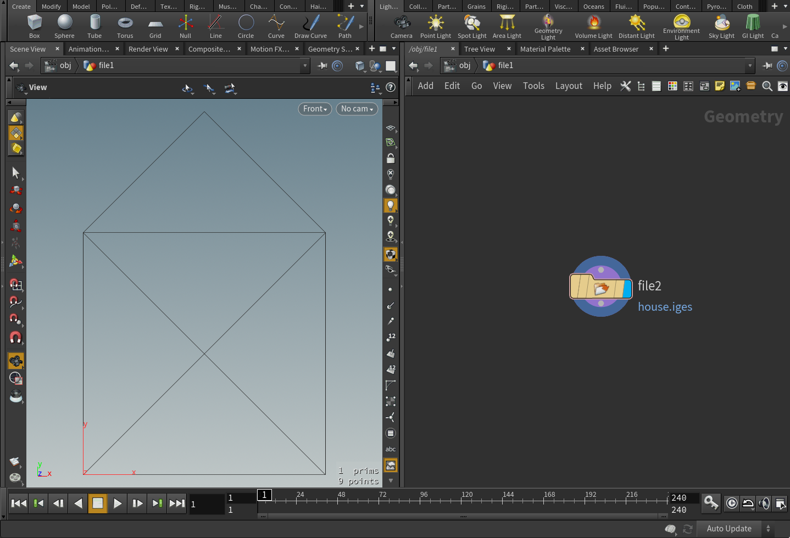

# @thi.ng/iges

[](https://www.npmjs.com/package/@thi.ng/iges)

This project is part of the
[@thi.ng/umbrella](https://github.com/thi-ng/umbrella/) monorepo.

## About

Bare-bones IGES 5.3 serializer for (currently only) polygonal geometry,
both open & closed, for use in various CAD applications (e.g. Rhino,
Houdini, Fusion 360)



## Installation

```bash
yarn add @thi.ng/iges
```

## Usage examples

```ts
import * as iges from "@thi.ng/iges";

const doc = iges.newDocument({
    maxCoord: 100,
    precision: 3,
    author: "toxi",
    authorOrg: "thi.ng",
});

doc.start = [
    "Example file for @thi.ng/iges",
    "Defines single open 2D polyline (type 106)"
];

iges.addPolyline2d(doc, [
    [0,0],
    [0, 100],
    [50, 150],
    [100, 100],
    [0, 100],
    [100, 0],
    [0, 0],
    [100, 100],
    [100, 0]
]);

console.log(iges.serialize(doc));
```

```iges
Example file for @thi.ng/iges                                           S      1
Defines single open 2D polyline (type 106)                              S      2
1H,,1H;,,,12H@thi.ng/iges,5H0.0.1,32,38,6,308,15,,1.000,2,2HMM,1,0.254, G      1
15H20180712.212228,0.001,100.000,4Htoxi,6Hthi.ng,11,0,                  G      2
15H20180712.212228;                                                     G      3
     106       1       0       0       0       0       0       000000000D      1
     106       0       0       3      11       0       0               0D      2
106,1,9,0.000,0.000,0.000,0.000,100.000,50.000,150.000,100.000,  0000001P      1
100.000,0.000,100.000,100.000,0.000,0.000,0.000,100.000,100.000, 0000001P      2
100.000,0.000;                                                   0000001P      3
S0000002G0000003D0000002P0000003                                        T      1
```

## Authors

- Karsten Schmidt

## License

&copy; 2016 - 2018 Karsten Schmidt // Apache Software License 2.0
