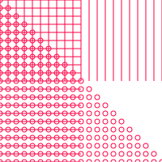

# @thi.ng/pointfree-lang

[](https://www.npmjs.com/package/@thi.ng/pointfree-lang)

This project is part of the [@thi.ng/umbrella](https://github.com/thi-ng/umbrella/) monorepo.

<!-- TOC depthFrom:2 depthTo:4 -->

- [About](#about)
- [Status](#status)
- [Installation](#installation)
- [Dependencies](#dependencies)
- [Usage examples](#usage-examples)
- [Language & Syntax](#language--syntax)
    - [Comments](#comments)
    - [Identifiers](#identifiers)
    - [Word definitions](#word-definitions)
        - [Hyperstatic words](#hyperstatic-words)
        - [Local variables](#local-variables)
    - [Boolean](#boolean)
    - [Numbers](#numbers)
    - [Strings](#strings)
    - [Quotations (Arrays)](#quotations-arrays)
    - [Literal quotes](#literal-quotes)
    - [Variables](#variables)
        - [Dynamic scoping](#dynamic-scoping)
    - [Objects](#objects)
- [Ideas / Todos](#ideas--todos)
- [Authors](#authors)
- [License](#license)

<!-- /TOC -->

## About

Experimental language layer with compact
[Forth](https://en.wikipedia.org/wiki/Forth_(programming_language))
style syntax for the
[@thi.ng/pointfree](https://github.com/thi-ng/umbrella/tree/master/packages/pointfree),
an ES6 embedded DSL for concatenative programming:

- [PegJS](https://pegjs.org/) based
  [grammar](https://github.com/thi-ng/umbrella/tree/master/packages/pointfree-lang/src/grammar.pegjs)
  & parser
- untyped, interpreted, but with AOT compilation of user defined words
- hyperstatic word definitions
- support for custom / externally defined words (JS functions)
- dynamically scoped variables (stored in environment object)
    - syntax sugar for declaring & autobinding local vars w/ stack values
- nested quotations (code as data, vanilla JS arrays)
- array & object literals (optionally w/ computed properties)
- all other features of @thi.ng/pointfree (combinators, array/vector ops etc.)

## Status

ALPHA

## Installation

```bash
yarn add @thi.ng/pointfree-lang
```

```ts
import * as pf from "@thi.ng/pointfree-lang";
```

## Dependencies

- [@thi.ng/api](https://github.com/thi-ng/umbrella/tree/master/packages/api)
- [@thi.ng/errors](https://github.com/thi-ng/umbrella/tree/master/packages/errors)
- [@thi.ng/pointfree](https://github.com/thi-ng/umbrella/tree/master/packages/pointfree)

## Usage examples

[A complete
example](https://github.com/thi-ng/umbrella/tree/master/examples/pointfree-svg/)
generating the below SVG graphic is located in the `/examples`
directory.



```ts
// DSL source code (syntax described further below)

const src = `
( helper words for forming 2D vectors )
: xy ( x y -- [x y] ) vec2 ;
: yx ( x y -- [y x] ) swap vec2 ;

( generate horizontal line coords )
: hline ( y width -- [0 y] [width y])
  over 0 yx -rot yx ;

( generate vertical line coords )
: vline ( x height -- [x 0] [x height])
  over 0 xy -rot xy ;

( draw haircross w/ FFI 'gfx.line' word )
: hairx ( x y w h -- [] )
  -rot [vline] [hline] bis2 [gfx.line] bia2;
`;


// custom word definition (will be used by `hairx` word above)
// stack effect:
// ( [x1 y1] [x2 y2] -- )

const drawLine = (ctx) => {
    const stack = ctx[0];
    // minimum stack depth guard
    pf.ensureStack(stack, 2);
    // pop top 2 values
    const [x2, y2] = stack.pop();
    const [x1, y1] = stack.pop();
    console.log(`draw line: ${x1},${y1} -> ${x2},${y2}`);

    // if we had a canvas drawing context stored in env...
    // const canvasCtx = ctx[2].canvasContext;
    // canvasCtx.beginPath();
    // canvasCtx.moveTo(x1, y1);
    // canvasCtx.lineTo(x2, y2);
    // canvasCtx.stroke();

    // or... alternatively generate SVG (and push result on stack (or store in env)
    // stack.push(`<line x1="${x1}" y1="${y1} x2="${x2} y2="${y2}"/>`);

    // ...same again, but in @thi.ng/hiccup format
    // stack.push(["line", {x1,y1,x2,y2}])

    return ctx;
};

// the DSL interpreter & compiler uses an environment object
// to lookup & store word definitions & variables
// here we create new environment and associate custom FFI word(s)
const env = pf.ffi({}, {
    "gfx.line": drawLine
});

// compile / execute source code w/ given env
// the compiled words will be stored in the env
pf.run(src, env);

// (optional, but that's how we do it here for example purposes)
// store some external state / config in env
// this could be modified via event handlers etc.
env.mouseX = 100;
env.mouseY = 200;
env.width = 640;
env.height = 480;

// now actually call the `hairx` word with args pulled from env
// words prefixed w/ `@` are variable lookups
pf.run(`@mouseX @mouseY @width @height hairx`, env);
// draw line: 100,0 -> 100,480
// draw line: 0,200 -> 640,200

// or call precompiled word/function directly w/ given initial stack
pf.runWord("hairx", env, [100, 200, 640, 480]);
// draw line: 100,0 -> 100,480
// draw line: 0,200 -> 640,200
```

## Language & Syntax

As noted previously, the syntax is closely based on Forth (and other
concatenative languages), however since this implementation is targetted
to ES6 environments, the semantics and actual implementation differ
drastically. In this DSL (and most aspects also in @thi.ng/pointfree):

- words and programs are implemented as functional compositions of
  vanilla JS functions, i.e. `1 2 +` => `add(push(1)(push(2)(ctx)))`
  - therefore no user controlled context switch between immediate &
    compile modes, as in Forth
  - parsing of word definitions triggers compile mode automatically
- variables and both stacks (D & R stacks) can store any valid JS data
  type
- no linear memory as in Forth, instead variables and the dictionary of
  (custom / FFI or user defined) words is stored in a separate
  environment object, which is passed to each word/function
- the DSL has syntax sugar for variable value lookups & assignments
- within word definitions the DSL supports binding stack values to local
  vars at the beginning of the word
- the DSL supports nested quotations (array) & object literals, incl.
  support for computed properties and/or values (lazily resolved within
  words)
- all symbols are separated by whitespace (like in Clojure, commas are
  considered whitespace too)

### Comments

As in Forth, comments are enclosed in `( ... )`. If the comment body
includes the `--` string, it's marked as a [stack effect
comment](https://github.com/thi-ng/umbrella/tree/master/packages/pointfree#about-stack-effects)
in preparation for future tooling additions.

Comments current cannot contain `(` or `)`, but can span multiple lines.
There's no special syntax for single line comments:

```
( multiline:
              .__        __    _____
______   ____ |__| _____/  |__/ ____\______   ____   ____
\____ \ /  _ \|  |/    \   __\   __\\_  __ \_/ __ \_/ __ \
|  |_> >  <_> )  |   |  \  |  |  |   |  | \/\  ___/\  ___/
|   __/ \____/|__|___|  /__|  |__|   |__|    \___  >\___  >
|__|                  \/                         \/     \/

)

1 2 ( embedded single line ) 3
```

### Identifiers

Word identifiers can contain any alhpanumeric character and these
additional ones: `*?$%&/|~<>=._+-`. However, digits are not allowed as
first char.

All 100+ built-in words defined by
[@thi.ng/pointfree](https://github.com/thi-ng/umbrella/tree/master/packages/pointfree)
are available by default with the following additional aliases (which
aren't valid names in the ES6 context):

| Alias | Original name |
| --- | --- |
| `?drop` | `dropif` |
| `?dup` | `dupif` |
| `-rot` | `invrot` |
| `>r` | `movdr` |
| `>r2` | `movdr2` |
| `r>` | `movrd` |
| `r2>` | `movrd2` |
| `if` | `condq` |
| `switch` | `casesq` |
| `while` | `loopq` |
| `+` | `add` |
| `-` | `sub` |
| `*` | `mul` |
| `/` | `div` |
| `v+` | `vadd` |
| `v-` | `vsub` |
| `v*` | `vmul` |
| `v/` | `vdiv` |
| `=` | `eq` |
| `not=` | `neq` |
| `<=` | `lteq` |
| `>=` | `gteq` |
| `<` | `lt` |
| `>` | `gt` |
| `pos?` | `ispos` |
| `neg?` | `isneg` |
| `nil?` | `isnil` |
| `zero?` | `iszero` |
| `pi` | `Math.PI` |
| `tau` | `2 * Math.PI` |
| `.` | `print` |
| `.s` | `printds` |
| `.r` | `printrs` |

The ID resolution priority is:

1. current env
2. built-in aliases
3. built-ins

### Word definitions

As in Forth, new words can be defined using the `: name ... ;` form.

```
: square ( x -- x*x ) dup * ;

10 square .
```

Will result in `100`.

There're no formatting rules enforced (yet, but under consideration).
However, it's strongly encouraged to include [stack effect
comments](https://github.com/thi-ng/umbrella/tree/master/packages/pointfree#about-stack-effects)
as shown in the examples above.

**Word definitions MUST be terminated with `;`.**

#### Hyperstatic words

Unlike [variables](#variables), which are [dynamically
scoped](https://en.wikipedia.org/wiki/Scope_(computer_science)#Dynamic_scoping),
words are defined in a
[hyper-static](http://wiki.c2.com/?HyperStaticGlobalEnvironment)
environment, meaning new versions of existing words can be defined,
however any other word (incl. the new version of same word) which uses
the earlier version will continue to use that older version.
Consequently, this too means that attempting to use undefined words
inside a word definition will fail, even if they'd be defined later on.
In these cases, use of variables and/or quotations is encouraged to
implement dynamic programming techniques.

```ts
// hyperstaticness by example
pf.run(`
: foo "foo1" ;
: bar foo "bar" + ;

( redefine foo, incl. use of existing version )
: foo foo "foo2" + ;

( use words )
foo bar
`)[0];
// [ 'foo1foo2', 'foo1bar' ]
```

#### Local variables

A word definition can include an optional declaration of local
variables, which are automatically bound to stack values each time the
word is invoked. The declarations are given via the form:

```
: wordname ^{ name1 name2 ... } ... ;
```

If used, the declaration MUST be given as first element of the word,
even before the optional stack comment:

```ts
// word with 2 local vars binding: a & b
// when the word is used, first pops 2 values from stack
// and stores them in local vars (in right to left order)
pf.run(`
: add ^{ a b } ( a b -- a+b )
  "a=" @a + .
  "b=" @b + . ;

1 2 add
`);
// a=1
// b=2
```

See [section about variables](#variables) for further details...

### Boolean

The symbol `T` evaluates as `true` and `F` as `false`.

### Numbers

- `0b...` - binary numbers (max 32 bits), e.g. `0b11110100`
- `0x...` - hex numbers (max 32bits), e.g. `0xdecafbad`
- decimals (optionally signed and/or scientific notation, e.g. `-1.23e-4`)

### Strings

`"Hello world"` - no `\"` escape feature implemented yet

### Quotations (Arrays)

Arrays can be contain any valid data literal or symbol and can be
arbitrarily nested. Commas optional.

`["result: " [2, 3, *] exec +]`

### Literal quotes

A single element quotation can be formed by prefixing a term with `'`. Nestable.

- `'+` => `[+]`
- `''+` => `[[+]]`
- `[1 2]` => `[[1,2]]`

### Variables

Variables can be looked up & resolved via the currently active
environment and scope by prefixing their name with `@`. Attempting to
resolve an unknown var will result in an error.

```ts
pf.runU(`@a @b +`, {a: 10, b: 20});
// 30
```

Assigning a value to a variable (in the the current scope) is done via
the `!` suffix:

```ts
pf.runE(`1 2 + a!`)
// {a: 3}
```

Furthermore, readonly variables can be defined via words. In this case
no prefix must be used and these kind of variables are
[hyperstatic](#hyperstatic-words).

```ts
pf.run(`: pi 3.1415 ; "π=" pi + .`);
// π=3.1415
```

#### Dynamic scoping

Each variable is resolved via its own stack of binding scopes, and
therefore technically results in [dynamic
scoping](https://en.wikipedia.org/wiki/Scope_(computer_science)#Dynamic_scoping).
However, in this DSL a new scope is only introduced when a word defines
a local var with an already existing name, so in practice the effect is
more like lexical scoping.

Var assignment always only impacts the current scope of a var.

```ts
// predefined global scope (via env binding)
pf.runU(`@a`, {a: 1});
// 1

// dynamically created global var, then used in quotation
pf.runU(`1 a! [@a @a]`);
// [1, 1]

// var lookup inside word
pf.runU(`: foo @a ; foo`, {a: 1});
// 1

// global & word local vars
// local var (value obtained from stack) takes precendence inside word
pf.runU(`: foo ^{ a } @a ; 2 foo, 3 foo, @a vec3`, {a: 1});
// [2, 3, 1]

// nested local var scopes
// both `foo` & `bar` define a local var `a`
pf.run(`
: foo ^{ a }
  "foo a=" @a + .
  ( since 'a' is declared as local var  )
  ( assignment is only to local scope )
  100 a! ;

: bar ^{ a }
  "bar1 a=" @a + .
  @a inc foo         ( call 'foo' w/ new value )
  "bar2 a=" @a + . ; ( @a still has same value here )

1 bar
"global a=" @a + .   ( global @a never modified )
`, { a: 0 });
// bar1 a=1
// foo a=2
// bar2 a=1
// global a=0

// since `b` is NOT declared as local var inside `foo`
// assigning a value to `b` (even inside `foo`) will be treated as global
pf.runE(`: foo @a b! ; foo`, {a: 1})
// { a: 1, b: 1, __words: { foo: [Function] } }

// here `foo` doesn't declare any locals
// so assignment to `a` will impact parent scope:
// - when `foo` is called from `bar`, bar's `a` var is modified
// - when `foo` is called from root level, global var `a` is created/modified
pf.runE(`
: foo 10 a! ;

: bar ^{ a }
  "before foo a=" @a + .
  foo
  "after foo a=" @a + . ;

1 bar

foo`
);
// before foo a=1
// after foo a=10
{ a: 10 ... }
```

### Objects

Plain objects literals can be created similarly as in JS, i.e.

`{key1: value, key2: val2 ...}` (again commas are optional)

Keys can be given with or without doublequotes (string literals). Quotes
for keys are only needed if:

- the key contains spaces, has `@` prefix or `!` suffix
- is a binary / hex number
- a number in scientific notation

Furthermore, variables can be used both as keys and/or values:

`{@a: {@b: @c}}`

```ts
// dynamically resolved switch using `bingo` var
src = `{@bingo: ["yay: " @bingo +] default: ["nope"]} switch`;
pf.runU(src, {bingo: 42}, [42]);
// bingo: 42

pf.runU(src, {bingo: 42}, [43]);
// nope
```

## Ideas / Todos

- [ ] add tests
- [ ] tail recursion (help wanted, see #1)
- [ ] async words
- [ ] canvas drawing vocab
- [ ] @thi.ng/atom vocab & integration
- [ ] @thi.ng/rstream vocab & integration

## Authors

- Karsten Schmidt

## License

&copy; 2018 Karsten Schmidt // Apache Software License 2.0
