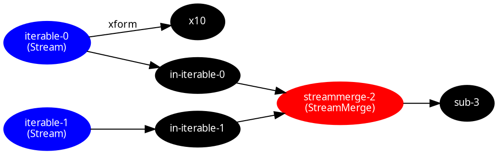

<!-- This file is generated - DO NOT EDIT! -->
<!-- Please see: https://github.com/thi-ng/umbrella/blob/develop/CONTRIBUTING.md#changes-to-readme-files -->

# 

[](https://www.npmjs.com/package/@thi.ng/rstream-dot)

[](https://mastodon.thi.ng/@toxi)

This is a standalone project, maintained as part of the
[@thi.ng/umbrella](https://github.com/thi-ng/umbrella/) monorepo and
anti-framework.

- [About](#about)
- [Status](#status)
- [Related packages](#related-packages)
- [Installation](#installation)
- [Dependencies](#dependencies)
- [Usage examples](#usage-examples)
- [API](#api)
- [Authors](#authors)
- [License](#license)

## About

Graphviz DOT conversion of [@thi.ng/rstream](https://github.com/thi-ng/umbrella/tree/develop/packages/rstream) dataflow graph topologies.

## Status

**STABLE** - used in production

[Search or submit any issues for this package](https://github.com/thi-ng/umbrella/issues?q=%5Brstream-dot%5D+in%3Atitle)

## Related packages

- [@thi.ng/dgraph-dot](https://github.com/thi-ng/umbrella/tree/develop/packages/dgraph-dot) - Customizable Graphviz DOT serialization for [@thi.ng/dgraph](https://github.com/thi-ng/umbrella/tree/develop/packages/dgraph)
- [@thi.ng/dot](https://github.com/thi-ng/umbrella/tree/develop/packages/dot) - Graphviz document abstraction & serialization to DOT format

## Installation

```bash
yarn add @thi.ng/rstream-dot
```

ES module import:

```html
<script type="module" src="https://cdn.skypack.dev/@thi.ng/rstream-dot"></script>
```

[Skypack documentation](https://docs.skypack.dev/)

For Node.js REPL:

```js
const rstreamDot = await import("@thi.ng/rstream-dot");
```

Package sizes (brotli'd, pre-treeshake): ESM: 806 bytes

## Dependencies

- [@thi.ng/rstream](https://github.com/thi-ng/umbrella/tree/develop/packages/rstream)
- [@thi.ng/strings](https://github.com/thi-ng/umbrella/tree/develop/packages/strings)
- [@thi.ng/transducers](https://github.com/thi-ng/umbrella/tree/develop/packages/transducers)

## Usage examples

Several projects in this repo's
[/examples](https://github.com/thi-ng/umbrella/tree/develop/examples)
directory are using this package:

| Screenshot                                                                                                          | Description                                            | Live demo                                              | Source                                                                              |
|:--------------------------------------------------------------------------------------------------------------------|:-------------------------------------------------------|:-------------------------------------------------------|:------------------------------------------------------------------------------------|
|                                                                                                                     | Minimal rstream dataflow graph                         | [Demo](https://demo.thi.ng/umbrella/rstream-dataflow/) | [Source](https://github.com/thi-ng/umbrella/tree/develop/examples/rstream-dataflow) |
|  | Multi-layer vectorization & dithering of bitmap images | [Demo](https://demo.thi.ng/umbrella/trace-bitmap/)     | [Source](https://github.com/thi-ng/umbrella/tree/develop/examples/trace-bitmap)     |

## API

[Generated API docs](https://docs.thi.ng/umbrella/rstream-dot/)

```ts tangle:export/readme.ts
import { fromIterable, merge, trace } from "@thi.ng/rstream";
import { serialize } from "@thi.ng/rstream-dot";

// create dummy dataflow
const a = fromIterable([1, 2, 3]);
const b = fromIterable([10, 20, 30]);
a.map((x) => x * 10, { id: "x10" });
merge({ src: [a, b] }).subscribe(trace());

// now capture the topology by walking the graph from its root(s)
// and convert the result to GraphViz DOT format
console.log(serialize([a, b]));
```

Resulting output:



Copy output to file `graph.dot` and then run:

```bash
dot -Tsvg -o graph.svg graph.dot
```

This will generate this diagram:


## Authors

- [Karsten Schmidt](https://thi.ng)

If this project contributes to an academic publication, please cite it as:

```bibtex
@misc{thing-rstream-dot,
  title = "@thi.ng/rstream-dot",
  author = "Karsten Schmidt",
  note = "https://thi.ng/rstream-dot",
  year = 2018
}
```

## License

&copy; 2018 - 2024 Karsten Schmidt // Apache License 2.0
