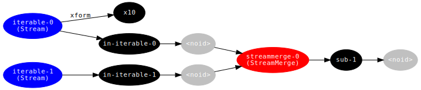

<!-- This file is generated - DO NOT EDIT! -->

# 

[](https://www.npmjs.com/package/@thi.ng/rstream-dot)

[](https://twitter.com/thing_umbrella)

This project is part of the
[@thi.ng/umbrella](https://github.com/thi-ng/umbrella/) monorepo.

- [About](#about)
  - [Status](#status)
  - [Related packages](#related-packages)
- [Installation](#installation)
- [Dependencies](#dependencies)
- [Usage examples](#usage-examples)
- [API](#api)
- [Authors](#authors)
- [License](#license)

## About

Graphviz DOT conversion of [@thi.ng/rstream](https://github.com/thi-ng/umbrella/tree/develop/packages/rstream) dataflow graph topologies.

### Status

**STABLE** - used in production

[Search or submit any issues for this package](https://github.com/thi-ng/umbrella/issues?q=%5Brstream-dot%5D+in%3Atitle)

### Related packages

- [@thi.ng/dgraph-dot](https://github.com/thi-ng/umbrella/tree/develop/packages/dgraph-dot) - Customizable Graphviz DOT serialization for [@thi.ng/dgraph](https://github.com/thi-ng/umbrella/tree/develop/packages/dgraph)
- [@thi.ng/dot](https://github.com/thi-ng/umbrella/tree/develop/packages/dot) - Graphviz document abstraction & serialization to DOT format

## Installation

```bash
yarn add @thi.ng/rstream-dot
```

ES module import:

```html
<script type="module" src="https://cdn.skypack.dev/@thi.ng/rstream-dot"></script>
```

[Skypack documentation](https://docs.skypack.dev/)

For Node.js REPL:

```text
# with flag only for < v16
node --experimental-repl-await

> const rstreamDot = await import("@thi.ng/rstream-dot");
```

Package sizes (gzipped, pre-treeshake): ESM: 835 bytes

## Dependencies

- [@thi.ng/rstream](https://github.com/thi-ng/umbrella/tree/develop/packages/rstream)
- [@thi.ng/strings](https://github.com/thi-ng/umbrella/tree/develop/packages/strings)
- [@thi.ng/transducers](https://github.com/thi-ng/umbrella/tree/develop/packages/transducers)

## Usage examples

Several demos in this repo's
[/examples](https://github.com/thi-ng/umbrella/tree/develop/examples)
directory are using this package.

A selection:

| Description                    | Live demo                                              | Source                                                                              |
|:-------------------------------|:-------------------------------------------------------|:------------------------------------------------------------------------------------|
| Minimal rstream dataflow graph | [Demo](https://demo.thi.ng/umbrella/rstream-dataflow/) | [Source](https://github.com/thi-ng/umbrella/tree/develop/examples/rstream-dataflow) |

## API

[Generated API docs](https://docs.thi.ng/umbrella/rstream-dot/)

```ts
import * as rsd from "@thi.ng/rstream-dot";

import * as rs from "@thi.ng/rstream";
import * as tx from "@thi.ng/transducers";

// create dummy dataflow
a = rs.fromIterable([1,2,3]);
b = rs.fromIterable([10, 20, 30]);
a.transform(tx.map((x) => x * 10), "x10");
rs.merge({src: [a, b]}).subscribe(rs.trace());

// now capture the topology by walking the graph from its root(s)
// and convert the result to GraphViz DOT format
console.log(rsd.toDot(rsd.walk([a, b])));

// digraph g {
// rankdir=LR;
// node[fontname=Inconsolata,fontsize=11,style=filled,fontcolor=white];
// edge[fontname=Inconsolata,fontsize=11];
// s0[label="iterable-0\n(Stream)", color=blue];
// s1[label="x10", color=black];
// s2[label="in-iterable-0", color=black];
// s3[label="<noid>", color=gray];
// s4[label="streammerge-0\n(StreamMerge)", color=red];
// s5[label="sub-1", color=black];
// s6[label="<noid>", color=gray];
// s7[label="iterable-1\n(Stream)", color=blue];
// s8[label="in-iterable-1", color=black];
// s9[label="<noid>", color=gray];
// s5 -> s6;
// s4 -> s5;
// s3 -> s4;
// s2 -> s3;
// s0 -> s1[label="xform"];
// s0 -> s2;
// s9 -> s4;
// s8 -> s9;
// s7 -> s8;
// }
```

Copy output to file `graph.dot` and then run:

```bash
dot -Tsvg -o graph.svg graph.dot
```

This will generate this diagram:



## Authors

Karsten Schmidt

If this project contributes to an academic publication, please cite it as:

```bibtex
@misc{thing-rstream-dot,
  title = "@thi.ng/rstream-dot",
  author = "Karsten Schmidt",
  note = "https://thi.ng/rstream-dot",
  year = 2018
}
```

## License

&copy; 2018 - 2022 Karsten Schmidt // Apache Software License 2.0
