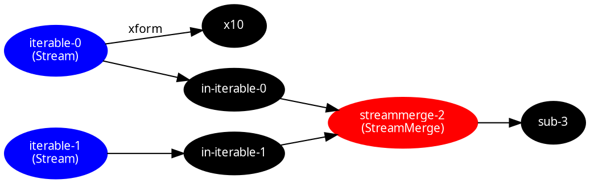

<!-- include ../../assets/tpl/header.md -->

<!-- toc -->

## About

{{pkg.description}}

{{meta.status}}

{{repo.supportPackages}}

{{repo.relatedPackages}}

{{meta.blogPosts}}

## Installation

{{pkg.install}}

{{pkg.size}}

## Dependencies

{{pkg.deps}}

{{repo.examples}}

## API

{{pkg.docs}}

```ts tangle:export/readme.ts
import { fromIterable, merge, trace } from "@thi.ng/rstream";
import { serialize } from "@thi.ng/rstream-dot";

// create dummy dataflow
const a = fromIterable([1, 2, 3]);
const b = fromIterable([10, 20, 30]);
a.map((x) => x * 10, { id: "x10" });
merge({ src: [a, b] }).subscribe(trace());

// now capture the topology by walking the graph from its root(s)
// and convert the result to GraphViz DOT format
console.log(serialize([a, b]));
```

Resulting output:



Copy output to file `graph.dot` and then run:

```bash
dot -Tsvg -o graph.svg graph.dot
```

This will generate this diagram:


<!-- include ../../assets/tpl/footer.md -->
