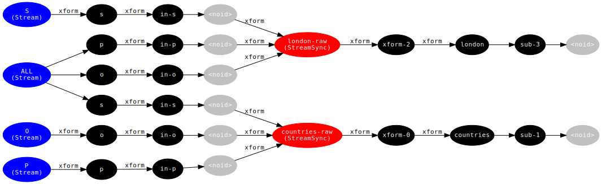

# @thi.ng/rstream-query

[](https://www.npmjs.com/package/@thi.ng/rstream-query)

This project is part of the
[@thi.ng/umbrella](https://github.com/thi-ng/umbrella/) monorepo.

## About

@thi.ng/rstream based [triple
store](https://en.wikipedia.org/wiki/Triplestore) & reactive query
engine with high re-use ratio of sub-query results. Inserted triples /
facts are broadcast to multiple indexing streams and any query
subscriptions attached to them. This enables push-based, auto-updating
query results, which are changing each time upstream transformations &
filters have been triggered (due to updates to the set of triples /
facts).

Triples are 3-tuples of `[subject, predicate, object]`. Unlike with
traditional
[RDF](https://en.wikipedia.org/wiki/Resource_Description_Framework)
triple stores, any JS data types can be used as subject, predicate or
object (though support for such must be explicitly enabled & this
feature is currently WIP).

### Current features

- Entirely based on stream abstractions provided by @thi.ng/rstream
- All data transformations done using @thi.ng/tranducers
- Dynamic dataflow graph construction via high-level methods
- Extensive re-use of existing sub-query results (via subscriptions)
- Auto-updating query results

### Status

This project is currently still in early development and intended as a
continuation of the Clojure based [thi.ng/fabric](http://thi.ng/fabric),
this time built on the streaming primitives provided by
[@thi.ng/rstream](https://github.com/thi-ng/umbrella/tree/master/packages/rstream).

## Installation

```
yarn add @thi.ng/rstream-query
```

## Usage examples

```typescript
import { TripleStore } from "@thi.ng/rstream-query";

store = new TripleStore();
store.addTriples([
    ["london", "type", "city"],
    ["london", "part-of", "uk"],
    ["portland", "type", "city"],
    ["portland", "part-of", "oregon"],
    ["portland", "part-of", "usa"],
    ["oregon", "type", "state"],
    ["usa", "type", "country"],
    ["uk", "type", "country"],
]);

// find all subjects with type = country
store.addParamQuery("countries", ["?country", "type", "country"]).subscribe(trace("country results:"));

// find all relations for subject "london"
store.addParamQuery("london", ["london", "?p", "?o"]).subscribe(trace("london results:"));

// country results: [ { country: 'usa' }, { country: 'uk' } ]
// london results: [ { p: 'type', o: 'city' }, { p: 'part-of', o: 'uk' } ]
```

After setting up the above 2 queries, the dataflow topology then looks as follows:



The blue nodes are `TripleStore`-internal index stream sources, which
emit changes when new triples are added. The red nodes are basic pattern
queries, responsible for joining the individual (S)ubject, (P)redicate
and (O)bject sub-queries. The results of these are then further
transformed to bind result values to query variables, as well as the
final subscriptions to output them to the console (using `trace`, see
above).

Btw. The diagram has been generated using
[@thi.ng/rstream-dot](https://github.com/thi-ng/umbrella/tree/master/packages/rstream-dot)
and can be recreated by calling `store.toDot()` (for the above example)

(Many) more features forthcoming...

## Authors

- Karsten Schmidt

## License

&copy; 2018 Karsten Schmidt // Apache Software License 2.0
