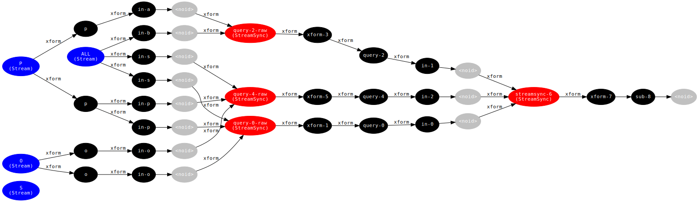

<!-- This file is generated - DO NOT EDIT! -->
<!-- Please see: https://github.com/thi-ng/umbrella/blob/develop/CONTRIBUTING.md#changes-to-readme-files -->

# 

[](https://www.npmjs.com/package/@thi.ng/rstream-query)

[](https://mastodon.thi.ng/@toxi)

This is a standalone project, maintained as part of the
[@thi.ng/umbrella](https://github.com/thi-ng/umbrella/) monorepo and
anti-framework.

- [About](#about)
  - [Current features](#current-features)
- [Status](#status)
- [Installation](#installation)
- [Dependencies](#dependencies)
- [Usage examples](#usage-examples)
- [API](#api)
  - [Visualizing a query's dataflow topology](#visualizing-a-querys-dataflow-topology)
- [Authors](#authors)
- [License](#license)

## About

[@thi.ng/rstream](https://github.com/thi-ng/umbrella/tree/develop/packages/rstream)
based [triple store](https://en.wikipedia.org/wiki/Triplestore) &
reactive query engine with declarative query specs related to
[Datalog](https://en.wikipedia.org/wiki/Datalog) /
[SPARQL](https://en.wikipedia.org/wiki/SPARQL). Inserted triples / facts
are broadcast to multiple indexing streams and any query subscriptions
attached to them. This enables push-based, auto-updating query results,
which are changing each time upstream transformations & filters have
been triggered.

[Triples](https://en.wikipedia.org/wiki/Semantic_triple) are 3-tuples of
`[subject, predicate, object]`. Unlike with traditional
[RDF](https://en.wikipedia.org/wiki/Resource_Description_Framework)
triple stores, any JS data types can be used as subject, predicate or
object (though support for such must be explicitly enabled & this
feature is currently WIP).

### Current features

- Dynamic & declarative dataflow graph construction via high-level data
  specs and/or functions
- Entirely based on stream abstractions provided by
  [@thi.ng/rstream](https://github.com/thi-ng/umbrella/tree/develop/packages/rstream)
- All data transformations done using dynamically composed
  [tranducers](https://github.com/thi-ng/umbrella/tree/develop/packages/transducers)
- Query optimizations
- Extensive re-use of existing sub-query results (via subscriptions)
- Interim result de-duplication / dataflow gates
- Push-based, auto-updating query results

## Status

**STABLE** - used in production

[Search or submit any issues for this package](https://github.com/thi-ng/umbrella/issues?q=%5Brstream-query%5D+in%3Atitle)

This project is currently still in early development and intended as a
continuation of the Clojure based [thi.ng/fabric](http://thi.ng/fabric),
this time built on the streaming primitives provided by
[@thi.ng/rstream](https://github.com/thi-ng/umbrella/tree/develop/packages/rstream).

## Installation

```bash
yarn add @thi.ng/rstream-query
```

ES module import:

```html
<script type="module" src="https://cdn.skypack.dev/@thi.ng/rstream-query"></script>
```

[Skypack documentation](https://docs.skypack.dev/)

For Node.js REPL:

```js
const rstreamQuery = await import("@thi.ng/rstream-query");
```

Package sizes (brotli'd, pre-treeshake): ESM: 2.61 KB

## Dependencies

- [@thi.ng/api](https://github.com/thi-ng/umbrella/tree/develop/packages/api)
- [@thi.ng/associative](https://github.com/thi-ng/umbrella/tree/develop/packages/associative)
- [@thi.ng/checks](https://github.com/thi-ng/umbrella/tree/develop/packages/checks)
- [@thi.ng/equiv](https://github.com/thi-ng/umbrella/tree/develop/packages/equiv)
- [@thi.ng/errors](https://github.com/thi-ng/umbrella/tree/develop/packages/errors)
- [@thi.ng/logger](https://github.com/thi-ng/umbrella/tree/develop/packages/logger)
- [@thi.ng/math](https://github.com/thi-ng/umbrella/tree/develop/packages/math)
- [@thi.ng/rstream](https://github.com/thi-ng/umbrella/tree/develop/packages/rstream)
- [@thi.ng/rstream-dot](https://github.com/thi-ng/umbrella/tree/develop/packages/rstream-dot)
- [@thi.ng/transducers](https://github.com/thi-ng/umbrella/tree/develop/packages/transducers)

## Usage examples

One project in this repo's
[/examples](https://github.com/thi-ng/umbrella/tree/develop/examples)
directory is using this package:

| Screenshot                                                                                                          | Description                                 | Live demo                                          | Source                                                                          |
|:--------------------------------------------------------------------------------------------------------------------|:--------------------------------------------|:---------------------------------------------------|:--------------------------------------------------------------------------------|
|  | Triple store query results & sortable table | [Demo](https://demo.thi.ng/umbrella/triple-query/) | [Source](https://github.com/thi-ng/umbrella/tree/develop/examples/triple-query) |

## API

[Generated API docs](https://docs.thi.ng/umbrella/rstream-query/)

```ts
import { TripleStore, asTriples } from "@thi.ng/rstream-query";
import { trace } from "@thi.ng/rstream";

// create store with initial set of triples / facts
const store = new TripleStore([
    ["london", "type", "city"],
    ["london", "part-of", "uk"],
    ["portland", "type", "city"],
    ["portland", "partOf", "oregon"],
    ["portland", "partOf", "usa"],
    ["oregon", "type", "state"],
    ["usa", "type", "country"],
    ["uk", "type", "country"],
]);

// alternatively, convert an object into a sequence of triples
const store = new TripleStore(asTriples({
    london: {
        type: "city",
        partOf: "uk"
    },
    portland: {
        type: "city",
        partOf: ["oregon", "usa"]
    },
    oregon: { type: "state" },
    uk: { type: "country" },
    usa: { type: "country" },
});

// compile the below query spec into a dataflow graph
// pattern items prefixed w/ "?" are query variables

// this query matches the following relationships
// using all currently known triples in the store
// when matching triples are added or removed, the query
// result updates automatically...

// currently only "where" and bounded "path" sub-queries are possible
// in the near future, more query types will be supported
// (e.g. optional relationships, pre/post filters etc.)
store.addQueryFromSpec({
    q: [
        {
            // all "where" subqueries are joined (logical AND)
            where: [
                // match any subject of type "city"
                ["?city", "type", "city"],
                // match each ?city var's "part-of" relationships (if any)
                ["?city", "partOf", "?country"],
                // matched ?country var must have type = "country"
                ["?country", "type", "country"]
            ]
        }
    ],
    // `bind` is an (optional) query post-processor and
    // allows injection of new variables into the result set
    // here we create a new var "answer" whose values are derived from
    // the other two query vars
    bind: {
        answer: (res) => `${res.city} is located in ${res.country}`
    },
    // another post-processing step, only keeps "answer" var in results
    select: ["answer"]
})
.subscribe(trace("results"))
// results Set {
//   { answer: 'london is located in uk' },
//   { answer: 'portland is located in usa' } }

// helper fn to insert new city relationship to the store
const addCity = (name, country) =>
    store.into([
        [name, "type", "city"],
        [name, "partOf", country],
        [country, "type", "country"],
    ]);

addCity("berlin", "germany");
// results Set {
//     { answer: 'london is located in uk' },
//     { answer: 'portland is located in usa' },
//     { answer: 'berlin is located in germany' } }

addCity("paris", "france");
// results Set {
//     { answer: 'london is located in uk' },
//     { answer: 'portland is located in usa' },
//     { answer: 'berlin is located in germany' },
//     { answer: 'paris is located in france' } }
```

### Visualizing a query's dataflow topology

After setting up the above query and its internal transformations, the
generated dataflow topology then looks as follows:



- The blue nodes are `TripleStore`-internal index stream sources,
  emitting changes when new triples are added
- The left set of red nodes are the sub-queries of the above `where`
  clause, responsible for joining the individual (S)ubject, (P)redicate
  and (O)bject sub-queries.
- The results of these are then further joined (right red node) &
  transformed to produce the final solution set and post-process it

Btw. The diagram has been generated using
[@thi.ng/rstream-dot](https://github.com/thi-ng/umbrella/tree/develop/packages/rstream-dot)
and can be recreated by calling `store.toDot()` (for the above example)

The source code for the above example is
[here](https://github.com/thi-ng/umbrella/tree/develop/packages/rstream-query/test/example.ts)

(Many) more features forthcoming...

## Authors

- [Karsten Schmidt](https://thi.ng)

If this project contributes to an academic publication, please cite it as:

```bibtex
@misc{thing-rstream-query,
  title = "@thi.ng/rstream-query",
  author = "Karsten Schmidt",
  note = "https://thi.ng/rstream-query",
  year = 2018
}
```

## License

&copy; 2018 - 2024 Karsten Schmidt // Apache License 2.0
