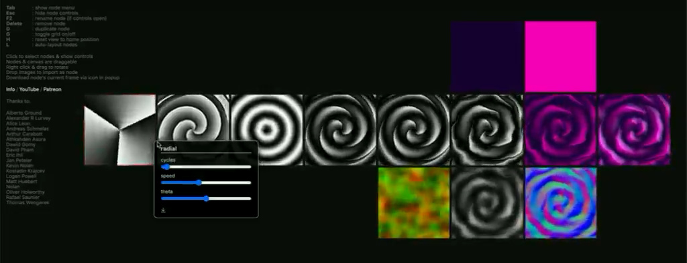
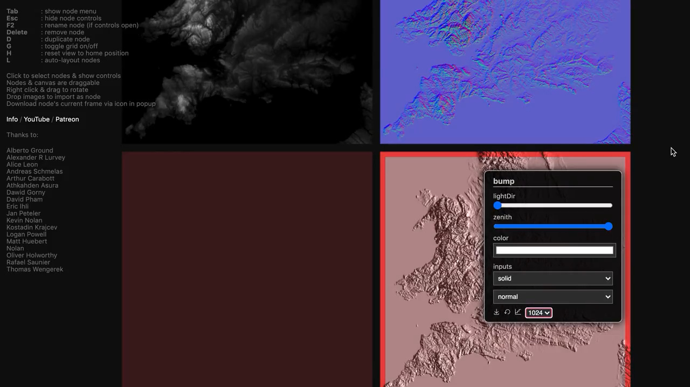
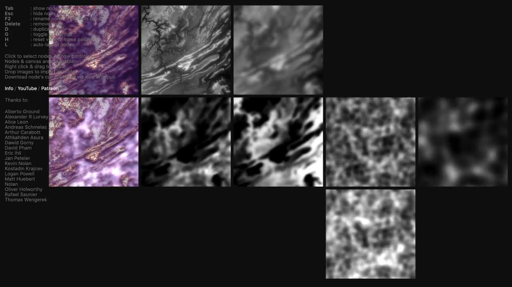
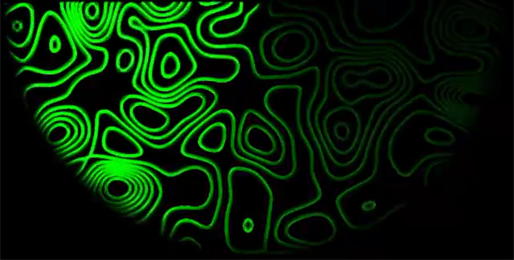
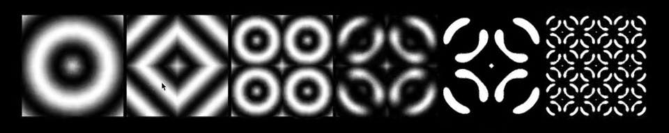
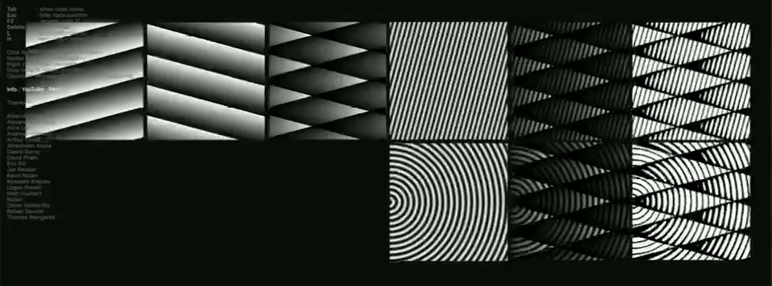
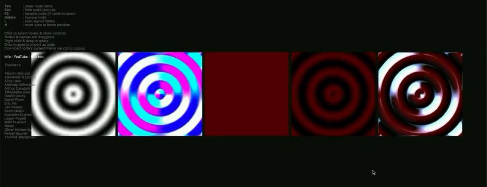

<!-- This file is generated - DO NOT EDIT! -->

# 

[](https://www.npmjs.com/package/@thi.ng/shader-ast)

[](https://mastodon.thi.ng/@toxi)

This project is part of the
[@thi.ng/umbrella](https://github.com/thi-ng/umbrella/) monorepo.

- [About](#about)
  - [Standard library of common, higher level operations](#standard-library-of-common-higher-level-operations)
  - [Benefits](#benefits)
  - [Shadergraph playground](#shadergraph-playground)
    - [Rose](#rose)
    - [DEM visualization](#dem-visualization)
    - [Animated radar swipe](#animated-radar-swipe)
    - [Pattern tessellations](#pattern-tessellations)
  - [Prior art / influences](#prior-art--influences)
  - [Future goals](#future-goals)
- [Status](#status)
- [Support packages](#support-packages)
- [Related packages](#related-packages)
- [Installation](#installation)
- [Dependencies](#dependencies)
- [Usage examples](#usage-examples)
- [API](#api)
  - [Supported types](#supported-types)
  - [Operators](#operators)
    - [Comparison](#comparison)
    - [Logic](#logic)
    - [Bitwise](#bitwise)
    - [Swizzling](#swizzling)
    - [Array index lookups](#array-index-lookups)
  - [Symbol definitions / assignments](#symbol-definitions--assignments)
  - [Control flow](#control-flow)
    - [If-Then-Else](#if-then-else)
    - [Ternary operator](#ternary-operator)
    - [For-loop](#for-loop)
    - [While-loop](#while-loop)
  - [Built-in functions](#built-in-functions)
  - [User defined functions](#user-defined-functions)
    - [Function arguments](#function-arguments)
    - [Inline functions](#inline-functions)
  - [Global scope](#global-scope)
    - [Input / output variables / declarations](#input--output-variables--declarations)
    - [Program definition](#program-definition)
  - [Code generation](#code-generation)
    - [GLSL (ES)](#glsl-es)
    - [JavaScript](#javascript)
  - [Compilation & execution](#compilation--execution)
  - [AST tooling, traversal, optimization](#ast-tooling-traversal-optimization)
    - [Tree traversals](#tree-traversals)
- [Authors](#authors)
- [License](#license)

## About

DSL to define shader code in TypeScript and cross-compile to GLSL, JS and other targets.

(**A 2h 40m long video tutorial (live stream) introducing this package: [Building a shader graph editor (WebGL, shader AST transpiler, UI)](https://www.youtube.com/watch?v=hEC_qbUXDo8)**)

---


<small>Example shader running in plain JS & Canvas 2D context,
cross-compiled JS/GLSL outputs on the right</small>

Both an [embedded
DSL](https://en.wikipedia.org/wiki/Domain-specific_language) and [IR
format](https://en.wikipedia.org/wiki/Intermediate_representation) to
encourage and define *modular* shader code directly in TypeScript and
then cross-compile to different languages. Using GLSL types and
semantics as starting point, the DSL is used as an assembly language to
define a partially (as much as possible / feasible) type checked AST,
incl. custom, user defined functions, higher-order functions, inline
functions, automatic vector-scalar overrides, most of GLSL ES 3.0
built-ins, arg checking, and function return type inference.

Code generation can be done for individual expressions or entire shader
programs, incl. call graph analysis and topological re-ordering of all
transitively called functions (other than built-ins). Currently only
GLSL & JS are supported as target (see code gen packages below), but
custom code generators can be easily added. Once more details have been
ironed out, we aim to support [Houdini
VEX](http://www.sidefx.com/docs/houdini/vex/index.html) (in-progress),
[WASM](https://webassembly.org), [WHLSL for
WebGPU](https://github.com/gpuweb/WHLSL) in the near future as well.


<small>Comparison of the raymarch shader example (link further below), cross
compiled to both GLSL (left) and JavaScript (right). Difference image of both results in the center.</small>


<small>[Larger
version](https://twitter.com/thing_umbrella/status/1146109598274924544) - The same raymarching example compiled to Houdini VEX and used as "Point
Wrangle" to displace a grid geometry (using only the depth value of the
raymarching step).</small>

### Standard library of common, higher level operations

In addition to the code generation aspects, this package also provides a
form of "standard library", pure functions for common shader & GPGPU use
cases and which can be used as syntax sugar and / or higher level
building blocks for your own shaders. So far, this includes various math
utils, lighting models, fog equations, SDF primitives / operators,
raymarching helpers etc. [These functions are distributed in as separate
package](https://github.com/thi-ng/umbrella/tree/develop/packages/shader-ast-stdlib).

### Benefits

- **no more copy & pasting, string interpolation / templating**: use
  standard TS/JS tooling & full IDE integration to create shaders (e.g.
  docs strings, packaging, 3rd party dependencies etc.)
- **all non-builtin functions keep track of their transitive dependencies**,
  enabling call graph analysis, dead code elimination, topologically
  correct code output ordering etc. - all without manual user intervention
- **improve general re-use**, especially once more target codegens are
  available (see [future goals](#future-goals)).
- **higher-order function composition & customization** (e.g. see
  [raymarch.ts](https://github.com/thi-ng/umbrella/tree/develop/packages/shader-ast-stdlib/src/raymarch/scene.ts),
  or
  [additive.ts](https://github.com/thi-ng/umbrella/tree/develop/packages/shader-ast-stdlib/src/math/additive.ts))
- **cross compilation** to different graphics environments
- shader functions can be called like standard TS/JS functions (incl.
  automatically type checked args via TS mapped types)
- type checking (at authoring time & compile time)
  and type annotations of all AST nodes catches many issues early on
- avoids complex GLSL parsing as done by other transpilers
- shader code will be fully minimized along with main app code in
  production builds as part of standard bundling processes / tool
  chains, no extra plugins needed
- small run time & file size overhead (depending on output target impl)

### Shadergraph playground

During one of the thi.ng live streams in 2020 I started [building a shader graph
editor](https://www.youtube.com/watch?v=hEC_qbUXDo8) which I subsequently
developed further and which is online at:
[shadergraph.thi.ng](https://shadergraph.thi.ng). All shader ops are entirely
based on functionality provided by shader-ast and its support packages.

Some small example projects documented as short clips (images are links to
videos on Twitter):

#### Rose

[](https://twitter.com/thing_umbrella/status/1294240300714676224)<br/>
[Final version](https://twitter.com/thing_umbrella/status/1294276813087223811)

#### DEM visualization

[](https://twitter.com/thing_umbrella/status/1297311020336197632)

[](https://twitter.com/thing_umbrella/status/1297935421914132481)

#### Animated radar swipe

[](https://twitter.com/toxi/status/1513278436378304515)

#### Pattern tessellations

[](https://twitter.com/thing_umbrella/status/1290571474852511744)

[](https://twitter.com/thing_umbrella/status/1292860207110991873)

##### Bump mapping
[](https://twitter.com/thing_umbrella/status/1293286949357326337)

### Prior art / influences

- [Hypergiant](http://alex-charlton.com/posts/Prototype_to_polish_Making_games_in_CHICKEN_Scheme_with_Hypergiant)
- [Lux](https://github.com/cscheid/lux/tree/develop/src/shade)
- [Penumbra](https://github.com/ztellman/penumbra)
- [gamma](https://github.com/kovasb/gamma/)
- [thi.ng/shader-graph](http://thi.ng/shader-graph)
- [LLVM](http://llvm.org)

### Future goals

See the [project
dashboard](https://github.com/thi-ng/umbrella/projects/2) for current
status. The TL;DR list...

- [ ] documentation
- [ ] struct support
- [ ] uniform blocks
- [ ] more code gens (JS ✅, WASM, WHLSL, OpenCL, Houdini VEX (WIP))
- [x] JS runtime improvements / features (non-GPU / vanilla JS shader execution)
- [ ] Integration w/ a GLSL parser (new or existing)
- [x] AST transformations (dead code elimination, optimizers, e.g. [constant
  folding](https://github.com/thi-ng/umbrella/tree/develop/packages/shader-ast/src/optimize.ts))

## Status

**STABLE** - used in production

[Search or submit any issues for this package](https://github.com/thi-ng/umbrella/issues?q=%5Bshader-ast%5D+in%3Atitle)

## Support packages

- [@thi.ng/shader-ast-glsl](https://github.com/thi-ng/umbrella/tree/develop/packages/shader-ast-glsl) - Customizable GLSL codegen for [@thi.ng/shader-ast](https://github.com/thi-ng/umbrella/tree/develop/packages/shader-ast)
- [@thi.ng/shader-ast-js](https://github.com/thi-ng/umbrella/tree/develop/packages/shader-ast-js) - Customizable JS codegen, compiler & runtime for [@thi.ng/shader-ast](https://github.com/thi-ng/umbrella/tree/develop/packages/shader-ast)
- [@thi.ng/shader-ast-optimize](https://github.com/thi-ng/umbrella/tree/develop/packages/shader-ast-optimize) - Shader AST code optimization passes/strategies
- [@thi.ng/shader-ast-stdlib](https://github.com/thi-ng/umbrella/tree/develop/packages/shader-ast-stdlib) - Function collection for modular GPGPU / shader programming with [@thi.ng/shader-ast](https://github.com/thi-ng/umbrella/tree/develop/packages/shader-ast)

## Related packages

- [@thi.ng/webgl](https://github.com/thi-ng/umbrella/tree/develop/packages/webgl) - WebGL & GLSL abstraction layer
- [@thi.ng/webgl-shadertoy](https://github.com/thi-ng/umbrella/tree/develop/packages/webgl-shadertoy) - Basic WebGL scaffolding for running interactive fragment shaders via [@thi.ng/shader-ast](https://github.com/thi-ng/umbrella/tree/develop/packages/shader-ast)

## Installation

```bash
yarn add @thi.ng/shader-ast
```

ES module import:

```html
<script type="module" src="https://cdn.skypack.dev/@thi.ng/shader-ast"></script>
```

[Skypack documentation](https://docs.skypack.dev/)

For Node.js REPL:

```js
const shaderAst = await import("@thi.ng/shader-ast");
```

Package sizes (brotli'd, pre-treeshake): ESM: 4.63 KB

## Dependencies

- [@thi.ng/api](https://github.com/thi-ng/umbrella/tree/develop/packages/api)
- [@thi.ng/checks](https://github.com/thi-ng/umbrella/tree/develop/packages/checks)
- [@thi.ng/defmulti](https://github.com/thi-ng/umbrella/tree/develop/packages/defmulti)
- [@thi.ng/dgraph](https://github.com/thi-ng/umbrella/tree/develop/packages/dgraph)
- [@thi.ng/errors](https://github.com/thi-ng/umbrella/tree/develop/packages/errors)
- [@thi.ng/logger](https://github.com/thi-ng/umbrella/tree/develop/packages/logger)

## Usage examples

Several demos in this repo's
[/examples](https://github.com/thi-ng/umbrella/tree/develop/examples)
directory are using this package.

A selection:

| Screenshot                                                                                                                   | Description                                              | Live demo                                                 | Source                                                                                 |
|:-----------------------------------------------------------------------------------------------------------------------------|:---------------------------------------------------------|:----------------------------------------------------------|:---------------------------------------------------------------------------------------|
|        | 2D canvas shader emulation                               | [Demo](https://demo.thi.ng/umbrella/shader-ast-canvas2d/) | [Source](https://github.com/thi-ng/umbrella/tree/develop/examples/shader-ast-canvas2d) |
|         | Evolutionary shader generation using genetic programming | [Demo](https://demo.thi.ng/umbrella/shader-ast-evo/)      | [Source](https://github.com/thi-ng/umbrella/tree/develop/examples/shader-ast-evo)      |
|       | HOF shader procedural noise function composition         | [Demo](https://demo.thi.ng/umbrella/shader-ast-noise/)    | [Source](https://github.com/thi-ng/umbrella/tree/develop/examples/shader-ast-noise)    |
|  | WebGL & JS canvas2D raymarch shader cross-compilation    | [Demo](https://demo.thi.ng/umbrella/shader-ast-raymarch/) | [Source](https://github.com/thi-ng/umbrella/tree/develop/examples/shader-ast-raymarch) |
|       | WebGL & JS canvas 2D SDF                                 | [Demo](https://demo.thi.ng/umbrella/shader-ast-sdf2d/)    | [Source](https://github.com/thi-ng/umbrella/tree/develop/examples/shader-ast-sdf2d)    |
|      | WebGL & Canvas2D textured tunnel shader                  | [Demo](https://demo.thi.ng/umbrella/shader-ast-tunnel/)   | [Source](https://github.com/thi-ng/umbrella/tree/develop/examples/shader-ast-tunnel)   |
|     | Fork-join worker-based raymarch renderer (JS/CPU only)   | [Demo](https://demo.thi.ng/umbrella/shader-ast-workers/)  | [Source](https://github.com/thi-ng/umbrella/tree/develop/examples/shader-ast-workers)  |
|           | Minimal shader graph developed during livestream #2      | [Demo](https://demo.thi.ng/umbrella/shader-graph/)        | [Source](https://github.com/thi-ng/umbrella/tree/develop/examples/shader-graph)        |
|           | Entity Component System w/ 100k 3D particles             | [Demo](https://demo.thi.ng/umbrella/soa-ecs/)             | [Source](https://github.com/thi-ng/umbrella/tree/develop/examples/soa-ecs)             |
|          | WebGL cube maps with async texture loading               | [Demo](https://demo.thi.ng/umbrella/webgl-cubemap/)       | [Source](https://github.com/thi-ng/umbrella/tree/develop/examples/webgl-cubemap)       |
|             | WebGL instancing, animated grid                          | [Demo](https://demo.thi.ng/umbrella/webgl-grid/)          | [Source](https://github.com/thi-ng/umbrella/tree/develop/examples/webgl-grid)          |
|             | WebGL MSDF text rendering & particle system              | [Demo](https://demo.thi.ng/umbrella/webgl-msdf/)          | [Source](https://github.com/thi-ng/umbrella/tree/develop/examples/webgl-msdf)          |
|                                                                                                                              | Minimal multi-pass / GPGPU example                       | [Demo](https://demo.thi.ng/umbrella/webgl-multipass/)     | [Source](https://github.com/thi-ng/umbrella/tree/develop/examples/webgl-multipass)     |
|        | Shadertoy-like WebGL setup                               | [Demo](https://demo.thi.ng/umbrella/webgl-shadertoy/)     | [Source](https://github.com/thi-ng/umbrella/tree/develop/examples/webgl-shadertoy)     |
|             | WebGL screenspace ambient occlusion                      | [Demo](https://demo.thi.ng/umbrella/webgl-ssao/)          | [Source](https://github.com/thi-ng/umbrella/tree/develop/examples/webgl-ssao)          |

## API

[Generated API docs](https://docs.thi.ng/umbrella/shader-ast/)

### Supported types

- `float` (32 bit)
- `int` (signed 32bit)
- `uint` (unsigned 32bit)
- `bool`
- `vec2` (f32)
- `vec3` (f32)
- `vec4` (f32)
- `ivec2` (i32)
- `ivec3` (i32)
- `ivec4` (i32)
- `uvec2` (u32)
- `uvec3` (u32)
- `uvec4` (u32)
- `bvec2` (bool)
- `bvec3` (bool)
- `bvec4` (bool)
- `mat2` (2x2, f32)
- `mat3` (3x3, f32)
- `mat4` (4x4, f32)
- `sampler2D`
- `sampler3D`
- `samplerCube`
- `sampler2DShadow`
- `samplerCubeShadow`
- `isampler2D`
- `isampler3D`
- `isamplerCube`
- `usampler2D`
- `usampler3D`
- `usamplerCube`

### Operators

The following operators are all applied componentwise, take 2 arguments
and support mixed vector / scalar args. One of the operands can also be
a plain JS number, but not both. The resulting AST nodes will contain
type hints to simplify later code generation tasks:

- `add`
- `div`
- `mul`
- `sub`

If one of the operands is a vector or matrix and the other scalar, the
result will be vector/matrix.

If a plain (unwrapped) JS number value is given for one of the operands,
it will be automatically wrapped in a suitable type, based on that of
the other operand. E.g. In `add(vec2(1), 10)`, the `10` will be cast to
`float(10)`. In `add(ivec2(1), 10)`, it will be cast to `int(10)`...

`mul` has exceptional semantics for `matrix * matrix`, `matrix *
vector` and `vector * matrix` operands (all perform correct linear
algebraic multiplications). See GLSL ES language reference.

#### Comparison

All comparisons result in a `bool` term (i.e. `Term<"bool">`)

| AST   | GLSL |
|-------|------|
| `lt`  | `<`  |
| `lte` | `<=` |
| `eq`  | `==` |
| `neq` | `!=` |
| `gte` | `>=` |
| `gt`  | `>`  |

#### Logic

| AST   | GLSL |
|-------|------|
| `and` | `&&` |
| `or`  | `||` |
| `not` | `!`  |

#### Bitwise

| AST      | GLSL |
|----------|------|
| `bitand` | `&`  |
| `bitor`  | `|`  |
| `bitxor` | `^`  |
| `bitnot` | `~`  |

#### Swizzling

Only available for vector types - to extract, , optionally reordered,
components and / or to expand, shorten vectors. If only one component is
selected, the result will be a scalar, else a vector of the specified
length.

- `$(vec3(1,2,3), "zyx")` => `vec3(3,2,1)`

Syntax sugar for single component lookups:

- `$x(v)` (same as `$(v, "x")`)
- `$y(v)`
- `$z(v)`
- `$w(v)`
- `$xy(v)`
- `$xyz(v)`

Swizzle patterns are type checked in the editor (and at compile time), i.e.

- `$(vec2(1,2), "xyx")` => ok (results in equivalent of `vec3(1,2,1)`)
- `$(vec2(1,2), "xyz")` => **illegal** (since `z` is not available in a `vec2`)

#### Array index lookups

- `index`
- `indexMat`

### Symbol definitions / assignments

- `sym`
- `arraySym`
- `assign`
- `input`
- `output`
- `uniform`

### Control flow

- `brk`
- `cont`
- `discard`

#### If-Then-Else

- `ifThen(test, truthy, falsy)`

#### Ternary operator

- `ternary(test, truthy, falsy)`

#### For-loop

- `forLoop(sym, testFn, iterFn, bodyFn)`

#### While-loop

- `whileLoop(test, body)`

### Built-in functions

The most common set of GLSL ES 3.0 builtins are supported. See
[/builtin](https://github.com/thi-ng/umbrella/tree/develop/packages/shader-ast/src/builtin/)
for reference.

### User defined functions

Functions can be created via `defn` and can accept 0-8 typed
arguments. Functions declared in this manner can be called like any
other TS/JS function and will return a function call AST node with the
supplied args.

```ts
// example based on @thi.ng/shader-ast-stdlib

/**
 * Computes Lambert term, optionally using Half-Lambertian,
 * if `half` is true.
 *
 * https://developer.valvesoftware.com/wiki/Half_Lambert
 *
 * @param surfNormal vec3
 * @param lightDir vec3
 * @param half bool
 */
const lambert = defn(
    // return type
    "float",
    // function name
    "lambert",
    // args (incl. optional name and other opts)
    ["vec3", "vec3", "bool"],
    // function body
    (n, ldir, bidir) => {
        // pre-declare local var
        let d: FloatSym;
        // function body is array of AST nodes
        return [
            // initialize local using expr given to `sym()`
            (d = sym(dot(n, ldir))),
            // return statement
            ret(
                ternary(
                    bidir,
                    fit1101(d),
                    // also see clamp01() in stdlib
                    clamp(d, float(0), float(1))
                )
            )
        ];
    }
);
```

When `defn` is called, the function body will be checked for correct
return types. Additionally a call graph for the function is generated to
ensure the code generator later emits all dependent functions in the
correct order.

Since `defn` returns a standard TS/JS function, all arguments will be
automatically type checked at call sites (in TypeScript only).

#### Function arguments

Function argument lists are given as arrays, with each item either:

1. an AST type string, e.g. `"float"`
2. a tuple of `[type, name?, opts?]`, e.g. `["vec2", "bar", { q: "out" }]`

If no name is specified, an auto-generated one will be used. Generally,
this is preferable, since these names are only used for code generation
purposes and in most cases only need to be machine readable...

The body function (last arg given to `defn`), is called with
instantiated, typed symbols representing each arg and can use any name
within that function (also as shown in the above example).

See `SymOpts` interface in
[/api/syms.ts](https://github.com/thi-ng/umbrella/tree/develop/packages/shader-ast/src/api/syms.ts)
for more details about the options object...

#### Inline functions

If no function local variables are required and/or inlining is desired,
vanilla TS/JS functions can be used to produce a partial AST, which is
then inserted at the call site:

```ts
/**
 * Inline function. Computes sinc(kx).
 *
 * https://en.wikipedia.org/wiki/Sinc_function
 *
 * @param x
 * @param k
 */
const sinc = (x: FloatTerm, k: FloatTerm) =>
    div(sin(mul(x,k)), mul(x, k));
```

**Performance tip for INLINE functions only:** Since the `FloatTerm`
type (or similarly any other `XXXTerm` type) refers to any expression
evaluating to a `"float"`, in some cases (like this `sinc()` example) it
might be better to only accept `FloatSym` arguments, since this ensures
the arg expressions are not causing duplicate evaluation. For example:

```ts
sinc(length(mul(vec3(1,2,3), 100)), float(10));
```

...will be expanded to:

```ts
div(
    sin(mul(length(mul(vec3(1,2,3), 100)),k)),
    mul(length(mul(vec3(1,2,3), 100)), k)
);
```

...which is not desirable.

If, however, the inline function asks for `FloatSym` args, the caller is
forced to supply variables and so is also responsible to pre-define
them... Alternatively, the function could be re-defined via `defn` to
avoid such issues altogether (but then causes an additional function
call at runtime - nothing comes for free!).

### Global scope

#### Input / output variables / declarations

- `input`
- `output`
- `uniform`

#### Program definition

- `program([...decls, ...functions])`

### Code generation

Currently, an AST can be compiled into the following languages:

#### GLSL (ES)

See
[@thi.ng/shader-ast-glsl](https://github.com/thi-ng/umbrella/tree/develop/packages/shader-ast-glsl)
for further details.

```ts
import { GLSLVersion, targetGLSL } from "@thi.ng/shader-ast-glsl";

// create codegen w/ options (defaults shown)
const glsl = targetGLSL({
    version: GLSLVersion.GLES_300,
    versionPragma: true,
    type: "fs"
});

console.log(glsl(lambert))
```

#### JavaScript

See
[@thi.ng/shader-ast-js](https://github.com/thi-ng/umbrella/tree/develop/packages/shader-ast-js)
for further details.

```ts
import { targetJS } from "@thi.ng/shader-ast-js";

const js = targetJS();

console.log(js(lambert))
```

### Compilation & execution

Depending on intended target environment, the following packages can be used to
execute shader-ast trees/programs:

- WebGL (v1, v2): [@thi.ng/webgl](https://github.com/thi-ng/umbrella/tree/develop/packages/webgl)
- JavaScript: [@thi.ng/shader-ast-js](https://github.com/thi-ng/umbrella/tree/develop/packages/shader-ast-js)

### AST tooling, traversal, optimization

#### Tree traversals

- `walk`
- `allChildren`
- `scopeChildren`

See
[@thi.ng/shader-ast-optimize](https://github.com/thi-ng/umbrella/tree/develop/packages/shader-ast-optimize)
for AST optimization strategies.

## Authors

- [Karsten Schmidt](https://thi.ng) (Main author)
- [Jamie Owen](https://github.com/jamieowen)

If this project contributes to an academic publication, please cite it as:

```bibtex
@misc{thing-shader-ast,
  title = "@thi.ng/shader-ast",
  author = "Karsten Schmidt and others",
  note = "https://thi.ng/shader-ast",
  year = 2019
}
```

## License

&copy; 2019 - 2023 Karsten Schmidt // Apache License 2.0
